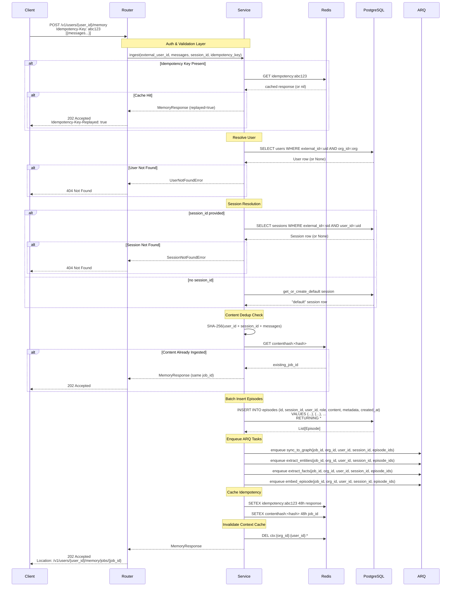

# Message Ingestion — Implementation Guide

> **Domain:** Core Memory
> **SRS Phase:** Phase 1 — Core Memory (Week 3)
> **Requirements:** ING-01 through ING-06, ING-08, ING-09, AUTH-01, SEC-09
> **Doc Dependencies:** [01-postgresql-schema.md](../01-data-models/01-postgresql-schema.md), [02-graphiti-schema.md](../01-data-models/02-graphiti-schema.md), [01-api-key-auth.md](../02-auth-tenancy/01-api-key-auth.md), [05-idempotency-dedup.md](05-idempotency-dedup.md)

---

## 1. Overview

Message ingestion is the primary entry point for persisting agent memory. Agents send conversation turns via `POST /v1/users/{user_id}/memory`, and the system:

1. Validates and persists messages as **episodes** in PostgreSQL
2. Returns HTTP 202 (Accepted) immediately with a tracking `job_id`
3. Enqueues ARQ worker tasks for async enrichment (entity extraction, embedding, fact extraction)

### 1.1 Key Design Decisions

| Decision | Rationale |
|----------|-----------|
| **Async ingestion** (202, not 201) | Enrichment (entity extraction, embedding) takes 1-10s — must not block the API response. Perf target: ≤200ms acknowledgement. |
| **PostgreSQL as authoritative store** | Graphiti's episodic layer is populated **asynchronously** via a `sync_to_graph` worker. No dual-write in the ingestion path. Postgres is the source of truth. |
| **Session-based grouping** | Messages belong to sessions. Sessions auto-close after 24h inactivity. If no session_id provided, a default session is auto-created. |
| **Idempotency via header + content hash** | `Idempotency-Key` header prevents duplicate HTTP requests. Content-level SHA-256 dedup prevents identical payloads from different clients. |
| **64KB content limit** | Per SEC-09. Enforced at Pydantic validation layer. |

---

## 2. Pydantic Schemas

Located in `services/api/schemas/memory.py`.

### 2.1 Message

```python
from datetime import datetime
from typing import Any
from uuid import UUID, uuid4

from pydantic import BaseModel, Field, field_validator


class Message(BaseModel):
    """A single conversation turn."""

    role: str = Field(
        ...,
        description="Message sender role. One of: user, assistant, system, tool.",
        pattern=r"^(user|assistant|system|tool)$",
    )
    content: str = Field(
        ...,
        description="Message body text. Max 64KB.",
        max_length=65536,  # 64KB
    )
    created_at: datetime | None = Field(
        default=None,
        description="ISO-8601 timestamp of when the message was created. Assigned server-side if omitted.",
    )
    metadata: dict[str, Any] = Field(
        default_factory=dict,
        description="Optional caller-defined metadata (tags, labels, etc).",
    )
```

**Validation rules:**
- `role` must be one of `user`, `assistant`, `system`, `tool` — enforced via regex pattern
- `content` max length 65,536 characters (~64KB UTF-8)
  - Note: a 64KB string in Python is ~64K codepoints, but UTF-8 can expand beyond this. The `max_length` check is a **first-line defense**; an explicit byte-length check in the validator below enforces the wire limit.
- `metadata` must be JSON-serializable `dict`. Non-dict values rejected at Pydantic boundary.

```python
    @field_validator("content")
    @classmethod
    def check_content_byte_size(cls, v: str) -> str:
        """Enforce 64KB byte limit per SEC-09."""
        if len(v.encode("utf-8")) > 65536:
            raise ValueError("Content exceeds 64KB when encoded as UTF-8")
        return v

    @field_validator("role")
    @classmethod
    def validate_role(cls, v: str) -> str:
        allowed = {"user", "assistant", "system", "tool"}
        if v.lower() not in allowed:
            raise ValueError(f"Role must be one of: {', '.join(sorted(allowed))}")
        return v.lower()
```

### 2.2 MemoryRequest

```python
class MemoryRequest(BaseModel):
    """Request body for POST /v1/users/{user_id}/memory."""

    messages: list[Message] = Field(
        ...,
        description="List of message objects. Must contain at least 1 message.",
        min_length=1,
    )
    session_id: str | None = Field(
        default=None,
        description="Optional session identifier. If omitted, a default 'default' session is auto-created.",
        max_length=255,
    )
```

**Validation:**
- `messages` must contain ≥1 message (Pydantic `min_length=1`)
- Empty list → 422 with field error
- `session_id` max 255 characters

### 2.3 MemoryResponse

```python
class MemoryResponse(BaseModel):
    """Response returned after successful ingestion."""

    status: str = Field(
        default="accepted",
        description="Always 'accepted' for synchronous acknowledgement.",
    )
    job_id: str = Field(
        ...,
        description="UUID string identifying the async enrichment job. Can be used to track completion.",
    )
    message_count: int = Field(
        ...,
        description="Number of messages ingested.",
    )
    session_id: str = Field(
        ...,
        description="The session_id these messages were added to (may be auto-created).",
    )
```

### 2.4 Error Responses

All errors follow the format specified in SRS §8.4:

```json
{
  "error": {
    "code": "RESOURCE_NOT_FOUND",
    "message": "User user_abc not found in organization org_xyz",
    "request_id": "req_01j9xmf..."
  }
}
```

| HTTP Status | Condition |
|-------------|-----------|
| 202 | Accepted — messages queued for processing |
| 400 | Validation failure (invalid role, malformed JSON) |
| 401 | Missing/invalid API key |
| 404 | User not found in organization |
| 409 | Conflict — idempotency key mismatch (key already used with different payload) |
| 413 | Content too large (message > 64KB) |
| 422 | Validation error (empty messages list, invalid field types) |
| 429 | Rate limited |

---

## 3. Router

Located in `services/api/routers/memory.py`.

### 3.1 Endpoint Definition

```python
from uuid import UUID

from fastapi import APIRouter, Depends, Header, Request, Response, status
from sqlalchemy.ext.asyncio import AsyncSession

from app.dependencies.auth import get_api_key_org
from app.dependencies.db import get_db
from app.schemas.memory import MemoryRequest, MemoryResponse, Message
from app.services.memory_service import MemoryService
from app.core.exceptions import UserNotFoundError, IdempotencyReplayError

router = APIRouter(prefix="/v1/users/{user_id}/memory", tags=["Memory"])


@router.post(
    "",
    status_code=status.HTTP_202_ACCEPTED,
    response_model=MemoryResponse,
    responses={
        202: {"description": "Accepted — messages queued for processing"},
        404: {"description": "User not found"},
        413: {"description": "Content exceeds 64KB limit"},
        422: {"description": "Validation error"},
    },
)
async def ingest_messages(
    user_id: str,
    payload: MemoryRequest,
    request: Request,
    response: Response,
    org_id: str = Depends(get_api_key_org),
    db: AsyncSession = Depends(get_db),
    idempotency_key: str | None = Header(default=None, alias="Idempotency-Key"),
) -> MemoryResponse:
    """Ingest messages into a user's memory.

    Messages are stored as episodes in PostgreSQL and enrichment tasks
    are enqueued asynchronously. Returns 202 immediately.
    """
    service = MemoryService(db=db, org_id=org_id, redis=request.app.state.redis)

    try:
        result = await service.ingest(
            external_user_id=user_id,
            messages=payload.messages,
            session_id=payload.session_id,
            idempotency_key=idempotency_key,
        )
    except UserNotFoundError as e:
        raise e  # Handled by global exception handler -> 404

    # Set Location header pointing to the job status endpoint
    response.headers["Location"] = f"/v1/users/{user_id}/memory/jobs/{result.job_id}"
    # Set idempotency key for duplicate detection
    if idempotency_key:
        response.headers["Idempotency-Key-Replayed"] = str(result.replayed).lower()

    return result
```

### 3.2 Response Header Contract

| Header | Always? | Description |
|--------|---------|-------------|
| `Location` | Always | URL to poll for job status: `/v1/users/{user_id}/memory/jobs/{job_id}` |
| `Idempotency-Key-Replayed` | Only if `Idempotency-Key` was sent | `true` if this was a replayed (duplicate) request, `false` if first-time |

### 3.3 Job Status Endpoint (Reference)

```python
@router.get(
    "/jobs/{job_id}",
    status_code=status.HTTP_200_OK,
)
async def get_ingestion_job_status(
    user_id: str,
    job_id: str,
    request: Request,
    org_id: str = Depends(get_api_key_org),
    db: AsyncSession = Depends(get_db),
) -> dict:
    """Check the status of an ingestion job.

    Returns current enrichment status: pending, processing, completed, failed.
    """
    service = MemoryService(db=db, org_id=org_id, redis=request.app.state.redis)
    return await service.get_job_status(
        external_user_id=user_id,
        job_id=job_id,
    )
```

---

## 4. Service Layer

Located in `services/api/services/memory_service.py`.

### 4.1 Service Class

```python
import hashlib
import json
from datetime import datetime, timezone
from uuid import UUID, uuid4

from arq import create_pool
from redis import asyncio as aioredis
from sqlalchemy.ext.asyncio import AsyncSession

from app.core.config import settings
from app.core.exceptions import (
    IdempotencyReplayError,
    SessionNotFoundError,
    UserNotFoundError,
)
from app.repositories.memory_repository import MemoryRepository
from app.repositories.user_repository import UserRepository
from app.repositories.session_repository import SessionRepository
from app.schemas.memory import MemoryResponse, Message


class MemoryService:
    """Service layer for message ingestion."""

    def __init__(
        self,
        db: AsyncSession,
        org_id: str,
        redis: aioredis.Redis,
    ) -> None:
        self._db = db
        self._org_id = org_id
        self._redis = redis

        # Repositories
        self._user_repo = UserRepository(db)
        self._session_repo = SessionRepository(db)
        self._memory_repo = MemoryRepository(db)

    # ──────────────────────────────────────────────
    # Public API
    # ──────────────────────────────────────────────

    async def ingest(
        self,
        external_user_id: str,
        messages: list[Message],
        session_id: str | None = None,
        idempotency_key: str | None = None,
    ) -> MemoryResponse:
        """Ingest messages into a user's memory.

        Flow:
        1. Idempotency check (Redis) — return cached response if duplicate
        2. Resolve external_user_id to internal UUID
        3. Validate or auto-create session
        4. Compute content hash for content-level dedup
        5. Batch-insert episodes into PostgreSQL
        6. Enqueue ARQ tasks (sync_to_graph, enrich)
        7. Cache idempotency key result
        8. Return 202 response
        """
        # ── Step 1: Idempotency check ──
        if idempotency_key:
            cached = await self._check_idempotency(idempotency_key)
            if cached is not None:
                return cached

        # ── Step 2: Resolve user ──
        user = await self._user_repo.get_by_external_id(
            org_id=self._org_id,
            external_id=external_user_id,
        )
        if user is None:
            raise UserNotFoundError(
                f"User '{external_user_id}' not found in organization '{self._org_id}'",
                code="USER_NOT_FOUND",
            )

        # ── Step 3: Resolve or auto-create session ──
        session = await self._resolve_session(user.id, session_id)

        # ── Step 4: Content-level dedup hash ──
        content_hash = self._compute_content_hash(
            user_id=str(user.id),
            session_id=str(session.id),
            messages=messages,
        )
        existing_job_id = await self._check_content_dedup(content_hash)
        if existing_job_id:
            # Same content already ingested — return existing job_id
            # Do NOT re-insert episodes
            return MemoryResponse(
                status="accepted",
                job_id=existing_job_id,
                message_count=len(messages),
                session_id=str(session.external_id),
            )

        # ── Step 5: Batch-insert episodes ──
        episodes = await self._memory_repo.batch_insert_episodes(
            session_id=session.id,
            user_id=user.id,
            messages=[
                {
                    "role": msg.role,
                    "content": msg.content,
                    "metadata": msg.metadata,
                    "created_at": msg.created_at or datetime.now(timezone.utc),
                }
                for msg in messages
            ],
        )

        # ── Step 6: Build ARQ tasks ──
        # Generate a composite job_id for the entire ingestion
        job_id = str(uuid4())
        episode_ids = [ep.id for ep in episodes]

        arq_tasks = [
            {
                "name": "sync_to_graph",
                "kwargs": {
                    "job_id": job_id,
                    "org_id": self._org_id,
                    "user_id": str(user.id),
                    "session_id": str(session.id),
                    "episode_ids": [str(eid) for eid in episode_ids],
                },
            },
            {
                "name": "extract_entities",
                "kwargs": {
                    "job_id": job_id,
                    "org_id": self._org_id,
                    "user_id": str(user.id),
                    "session_id": str(session.id),
                    "episode_ids": [str(eid) for eid in episode_ids],
                },
            },
            {
                "name": "extract_facts",
                "kwargs": {
                    "job_id": job_id,
                    "org_id": self._org_id,
                    "user_id": str(user.id),
                    "session_id": str(session.id),
                    "episode_ids": [str(eid) for eid in episode_ids],
                },
            },
            {
                "name": "embed_episode",
                "kwargs": {
                    "job_id": job_id,
                    "org_id": self._org_id,
                    "user_id": str(user.id),
                    "session_id": str(session.id),
                    "episode_ids": [str(eid) for eid in episode_ids],
                },
            },
        ]

        # ── Step 7: Enqueue ARQ tasks ──
        arq_pool = await create_pool(settings.redis_url)
        for task in arq_tasks:
            await arq_pool.enqueue_job(
                task["name"],
                **task["kwargs"],
                _queue="high",  # High-priority queue per WRK-07
            )

        # ── Step 8: Cache idempotency key ──
        response = MemoryResponse(
            status="accepted",
            job_id=job_id,
            message_count=len(messages),
            session_id=str(session.external_id),
        )

        if idempotency_key:
            await self._cache_idempotency(idempotency_key, response)

        # Cache content hash
        await self._cache_content_hash(content_hash, job_id)

        # ── Invalidate context cache for this user ──
        await self._redis.delete(f"ctx:{self._org_id}:{user.id}:*")

        return response
```

### 4.2 Session Resolution

```python
    async def _resolve_session(
        self,
        user_id: UUID,
        session_id: str | None,
    ) -> Session:
        """Resolve an existing session or auto-create a default one.

        Rules:
        - If session_id provided: look up existing session. If not found, raise 404.
          Sessions are NOT auto-created from arbitrary session_id strings — the SDK
          must call POST /sessions first, or omit session_id for default behaviour.
        - If session_id omitted: get or create a session named "default".
        - If existing session was auto-closed (>24h inactive): create a new "default"
          session with a fresh UUID, same external_id="default".
        """
        if session_id:
            session = await self._session_repo.get_by_external_id(
                user_id=user_id,
                external_id=session_id,
            )
            if session is None:
                raise SessionNotFoundError(
                    f"Session '{session_id}' not found for user {user_id}",
                    code="SESSION_NOT_FOUND",
                )
            # Touch session — update last_active timestamp
            await self._session_repo.touch(session.id)
            return session

        # Auto-create or get existing "default" session
        return await self._session_repo.get_or_create_default(
            user_id=user_id,
            inactivity_timeout_hours=24,
        )
```

### 4.3 Idempotency Helpers

```python
    async def _check_idempotency(
        self, key: str
    ) -> MemoryResponse | None:
        """Check Redis for a cached response for this idempotency key.

        Returns the cached MemoryResponse if found and still valid, otherwise None.
        """
        cached = await self._redis.get(f"idempotency:{key}")
        if cached is not None:
            data = json.loads(cached)
            # Mark as replayed so the router can set the header
            return MemoryResponse(**data)
        return None

    async def _cache_idempotency(
        self, key: str, response: MemoryResponse
    ) -> None:
        """Cache the response for this idempotency key with 48h TTL."""
        await self._redis.setex(
            f"idempotency:{key}",
            172800,  # 48 hours
            response.model_dump_json(),
        )

    def _compute_content_hash(
        self,
        user_id: str,
        session_id: str,
        messages: list[Message],
    ) -> str:
        """Compute SHA-256 hash of (user_id, session_id, messages) for dedup."""
        canonical = json.dumps(
            {
                "user_id": user_id,
                "session_id": session_id,
                "messages": [
                    {"role": m.role, "content": m.content, "metadata": m.metadata}
                    for m in messages
                ],
            },
            sort_keys=True,
        )
        return hashlib.sha256(canonical.encode("utf-8")).hexdigest()

    async def _check_content_dedup(self, content_hash: str) -> str | None:
        """Check if this exact content has been ingested before.

        Returns the existing job_id if found, None otherwise.
        """
        existing = await self._redis.get(f"contenthash:{content_hash}")
        return existing.decode() if existing else None

    async def _cache_content_hash(self, content_hash: str, job_id: str) -> None:
        """Cache content hash with 48h TTL."""
        await self._redis.setex(
            f"contenthash:{content_hash}",
            172800,  # 48 hours
            job_id,
        )
```

---

## 5. Repository Layer

### 5.1 batch_insert_episodes

```python
from datetime import datetime, timezone
from uuid import UUID, uuid4

from sqlalchemy import text
from sqlalchemy.ext.asyncio import AsyncSession

from app.models.episode import Episode


class MemoryRepository:
    """Repository for episode CRUD operations."""

    def __init__(self, db: AsyncSession) -> None:
        self._db = db

    async def batch_insert_episodes(
        self,
        session_id: UUID,
        user_id: UUID,
        messages: list[dict],
    ) -> list[Episode]:
        """Batch-insert multiple episodes in a single DB round-trip.

        Uses PostgreSQL's INSERT ... RETURNING to get back all
        generated IDs and timestamps in one query.
        """
        if not messages:
            return []

        # Build VALUES clause for bulk insert
        values = []
        params: dict[str, object] = {}
        now = datetime.now(timezone.utc)

        for i, msg in enumerate(messages):
            episode_id = uuid4()
            params[f"id_{i}"] = episode_id
            params[f"session_id_{i}"] = session_id
            params[f"user_id_{i}"] = user_id
            params[f"role_{i}"] = msg["role"]
            params[f"content_{i}"] = msg["content"]
            params[f"metadata_{i}"] = json.dumps(msg.get("metadata", {}))
            params[f"created_at_{i}"] = msg.get("created_at", now)

            placeholders = (
                f"(:id_{i}, :session_id_{i}, :user_id_{i}, "
                f":role_{i}, :content_{i}, :metadata_{i}::jsonb, :created_at_{i})"
            )
            values.append(placeholders)

        stmt = text(
            f"""
            INSERT INTO episodes (id, session_id, user_id, role, content, metadata, created_at)
            VALUES {', '.join(values)}
            RETURNING id, session_id, user_id, role, content, metadata, embedding, created_at, graphiti_node_id
            """
        )

        result = await self._db.execute(stmt, params)
        await self._db.commit()

        rows = result.fetchall()
        return [Episode(**dict(row._mapping)) for row in rows]
```

### 5.2 Idempotency Repository (Redis, in service)

Idempotency state is stored in Redis, not PostgreSQL. See [05-idempotency-dedup.md](05-idempotency-dedup.md) for the complete Redis schema and TTL strategy.

---

## 6. Worker Integration

After ingestion, the service layer enqueues the following ARQ tasks. See [02-task-definitions.md](../06-worker-system/02-task-definitions.md) for complete task specs.

### 6.1 Task DAG

```
ingest_messages (HTTP handler)
    │
    ├──► sync_to_graph (high queue)
    │       Populates Graphiti episodic nodes from PostgreSQL episodes.
    │       Runs FIRST because entity extraction depends on graph state.
    │
    ├──► extract_entities (high queue)
    │       LLM call to extract entities + relationships from messages.
    │       Runs after sync_to_graph.
    │
    ├──► extract_facts (high queue)
    │       LLM call to zero-shot extract factual statements.
    │       Runs after sync_to_graph.
    │
    └──► embed_episode (high queue)
            Generates embedding for each episode via configured embedding API.
            Runs after sync_to_graph.
```

### 6.2 Task Failure Handling

| Failure Mode | Behaviour |
|--------------|-----------|
| LLM API timeout | Exponential backoff, max 3 retries (WRK-03). After 3rd failure, task moves to DLQ. |
| Episode not found in DB | Log warning, skip task. Episode may have been deleted between enqueue and execution. |
| Graphiti node creation failure | Retry with backoff. If persistent, mark task as failed and alert. |
| Duplicate task (same episode processed twice) | Check `episodes.enrichment_status` column. If `completed`, skip. |

### 6.3 Dual-Write Resolution

**PostgreSQL is authoritative.** Graphiti's episodic layer is populated **asynchronously** via the `sync_to_graph` worker task. There is NO dual-write in the ingestion path.

```
HTTP 202 ──► DB write ──► ARQ enqueue ──► sync_to_graph worker ──► Graphiti node
                 │                                   │
           Postgres is                          If worker crashes,
           source of truth                      graph is stale but DB
                                                is intact — replayable
```

**Recovery:** If the `sync_to_graph` worker task fails, the episode remains in PostgreSQL with `graphiti_node_id = NULL`. A backfill task can re-sync all episodes with NULL `graphiti_node_id`.

---

## 7. Sequence Diagram



---

## 8. Edge Cases

### 8.1 Empty Messages List

The Pydantic schema enforces `min_length=1` on `messages`. An empty list returns HTTP 422:

```json
{
  "error": {
    "code": "VALIDATION_ERROR",
    "message": "messages: List should have at least 1 item",
    "request_id": "req_..."
  }
}
```

### 8.2 Content > 64KB

Both Pydantic `max_length` and the custom byte-length validator reject oversized content:

| Limit | Enforced At | Response |
|-------|-------------|----------|
| 65,536 characters | Pydantic `max_length` | 422 |
| 65,536 UTF-8 bytes | `@field_validator` byte check | 422 |

The byte check catches cases where multi-byte characters (e.g. emoji) stay under the character limit but exceed 64KB on the wire. Example: 60,000 emoji characters would be ~240KB.

### 8.3 Missing User

```python
class UserNotFoundError(AppError):
    """Raised when a user with the given external_id is not found."""
    default_code = "RESOURCE_NOT_FOUND"
    default_status_code = 404
```

Mapped in `main.py`'s global exception handler to return RFC 7807 problem detail.

### 8.4 Concurrent Ingestion (Same Session)

If two requests arrive concurrently for the same session:

1. Both pass the idempotency check (different keys) and content dedup (time-of-check ≠ time-of-use)
2. Both batch-insert episodes into PostgreSQL — no conflict because each episode has a new UUID
3. Both enqueue ARQ tasks — the `sync_to_graph` worker handles dedup at the graph level (see [05-idempotency-dedup.md](05-idempotency-dedup.md))

**Risk:** Episodes may be interleaved chronologically if messages in batch B have earlier `created_at` timestamps than batch A. Mitigation: the context assembly endpoint sorts by `created_at` when assembling context.

### 8.5 Session Auto-Close During Ingestion

Race condition: a session auto-closes (24h inactivity) between the user resolution step and the session resolution step.

**Mitigation:** `get_or_create_default` checks `closed_at IS NULL`. If the session was closed, it creates a new "default" session with a fresh UUID. The old session's episodes remain queryable but are not written to the new session.

### 8.6 ARQ Pool Connection Failure

If Redis is unavailable when the service tries to enqueue tasks:

**Behaviour:** The episodes are already committed to PostgreSQL. The `arq_pool.enqueue_job()` call will raise a connection error.

**Recovery:** The service catches this error, logs the episode IDs, and stores them in a `pending_sync_episodes` table (or simpler: logs a critical error for manual re-queue). A background reconciliation worker periodically scans for episodes with no corresponding ARQ job and re-enqueues them.

**Fallback implementation in service:**

```python
try:
    arq_pool = await create_pool(settings.redis_url)
    for task in arq_tasks:
        await arq_pool.enqueue_job(...)
except ConnectionError:
    logger.critical(
        "Failed to enqueue ARQ tasks after episode insert",
        extra={
            "org_id": self._org_id,
            "user_id": str(user.id),
            "session_id": str(session.id),
            "episode_ids": [str(eid) for eid in episode_ids],
            "job_id": job_id,
        },
    )
    # Log to pending_sync table for reconciliation
    await self._memory_repo.record_pending_job(job_id, episode_ids)
```

---

## 9. Testing Guide

### 9.1 Unit Tests

```python
import pytest
from unittest.mock import AsyncMock, MagicMock, patch

from app.schemas.memory import MemoryRequest, Message
from app.services.memory_service import MemoryService


@pytest.mark.asyncio
async def test_ingest_success_default_session():
    """Verify happy path: messages ingested, ARQ tasks enqueued."""
    # Arrange
    db_mock = AsyncMock()
    redis_mock = AsyncMock()
    redis_mock.get.return_value = None  # No idempotency cache hit

    service = MemoryService(db=db_mock, org_id="org_abc", redis=redis_mock)

    # Mock repositories
    service._user_repo.get_by_external_id = AsyncMock(return_value=MagicMock(id=UUID("1111")))
    service._session_repo.get_or_create_default = AsyncMock(
        return_value=MagicMock(id=UUID("2222"), external_id="default")
    )
    service._memory_repo.batch_insert_episodes = AsyncMock(
        return_value=[
            MagicMock(id=UUID("3333")),
            MagicMock(id=UUID("4444")),
        ]
    )

    with patch("app.services.memory_service.create_pool") as mock_create_pool:
        mock_arq = AsyncMock()
        mock_create_pool.return_value = mock_arq

        # Act
        result = await service.ingest(
            external_user_id="user_123",
            messages=[
                Message(role="user", content="Hello"),
                Message(role="assistant", content="Hi there!"),
            ],
        )

    # Assert
    assert result.status == "accepted"
    assert result.message_count == 2
    assert result.session_id == "default"
    assert mock_arq.enqueue_job.call_count == 4  # sync_to_graph, extract_entities, extract_facts, embed_episode


@pytest.mark.asyncio
async def test_ingest_user_not_found():
    """Verify UserNotFoundError raised for non-existent user."""
    db_mock = AsyncMock()
    redis_mock = AsyncMock()
    redis_mock.get.return_value = None

    service = MemoryService(db=db_mock, org_id="org_abc", redis=redis_mock)
    service._user_repo.get_by_external_id = AsyncMock(return_value=None)

    with pytest.raises(UserNotFoundError):
        await service.ingest(
            external_user_id="nonexistent",
            messages=[Message(role="user", content="Hello")],
        )


@pytest.mark.asyncio
async def test_ingest_idempotency_replay():
    """Verify duplicate Idempotency-Key returns cached response."""
    db_mock = AsyncMock()
    redis_mock = AsyncMock()
    cached_response = MemoryResponse(
        status="accepted",
        job_id="existing_job_id",
        message_count=2,
        session_id="default",
    )
    redis_mock.get.return_value = cached_response.model_dump_json().encode()

    service = MemoryService(db=db_mock, org_id="org_abc", redis=redis_mock)

    result = await service.ingest(
        external_user_id="user_123",
        messages=[Message(role="user", content="Hello")],
        idempotency_key="abc123",
    )

    assert result.job_id == "existing_job_id"
    # Verify no DB calls were made
    service._user_repo.get_by_external_id.assert_not_called()


@pytest.mark.asyncio
async def test_content_hash_dedup():
    """Verify identical content returns same job_id without re-inserting."""
    db_mock = AsyncMock()
    redis_mock = AsyncMock()

    # First call: no cache hit
    redis_mock.get.side_effect = lambda key: (
        None if b"contenthash" not in key.encode() else b"existing_job_id"
    )

    service = MemoryService(db=db_mock, org_id="org_abc", redis=redis_mock)
    service._user_repo.get_by_external_id = AsyncMock(return_value=MagicMock(id=UUID("1111")))
    service._session_repo.get_or_create_default = AsyncMock(
        return_value=MagicMock(id=UUID("2222"), external_id="default")
    )

    result = await service.ingest(
        external_user_id="user_123",
        messages=[Message(role="user", content="Hello")],
    )

    assert result.job_id == "existing_job_id"
    # Episode insert should NOT be called
    service._memory_repo.batch_insert_episodes.assert_not_called()
```

### 9.2 Integration Tests

```python
@pytest.mark.asyncio
@pytest.mark.integration
async def test_ingest_endpoint_happy_path(
    async_client: AsyncClient,
    auth_headers: dict,
    db_session: AsyncSession,
    seed_user: dict,
):
    """POST /v1/users/{user_id}/memory returns 202 with Location header."""
    response = await async_client.post(
        f"/v1/users/{seed_user['external_id']}/memory",
        json={
            "messages": [
                {"role": "user", "content": "What's the weather in London?"},
                {"role": "assistant", "content": "It's currently 15°C and cloudy."},
            ]
        },
        headers=auth_headers,
    )

    assert response.status_code == 202
    data = response.json()
    assert data["status"] == "accepted"
    assert data["message_count"] == 2
    assert "Location" in response.headers
    assert "/memory/jobs/" in response.headers["Location"]


@pytest.mark.asyncio
@pytest.mark.integration
async def test_ingest_empty_messages_422(
    async_client: AsyncClient,
    auth_headers: dict,
    seed_user: dict,
):
    """Empty messages list returns 422."""
    response = await async_client.post(
        f"/v1/users/{seed_user['external_id']}/memory",
        json={"messages": []},
        headers=auth_headers,
    )
    assert response.status_code == 422


@pytest.mark.asyncio
@pytest.mark.integration
async def test_ingest_content_too_large_413(
    async_client: AsyncClient,
    auth_headers: dict,
    seed_user: dict,
):
    """Message content > 64KB returns 413."""
    huge_content = "A" * 70000  # > 64KB of ASCII = >64KB bytes
    response = await async_client.post(
        f"/v1/users/{seed_user['external_id']}/memory",
        json={
            "messages": [
                {"role": "user", "content": huge_content}
            ]
        },
        headers=auth_headers,
    )
    assert response.status_code in (413, 422)  # Either is acceptable


@pytest.mark.asyncio
@pytest.mark.integration
async def test_ingest_idempotency_key(
    async_client: AsyncClient,
    auth_headers: dict,
    seed_user: dict,
):
    """Same Idempotency-Key returns same response without re-processing."""
    headers = {**auth_headers, "Idempotency-Key": "test-key-123"}

    # First request
    resp1 = await async_client.post(
        f"/v1/users/{seed_user['external_id']}/memory",
        json={"messages": [{"role": "user", "content": "Hello"}]},
        headers=headers,
    )
    assert resp1.status_code == 202

    # Duplicate request
    resp2 = await async_client.post(
        f"/v1/users/{seed_user['external_id']}/memory",
        json={"messages": [{"role": "user", "content": "Hello"}]},
        headers=headers,
    )
    assert resp2.status_code == 202
    assert resp2.json()["job_id"] == resp1.json()["job_id"]
    assert resp2.headers.get("Idempotency-Key-Replayed") == "true"
```

---

## 10. Configuration

| Variable | Default | Description |
|----------|---------|-------------|
| `CONTENT_MAX_BYTES` | `65536` | Maximum message content size in UTF-8 bytes |
| `SESSION_INACTIVITY_TIMEOUT_HOURS` | `24` | Hours of inactivity before auto-closing a session |
| `IDEMPOTENCY_TTL_SECONDS` | `172800` | TTL for idempotency and content hash cache entries (48h) |
| `ARQ_HIGH_QUEUE_NAME` | `high` | ARQ queue name for ingestion-related tasks |

---

## 11. Open Questions

| # | Question | Decision |
|---|----------|----------|
| OQ-1 | Should we validate session_id ownership at the org level (session belongs to user who belongs to org)? | Yes — `sessions` table has `user_id` FK, which cascades through `users.organization_id`. Query always joins through user. |
| OQ-2 | What happens when a `sync_to_graph` task finds that the episode's user graph namespace doesn't exist yet? | Graphiti auto-creates namespaces on first write. If it fails, task retries with backoff. |
| OQ-3 | Should we support batch-inserting >100 messages in a single request? | Yes — Pydantic validates the list, but there's no hard limit on list length beyond 64KB per message. For very large batches (>50 messages), the caller should batch at the SDK level. |

---

*Document maintained by the OpenZep team. Update this document if discovery during implementation changes the ingestion flow.*
