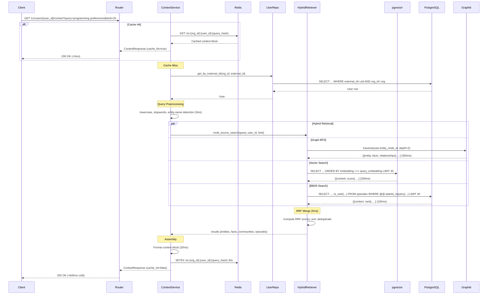

# Context Assembly — Implementation Guide

> **Domain:** Core Memory
> **SRS Phase:** Phase 1 — Core Memory (Week 3)
> **Requirements:** CTX-01 through CTX-06, RET-01 through RET-06, PERF-01 through PERF-03
> **Doc Dependencies:** [01-message-ingestion.md](01-message-ingestion.md), [03-hybrid-retrieval.md](03-hybrid-retrieval.md), [04-caching-strategy.md](04-caching-strategy.md)

---

## 1. Overview

The context assembly endpoint (`GET /v1/users/{user_id}/context`) is the **primary retrieval path** for LLM agents. Given a natural language query, it assembles a structured context block containing relevant facts, entity summaries, recent episodes, and community summaries — formatted for direct injection into an LLM prompt.

### 1.1 Key Design Decisions

| Decision | Rationale |
|----------|-----------|
| **Hybrid retrieval** (vector + BM25 + graph BFS + RRF) | No single retrieval method captures all relevant memory types. Vector finds semantic matches, BM25 finds keyword matches, BFS finds graph neighbours. RRF merges them without tuning per-source weights. |
| **Cache-aside with 30s TTL** | Conversational queries from agents are repetitive (similar topics within a session). 30s cache avoids recomputing identical context blocks while keeping staleness acceptable. |
| **Plain text by default, JSON optional** | Most LLM integrations just need a string to inject into `system_prompt`. JSON format (`format=json`) enables SDK consumers to parse structured results. |
| **BFs depth default 2** | Depth 1 = direct neighbours, depth 2 = neighbours-of-neighbours. Beyond depth 2 yields diminishing returns and exponentially more nodes. |
| **Cross-encoder re-ranker is P2** | The cross-encoder step (RET-05) is async enrichment, NOT part of synchronous path. Keeping it out maintains p99 ≤ 1500ms cold target. |

---

## 2. Pydantic Schemas

Located in `services/api/schemas/context.py`.

```python
from typing import Any
from pydantic import BaseModel, Field


class ContextRequest(BaseModel):
    """Query parameters for GET /v1/users/{user_id}/context."""

    query: str = Field(
        ...,
        description="Natural language query to search memory against.",
        min_length=1,
        max_length=2000,
    )
    limit: int = Field(
        default=20,
        description="Maximum number of facts/messages to include in the context block.",
        ge=1,
        le=100,
    )
    format: str = Field(
        default="text",
        description="Output format. 'text' for plain string, 'json' for structured response.",
        pattern=r"^(text|json)$",
    )


class ContextMetadata(BaseModel):
    """Metadata about the assembled context."""

    source_counts: dict[str, int] = Field(
        ...,
        description="Number of items from each retrieval source: graph, vector, bm25.",
    )
    total_items: int = Field(
        ...,
        description="Total number of items in the context block.",
    )
    retrieval_time_ms: float = Field(
        ...,
        description="Time taken for the full retrieval pipeline in milliseconds.",
    )
    cache_hit: bool = Field(
        default=False,
        description="Whether this response was served from cache.",
    )
    degraded_mode: bool = Field(
        default=False,
        description="True if a retrieval source failed and results are partial.",
    )


class ContextResponse(BaseModel):
    """Response for GET /v1/users/{user_id}/context.

    When format='text', the `context` field contains a plain-text block
    formatted for LLM prompt injection. When format='json', it contains
    structured data.
    """

    context: str = Field(
        ...,
        description="Assembled context block as plain text (or JSON string when format=json).",
    )
    metadata: ContextMetadata = Field(
        ...,
        description="Metadata about the context assembly process.",
    )
```

---

## 3. Router

Located in `services/api/routers/context.py`.

```python
from fastapi import APIRouter, Depends, Query, Request, status
from sqlalchemy.ext.asyncio import AsyncSession

from app.dependencies.auth import get_api_key_org
from app.dependencies.db import get_db
from app.schemas.context import ContextRequest, ContextResponse
from app.services.context_service import ContextService

router = APIRouter(prefix="/v1/users/{user_id}/context", tags=["Context"])


@router.get(
    "",
    status_code=status.HTTP_200_OK,
    response_model=ContextResponse,
    responses={
        200: {"description": "Context block assembled successfully"},
        404: {"description": "User not found"},
        422: {"description": "Validation error (empty query, invalid format)"},
    },
)
async def get_context(
    user_id: str,
    request: Request,
    query: str = Query(..., description="Natural language query", min_length=1),
    limit: int = Query(default=20, ge=1, le=100),
    format: str = Query(default="text", pattern=r"^(text|json)$"),
    org_id: str = Depends(get_api_key_org),
    db: AsyncSession = Depends(get_db),
) -> ContextResponse:
    """Assemble a context block for the given query.

    The context block contains relevant facts, entity summaries,
    recent episodic messages, and community summaries formatted
    for LLM prompt injection.
    """
    service = ContextService(
        db=db,
        org_id=org_id,
        redis=request.app.state.redis,
        graphiti=request.app.state.graphiti,
    )

    ctx_request = ContextRequest(query=query, limit=limit, format=format)
    result = await service.assemble(
        external_user_id=user_id,
        request=ctx_request,
    )
    return result
```

---

## 4. Service Layer

Located in `services/api/services/context_service.py`.

### 4.1 Service Class

```python
import hashlib
import time
from typing import Any

from redis import asyncio as aioredis
from sqlalchemy.ext.asyncio import AsyncSession

from app.core.config import settings
from app.core.exceptions import UserNotFoundError
from app.repositories.user_repository import UserRepository
from app.repositories.session_repository import SessionRepository
from app.services.hybrid_retriever import HybridRetriever
from app.schemas.context import ContextRequest, ContextResponse, ContextMetadata


class ContextService:
    """Service layer for context assembly."""

    def __init__(
        self,
        db: AsyncSession,
        org_id: str,
        redis: aioredis.Redis,
        graphiti: Any,  # Graphiti client instance
    ) -> None:
        self._db = db
        self._org_id = org_id
        self._redis = redis
        self._graphiti = graphiti

        self._user_repo = UserRepository(db)
        self._retriever = HybridRetriever(db=db, graphiti=graphiti, org_id=org_id)

    # ──────────────────────────────────────────────
    # Public API
    # ──────────────────────────────────────────────

    async def assemble(
        self,
        external_user_id: str,
        request: ContextRequest,
    ) -> ContextResponse:
        """Assemble a context block for the given query.

        Flow:
        1. Check Redis cache → return if hit
        2. Resolve user to internal UUID
        3. Run hybrid retrieval (vector + BM25 + graph BFS)
        4. Assemble plain-text or JSON context block
        5. Cache result in Redis
        6. Return response with metadata
        """
        start_time = time.monotonic()

        # ── Step 1: Resolve user ──
        user = await self._user_repo.get_by_external_id(
            org_id=self._org_id,
            external_id=external_user_id,
        )
        if user is None:
            raise UserNotFoundError(
                f"User '{external_user_id}' not found in organization '{self._org_id}'",
                code="USER_NOT_FOUND",
            )

        # ── Step 2: Cache check ──
        query_hash = self._compute_query_hash(request.query)
        cache_key = f"ctx:{self._org_id}:{user.id}:{query_hash}"

        cached = await self._redis.get(cache_key)
        if cached is not None:
            elapsed = (time.monotonic() - start_time) * 1000
            data = json.loads(cached)
            return ContextResponse(
                context=data["context"],
                metadata=ContextMetadata(
                    source_counts=data["source_counts"],
                    total_items=data["total_items"],
                    retrieval_time_ms=elapsed,
                    cache_hit=True,
                    degraded_mode=False,
                ),
            )

        # ── Step 3: Hybrid retrieval ──
        degraded_mode = False
        try:
            results = await self._retriever.hybrid_search(
                query=request.query,
                user_id=user.id,
                limit=request.limit,
            )
        except Exception as e:
            logger.warning("Hybrid retrieval failed, falling back to degraded mode", extra={
                "org_id": self._org_id,
                "user_id": str(user.id),
                "error": str(e),
            })
            # Fallback: try vector-only search
            results = await self._retriever.vector_only_search(
                query=request.query,
                user_id=user.id,
                limit=request.limit,
            )
            degraded_mode = True

        # ── Step 4: Assemble context block ──
        context_block = self._assemble_block(
            results=results,
            format=request.format,
        )

        # ── Step 5: Cache ──
        cache_data = {
            "context": context_block,
            "source_counts": results["source_counts"],
            "total_items": results["total_items"],
        }
        await self._redis.setex(
            cache_key,
            settings.CONTEXT_CACHE_TTL,  # default 30s
            json.dumps(cache_data),
        )

        elapsed = (time.monotonic() - start_time) * 1000

        return ContextResponse(
            context=context_block,
            metadata=ContextMetadata(
                source_counts=results["source_counts"],
                total_items=results["total_items"],
                retrieval_time_ms=round(elapsed, 2),
                cache_hit=False,
                degraded_mode=degraded_mode,
            ),
        )
```

### 4.2 Context Block Assembly

```python
    def _assemble_block(
        self,
        results: dict[str, Any],
        format: str = "text",
    ) -> str:
        """Assemble the context block from hybrid retrieval results.

        Plain text format (default):
            -- Source: entity --
            Entity: Alice
            Type: Person
            Summary: Senior developer at Acme Corp, working on ML projects.

            -- Source: fact --
            Alice prefers Python over JavaScript.
            Alice is working on a machine learning project.

            -- Source: community --
            Community: Engineering Team
            Summary: The engineering team consists of Alice, Bob, and Charlie.
            They work on ML, backend, and infrastructure respectively.

            -- Source: episode --
            User: Can you recommend a good Python web framework?
            Assistant: FastAPI is a great choice for async applications.

        JSON format:
            See _assemble_json_block()
        """
        if format == "json":
            return self._assemble_json_block(results)

        parts: list[str] = []

        # Entity summaries
        entities = results.get("entities", [])
        if entities:
            for entity in entities:
                block = [
                    f"-- Source: entity --",
                    f"Entity: {entity.get('name', 'Unknown')}",
                    f"Type: {entity.get('type', 'Unknown')}",
                ]
                if entity.get("summary"):
                    block.append(f"Summary: {entity['summary']}")
                if entity.get("fact_count"):
                    block.append(f"Related facts: {entity['fact_count']}")
                parts.append("\n".join(block))

        # Facts
        facts = results.get("facts", [])
        if facts:
            for fact in facts:
                parts.append(
                    f"-- Source: fact --\n{fact['content']}"
                )

        # Community summaries
        communities = results.get("communities", [])
        if communities:
            for community in communities:
                parts.append(
                    f"-- Source: community --\n"
                    f"Community: {community.get('name', 'Unknown')}\n"
                    f"Summary: {community.get('summary', '')}"
                )

        # Recent episodes
        episodes = results.get("episodes", [])
        if episodes:
            for ep in episodes:
                parts.append(
                    f"-- Source: episode --\n"
                    f"{ep['role'].capitalize()}: {ep['content']}"
                )

        return "\n\n".join(parts)

    def _assemble_json_block(self, results: dict[str, Any]) -> str:
        """Assemble context block as JSON string."""
        return json.dumps({
            "entities": results.get("entities", []),
            "facts": results.get("facts", []),
            "communities": results.get("communities", []),
            "episodes": results.get("episodes", []),
        }, indent=2)
```

### 4.3 Cache Key Helpers

```python
    def _compute_query_hash(self, query: str) -> str:
        """Compute a stable hash for cache key lookup.

        Normalises the query before hashing to increase cache hit rate:
        - lowercase
        - strip leading/trailing whitespace
        - collapse multiple spaces
        """
        normalised = " ".join(query.lower().strip().split())
        return hashlib.sha256(normalised.encode("utf-8")).hexdigest()
```

---

## 5. Latency Budget

The cold-path (cache miss) latency budget for `GET /context` is **1500ms p99** (PERF-03). The warm cache target is **≤50ms p50, ≤300ms p99** (PERF-01, PERF-02).

### 5.1 Cold Path Budget

| Step | Time (ms) | % of Budget | Notes |
|------|-----------|-------------|-------|
| User resolution | 10 | 0.7% | Indexed lookup on `users.external_id + org_id` |
| Cache check | 2 | 0.1% | Redis GET, single key |
| Query preprocessing | 3 | 0.2% | Tokenization, stopword removal, entity-name detection |
| **BFS graph traversal** | **300** | **20.0%** | Graphiti BFS depth=2. Worst case: user has ~1000 neighbours. |
| **Vector similarity** | **200** | **13.3%** | pgvector IVFFlat cosine search. `LIMIT 40` (limit*2) |
| **BM25 full-text** | **100** | **6.7%** | GIN-indexed `ts_rank`. `LIMIT 40` |
| RRF merge | 5 | 0.3% | In-memory sort of 3 result lists |
| Context block assembly | 20 | 1.3% | String formatting, JSON serialisation |
| Cache write | 5 | 0.3% | Redis SETEX |
| **Total (estimated)** | **645** | **43%** | Well within 1500ms budget |
| Network latency | 200 | 13.3% | Client ↔ API round-trip |
| Auth + middleware | 100 | 6.7% | API key validation, rate limit check, tracing |
| **Total (with overhead)** | **945** | **63%** | ~37% headroom for GC, scheduling jitter |

### 5.2 Warm Path Budget

| Step | Time (ms) | Notes |
|------|-----------|-------|
| Cache check | 2 | Redis GET |
| Deserialize | 1 | JSON parse |
| **Total** | **3-5** | Well under 50ms p50 target |

### 5.3 Query Preprocessing Overhead

Query preprocessing (lowercase, stopword removal, entity-name detection) is lightweight and runs synchronously in the service layer. No external dependencies.

```python
# Preprocessing logic (pseudocode)
STOPWORDS = {"a", "an", "the", "is", "are", "was", "were", "in", "on", "at", "to", "for", "of", "with", "and", "or", "but"}

def preprocess_query(query: str) -> tuple[str, bool]:
    """Preprocess query and determine if it's an entity-name query.

    Returns (cleaned_query, is_entity_name_query).
    Entity-name queries are short (1-3 words, no verbs) and typically
    refer to a named entity (e.g. "Alice", "Acme Corp pricing").
    """
    lower = query.lower().strip()
    tokens = [t for t in lower.split() if t not in STOPWORDS]
    cleaned = " ".join(tokens)

    # Heuristic: entity-name queries are short and contain no common verbs
    is_entity = len(tokens) <= 3 and not any(
        t in {"what", "how", "why", "when", "where", "who", "tell", "give", "find"}
        for t in tokens
    )

    return cleaned, is_entity
```

---

## 6. Repository Layer

The hybrid retrieval logic lives in its own class (`HybridRetriever`). The context assembly service delegates to it. See [03-hybrid-retrieval.md](03-hybrid-retrieval.md) for the complete implementation.

### 6.1 Context Service → HybridRetriever Contract

```python
# Results returned by HybridRetriever.hybrid_search()
results = {
    "entities": [
        {"name": "Alice", "type": "Person", "summary": "...", "fact_count": 5},
    ],
    "facts": [
        {"content": "Alice prefers Python over JavaScript.", "confidence": 0.95},
    ],
    "communities": [
        {"name": "Engineering Team", "summary": "..."},
    ],
    "episodes": [
        {"role": "user", "content": "What's the weather?", "created_at": "..."},
        {"role": "assistant", "content": "It's 15°C.", "created_at": "..."},
    ],
    "source_counts": {
        "graph": 8,
        "vector": 12,
        "bm25": 10,
    },
    "total_items": 20,
}
```

---

## 7. Sequence Diagram



---

## 8. Edge Cases

### 8.1 Empty Query

The Pydantic schema enforces `min_length=1` on query. Empty query returns 422.

### 8.2 User Has No Episodes/Facts

If a user has no data in any retrieval source:

- `HybridRetriever` returns empty lists for all sources
- `_assemble_block` returns an empty string
- Response includes `total_items: 0` and `source_counts: {graph: 0, vector: 0, bm25: 0}`

The caller (agent) should handle empty context gracefully — e.g., `"No prior knowledge found about this query."`

### 8.3 Graph Traversal Fails

The context assembly catches exceptions from the `HybridRetriever` and falls back to a vector-only search. The response metadata includes `degraded_mode: true` so callers can observe the degraded state.

```python
try:
    results = await self._retriever.hybrid_search(...)
except GraphTraversalError:
    logger.warning("Graph BFS failed, falling back to vector+BM25", ...)
    results = await self._retriever.vector_bm25_search(...)
    degraded_mode = True
```

### 8.4 Same Query, Different Users

Cache keys include both `org_id` and `user_id`, so two different users issuing the same query get separate cache entries. This is correct behaviour — different users have different memories.

### 8.5 Cache Stampede

If 10 concurrent requests arrive for the same uncached query, all 10 would hit the DB simultaneously. **Mitigation:** Use a Redis distributed lock (`SET NX EX 5`) around the assembly operation for the specific cache key. Only the first request proceeds; others wait for the lock and then read the cached result.

```python
async def assemble(self, ...) -> ContextResponse:
    cache_key = f"ctx:{self._org_id}:{user.id}:{query_hash}"

    # ── Lock-free cache check ──
    cached = await self._redis.get(cache_key)
    if cached:
        return self._from_cache(cached)

    # ── Distributed lock ──
    lock_key = f"lock:{cache_key}"
    lock_acquired = await self._redis.set(lock_key, "1", nx=True, ex=5)

    if not lock_acquired:
        # Another request is assembling — wait and retry
        for _ in range(10):
            await asyncio.sleep(0.05)
            cached = await self._redis.get(cache_key)
            if cached:
                return self._from_cache(cached)
        # Fall through if cache never populated (lock holder crashed)

    try:
        # ── Double-check after lock acquisition ──
        cached = await self._redis.get(cache_key)
        if cached:
            return self._from_cache(cached)

        # ── Do the expensive work ──
        result = await self._assemble_inner(...)
        await self._redis.setex(cache_key, TTL, result.model_dump_json())
        return result
    finally:
        await self._redis.delete(lock_key)
```

### 8.6 Community Summaries Not Available

Community summaries are generated on a scheduled nightly basis (P1, NLP-15). If they don't exist yet, the graph traversal simply returns no `CommunityNode` results — no error.

---

## 9. Testing Guide

### 9.1 Unit Tests

```python
import pytest
from unittest.mock import AsyncMock, MagicMock, patch
from app.services.context_service import ContextService


@pytest.mark.asyncio
async def test_assemble_cache_hit():
    """Verify cache hit returns immediately without retrieval."""
    db_mock = AsyncMock()
    redis_mock = AsyncMock()
    graphiti_mock = MagicMock()

    # Cache contains data
    cached_data = json.dumps({
        "context": "-- Source: fact --\nAlice prefers Python.",
        "source_counts": {"graph": 0, "vector": 1, "bm25": 0},
        "total_items": 1,
    })
    redis_mock.get.return_value = cached_data.encode()

    service = ContextService(db=db_mock, org_id="org_abc", redis=redis_mock, graphiti=graphiti_mock)
    service._user_repo.get_by_external_id = AsyncMock(return_value=MagicMock(id=UUID("1111")))

    result = await service.assemble(
        external_user_id="user_123",
        request=ContextRequest(query="programming", limit=20, format="text"),
    )

    assert result.metadata.cache_hit is True
    assert "Alice prefers Python" in result.context
    # Retrieval not called
    service._retriever.hybrid_search.assert_not_called()


@pytest.mark.asyncio
async def test_assemble_full_flow():
    """Verify full retrieval pipeline on cache miss."""
    db_mock = AsyncMock()
    redis_mock = AsyncMock()
    redis_mock.get.return_value = None  # Cache miss
    graphiti_mock = MagicMock()

    service = ContextService(db=db_mock, org_id="org_abc", redis=redis_mock, graphiti=graphiti_mock)
    service._user_repo.get_by_external_id = AsyncMock(return_value=MagicMock(id=UUID("1111")))

    # Mock retrieval results
    service._retriever.hybrid_search = AsyncMock(return_value={
        "entities": [{"name": "Alice", "type": "Person", "summary": "Python developer"}],
        "facts": [{"content": "Alice prefers Python over JavaScript.", "confidence": 0.95}],
        "communities": [],
        "episodes": [],
        "source_counts": {"graph": 1, "vector": 1, "bm25": 0},
        "total_items": 2,
    })

    result = await service.assemble(
        external_user_id="user_123",
        request=ContextRequest(query="programming", limit=20, format="text"),
    )

    assert result.metadata.cache_hit is False
    assert "Alice prefers Python" in result.context
    assert "Python developer" in result.context
    assert "entity" in result.context.lower()


@pytest.mark.asyncio
async def test_assemble_degraded_mode():
    """Verify degraded mode when graph traversal fails."""
    db_mock = AsyncMock()
    redis_mock = AsyncMock()
    redis_mock.get.return_value = None
    graphiti_mock = MagicMock()

    service = ContextService(db=db_mock, org_id="org_abc", redis=redis_mock, graphiti=graphiti_mock)
    service._user_repo.get_by_external_id = AsyncMock(return_value=MagicMock(id=UUID("1111")))

    # Full hybrid search fails
    service._retriever.hybrid_search = AsyncMock(side_effect=Exception("Graphiti connection refused"))
    # Fallback succeeds
    service._retriever.vector_only_search = AsyncMock(return_value={
        "entities": [],
        "facts": [{"content": "Alice prefers Python.", "confidence": 0.9}],
        "communities": [],
        "episodes": [],
        "source_counts": {"graph": 0, "vector": 1, "bm25": 0},
        "total_items": 1,
    })

    result = await service.assemble(
        external_user_id="user_123",
        request=ContextRequest(query="programming", limit=20, format="text"),
    )

    assert result.metadata.degraded_mode is True
    assert "Alice prefers Python" in result.context
```

### 9.2 Integration Tests

```python
@pytest.mark.asyncio
@pytest.mark.integration
async def test_context_endpoint_happy_path(
    async_client: AsyncClient,
    auth_headers: dict,
    seed_user_with_memory: dict,
):
    """GET /context returns a non-empty context block."""
    response = await async_client.get(
        f"/v1/users/{seed_user_with_memory['external_id']}/context",
        params={"query": "programming preferences", "limit": 10},
        headers=auth_headers,
    )

    assert response.status_code == 200
    data = response.json()
    assert len(data["context"]) > 0
    assert data["metadata"]["total_items"] > 0
    assert "retrieval_time_ms" in data["metadata"]


@pytest.mark.asyncio
@pytest.mark.integration
async def test_context_caching(
    async_client: AsyncClient,
    auth_headers: dict,
    seed_user_with_memory: dict,
):
    """Second request for same query returns cached result."""
    params = {"query": "the same query", "limit": 10}

    # First request
    resp1 = await async_client.get(
        f"/v1/users/{seed_user_with_memory['external_id']}/context",
        params=params,
        headers=auth_headers,
    )
    assert resp1.json()["metadata"]["cache_hit"] is False

    # Second request
    resp2 = await async_client.get(
        f"/v1/users/{seed_user_with_memory['external_id']}/context",
        params=params,
        headers=auth_headers,
    )
    assert resp2.json()["metadata"]["cache_hit"] is True
    assert resp2.json()["context"] == resp1.json()["context"]


@pytest.mark.asyncio
@pytest.mark.integration
async def test_context_empty_for_new_user(
    async_client: AsyncClient,
    auth_headers: dict,
    seed_user: dict,
):
    """Context for a user with no data returns empty string."""
    response = await async_client.get(
        f"/v1/users/{seed_user['external_id']}/context",
        params={"query": "anything", "limit": 10},
        headers=auth_headers,
    )

    assert response.status_code == 200
    data = response.json()
    assert data["context"] == ""
    assert data["metadata"]["total_items"] == 0
```

---

## 10. Configuration

| Variable | Default | Description |
|----------|---------|-------------|
| `CONTEXT_CACHE_TTL` | `30` | TTL for context block cache entries (seconds) |
| `CONTEXT_BFS_MAX_DEPTH` | `2` | Maximum graph traversal depth from user entity node |
| `CONTEXT_PER_SOURCE_LIMIT_MULTIPLIER` | `2` | Multiplier applied to `limit` when fetching per-source (limit*2 for RRF) |
| `CONTEXT_LOCK_TTL` | `5` | TTL for distributed cache stampede lock (seconds) |
| `CONTEXT_MAX_QUERY_LENGTH` | `2000` | Maximum query string length |

---

## 11. Open Questions

| # | Question | Decision |
|---|----------|----------|
| OQ-1 | Should we support optional `session_id` filter on context (scope context to a specific session)? | Not in P0. The context endpoint is designed to retrieve ALL relevant memory for a user. Session-scoped retrieval can be done via the search endpoint with a session filter. |
| OQ-2 | What embedding model produces the query vector? | The same model configured for episode embeddings (`EMBEDDING_MODEL`). The query is embedded at request time using the same API. |
| OQ-3 | Should RRF weights be configurable per request? | Not in P0. Default equal weights. Future: per-source weights in `ContextRequest`. |
| OQ-4 | How do we handle query embedding latency? | Embedding API call is part of vector search step (200ms budget). For OpenAI `text-embedding-3-small`, typical latency is 50-150ms. Local Ollama is 100-300ms. |

---

*Document maintained by the OpenZep team. Update this document if discovery during implementation changes the context assembly flow.*
