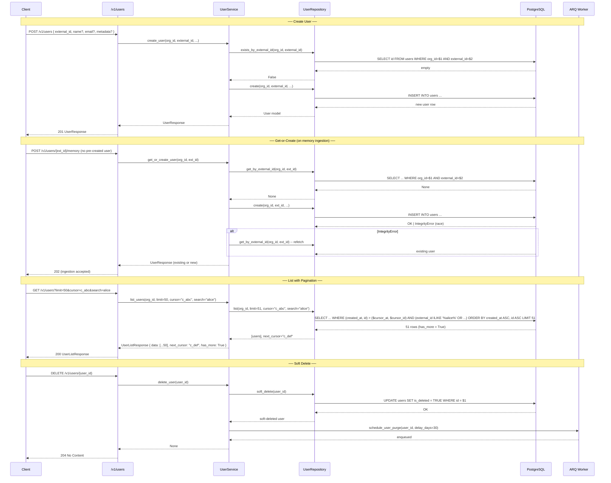

# User CRUD — Implementation Guide

> **Domain:** User & Session Management
> **SRS Phase:** Phase 1 — Core Memory (Week 3)
> **Requirements:** USR-01 through USR-05, MT-01, MT-02, SCALE-02
> **Doc Dependencies:** [01-postgresql-schema.md](../01-data-models/01-postgresql-schema.md), [03-tenant-isolation.md](../02-auth-tenancy/03-tenant-isolation.md), [03-pagination.md](../08-api-gateway/03-pagination.md)

---

## 1. Overview

The User CRUD subsystem provides the foundational data management for all user-facing MemGraph features. Every piece of stored memory — episodes, facts, entities, graph nodes — belongs to a user within an organization.

### 1.1 Key Design Decisions

| Decision | Rationale |
|----------|-----------|
| **Dual key lookup** (UUID + external_id) | The internal `id` (UUID) is used for all foreign key references. The caller-defined `external_id` allows clients to use their own user identifier without maintaining an ID mapping. |
| **Get-or-create pattern** | `get_or_create_user` is the primary ingestion path entry point. If a caller sends memory for an unknown `external_id`, the user is auto-created rather than returning 404. Avoids an extra create-before-ingest step in every SDK integration. |
| **Cursor-based pagination** | Keyset pagination provides stable ordering across concurrent writes. Avoids the phantom-row problem of offset-based pagination. Cursor is a base64-encoded composite of `(created_at, id)`. |
| **Metadata merge, not replace** | On PATCH, `metadata` is deep-merged into existing metadata, not replaced. Callers can update specific keys without reading-modifying-writing the full metadata blob. |
| **Soft-delete reserve** | GDPR requires a 30-day grace period before hard-delete (see [03-gdpr-compliance.md](03-gdpr-compliance.md)). The DELETE endpoint triggers soft-delete + a scheduled purge task. |
| **Composite unique constraint** | `(organization_id, external_id)` enforces tenant-scoped uniqueness of external IDs. Two orgs can each have `user_123` without collision. |

### 1.2 Data Flow Summary

```
POST /v1/users ──► Router ──► Schema Validation ──► Service ──► Repository ──► PostgreSQL
  │                                                                                │
  └── Returns 201 UserResponse ───────────────────────────────────────────────────┘

GET /v1/users/{user_id} ──► Router ──► Service ──► Repository ──► DB
  │                                                       │
  └── Returns 200 UserResponseWithStats ──────────────────┘  (message_count, fact_count)

GET /v1/users ──► Router ──► Service ──► Repository ──► DB (cursor pagination)
  │
  └── Returns 200 UserListResponse ──► { data, next_cursor, has_more }
```

---

## 2. Pydantic Schemas

Located in `services/api/schemas/users.py`.

### 2.1 CreateUserRequest

```python
from datetime import datetime
from typing import Any
from uuid import UUID

from pydantic import BaseModel, Field, field_validator


class CreateUserRequest(BaseModel):
    """Request body for POST /v1/users."""

    external_id: str = Field(
        ...,
        description="Caller-defined unique user identifier. Must be unique within the organization.",
        min_length=1,
        max_length=255,
        examples=["user_abc123", "alice@example.com", "usr_8f3a2c"],
    )
    name: str | None = Field(
        default=None,
        description="Human-readable display name for the user.",
        max_length=512,
        examples=["Alice Johnson"],
    )
    email: str | None = Field(
        default=None,
        description="Email address for the user.",
        max_length=320,
        examples=["alice@example.com"],
    )
    metadata: dict[str, Any] = Field(
        default_factory=dict,
        description="Arbitrary JSON metadata for the user. Deep-merged on update.",
        examples=[{"plan": "pro", "region": "us-east", "onboarded_at": "2026-01-15"}],
    )

    @field_validator("email")
    @classmethod
    def validate_email_format(cls, v: str | None) -> str | None:
        if v is not None and "@" not in v:
            raise ValueError("Email must contain '@'")
        return v

    @field_validator("external_id")
    @classmethod
    def validate_external_id(cls, v: str) -> str:
        if len(v.encode("utf-8")) > 255:
            raise ValueError("external_id exceeds 255 bytes when encoded as UTF-8")
        return v.strip()
```

### 2.2 UserResponse

```python
class UserResponse(BaseModel):
    """Response body for single-user endpoints."""

    id: UUID = Field(..., description="Internal MemGraph user UUID.")
    external_id: str = Field(..., description="Caller-defined user identifier.")
    name: str | None = Field(default=None, description="Display name.")
    email: str | None = Field(default=None, description="Email address.")
    metadata: dict[str, Any] = Field(
        default_factory=dict, description="User metadata JSON."
    )
    organization_id: UUID = Field(..., description="Tenant organization UUID.")
    created_at: datetime = Field(..., description="User creation timestamp (UTC).")
    updated_at: datetime = Field(..., description="Last update timestamp (UTC).")
    is_deleted: bool = Field(
        default=False,
        description="Soft-delete flag. True during the 30-day GDPR grace period.",
    )

    model_config = {"from_attributes": True}
```

### 2.3 UserResponseWithStats

```python
class UserResponseWithStats(UserResponse):
    """Extended user response with aggregate statistics."""

    message_count: int = Field(
        default=0, description="Total number of ingested messages (episodes)."
    )
    fact_count: int = Field(
        default=0,
        description="Total number of extracted facts for this user.",
    )
    session_count: int = Field(
        default=0, description="Total number of sessions (including closed)."
    )
```

### 2.4 UpdateUserRequest

```python
class UpdateUserRequest(BaseModel):
    """Request body for PATCH /v1/users/{user_id}.

    All fields are optional. Only provided fields are updated.
    metadata is deep-merged into existing metadata, not replaced.
    """

    name: str | None = Field(
        default=None,
        description="New display name. Set to null to clear.",
        max_length=512,
    )
    email: str | None = Field(
        default=None,
        description="New email address. Set to null to clear.",
        max_length=320,
    )
    metadata: dict[str, Any] | None = Field(
        default=None,
        description=(
            "Metadata keys to merge into existing metadata. "
            "Set a key to null to remove it. Does NOT replace the full metadata dict."
        ),
    )

    @field_validator("email")
    @classmethod
    def validate_email(cls, v: str | None) -> str | None:
        if v is not None and "@" not in v:
            raise ValueError("Email must contain '@'")
        return v
```

### 2.5 UserListResponse

```python
class UserListResponse(BaseModel):
    """Paginated response for GET /v1/users."""

    data: list[UserResponse] = Field(
        ..., description="List of users for the current page."
    )
    next_cursor: str | None = Field(
        default=None,
        description="Cursor to pass as ?cursor= in the next request. Null if no more results.",
    )
    has_more: bool = Field(
        default=False,
        description="True if there are additional pages beyond this one.",
    )
```

---

## 3. Repository Layer

Located in `services/api/repositories/user_repository.py`.

### 3.1 Core CRUD

```python
from collections.abc import Sequence
from datetime import datetime
from typing import Any
from uuid import UUID

from sqlalchemy import Select, or_, select, text, func
from sqlalchemy.ext.asyncio import AsyncSession
from sqlalchemy.orm import joinedload

from app.models.user import User
from app.models.episode import Episode
from app.models.fact import Fact
from app.models.session import Session


class UserRepository:
    """All database access for users.

    Every method accepts organization_id to enforce tenant isolation.
    No business logic — pure query construction and execution.
    """

    def __init__(self, db: AsyncSession) -> None:
        self._db = db

    # ── Create ──────────────────────────────────────────────────────

    async def create(
        self,
        organization_id: UUID,
        external_id: str,
        name: str | None = None,
        email: str | None = None,
        metadata: dict[str, Any] | None = None,
    ) -> User:
        """Insert a new user. Raises IntegrityError on duplicate external_id."""
        user = User(
            organization_id=organization_id,
            external_id=external_id,
            name=name,
            email=email,
            metadata=metadata or {},
        )
        self._db.add(user)
        await self._db.flush()
        await self._db.refresh(user)
        return user

    # ── Read ────────────────────────────────────────────────────────

    async def get_by_external_id(
        self, organization_id: UUID, external_id: str
    ) -> User | None:
        """Look up a user by caller-defined external ID within an org."""
        result = await self._db.execute(
            select(User).where(
                User.organization_id == organization_id,
                User.external_id == external_id,
            )
        )
        return result.scalar_one_or_none()

    async def get_by_uuid(self, user_id: UUID) -> User | None:
        """Look up a user by internal UUID. Does NOT check org_id —
        caller is responsible for tenant authorization."""
        result = await self._db.execute(select(User).where(User.id == user_id))
        return result.scalar_one_or_none()

    # ── Update ──────────────────────────────────────────────────────

    async def update(
        self,
        user_id: UUID,
        name: str | None = None,
        email: str | None = None,
        metadata: dict[str, Any] | None = None,
    ) -> User | None:
        """Update user fields. Only non-None fields are applied.

        For metadata, performs a JSONB merge (not replace).
        Caller should pass the full merge intent — keys with None values
        are removed from metadata.
        """
        result = await self._db.execute(select(User).where(User.id == user_id))
        user = result.scalar_one_or_none()
        if user is None:
            return None

        if name is not None:
            user.name = name
        if email is not None:
            user.email = email
        if metadata is not None:
            # Deep merge: new keys override, None values remove
            existing = dict(user.metadata or {})
            for k, v in metadata.items():
                if v is None:
                    existing.pop(k, None)
                elif isinstance(v, dict) and isinstance(existing.get(k), dict):
                    # Recursive merge for nested dicts
                    existing[k] = {**existing[k], **v}
                else:
                    existing[k] = v
            user.metadata = existing

        await self._db.flush()
        await self._db.refresh(user)
        return user

    # ── Soft Delete ─────────────────────────────────────────────────

    async def soft_delete(self, user_id: UUID) -> User | None:
        """Set is_deleted = True. Called on DELETE endpoint
        (GDPR two-phase deletion: soft -> hard after 30 days)."""
        result = await self._db.execute(select(User).where(User.id == user_id))
        user = result.scalar_one_or_none()
        if user is None:
            return None
        user.is_deleted = True
        await self._db.flush()
        await self._db.refresh(user)
        return user

    # ── Hard Delete ─────────────────────────────────────────────────

    async def hard_delete(self, user_id: UUID) -> bool:
        """Permanently remove user row. Used by GDPR purge worker
        after the 30-day grace period. Cascade rules handle child tables."""
        result = await self._db.execute(select(User).where(User.id == user_id))
        user = result.scalar_one_or_none()
        if user is None:
            return False
        await self._db.delete(user)
        await self._db.flush()
        return True

    # ── List with Cursor Pagination ─────────────────────────────────

    async def list(
        self,
        organization_id: UUID,
        limit: int = 50,
        cursor: str | None = None,
        search: str | None = None,
        created_after: datetime | None = None,
        created_before: datetime | None = None,
        include_deleted: bool = False,
    ) -> tuple[list[User], str | None]:
        """List users with cursor-based pagination and optional filters.

        Cursor is a base64-encoded composite of (created_at, id).
        Filters are composable — any combination of search, date range.

        Args:
            organization_id: Tenant scope (always applied).
            limit: Max results per page (default 50, max 200).
            cursor: Opaque pagination token from previous response.
            search: Fuzzy match against external_id, name, email, and
                    metadata JSONB keys (uses PostgreSQL ILIKE).
            created_after: Only users created on or after this timestamp.
            created_before: Only users created before this timestamp.
            include_deleted: If True, include soft-deleted users.

        Returns:
            Tuple of (users_list, next_cursor_string).
            next_cursor is None when no more pages exist.
        """
        # ⚠️ LIMIT + 1 to detect has_more without a separate COUNT query
        effective_limit = min(limit, 200) + 1

        query = select(User).where(User.organization_id == organization_id)

        if not include_deleted:
            query = query.where(User.is_deleted.is_(False))

        # Cursor pagination: composite WHERE clause
        if cursor is not None:
            cursor_at, cursor_id = self._decode_cursor(cursor)
            # WHERE (created_at, id) > (cursor_at, cursor_id)
            query = query.where(
                or_(
                    User.created_at > cursor_at,
                    User.created_at == cursor_at,
                    User.id > cursor_id,
                )
            )

        # Search: multi-field ILIKE
        if search:
            search_pattern = f"%{search}%"
            query = query.where(
                or_(
                    User.external_id.ilike(search_pattern),
                    User.name.ilike(search_pattern),
                    User.email.ilike(search_pattern),
                    # JSONB text search — extract all values as text and ILIKE
                    # Uses jsonb_each_text in a LATERAL join for JSONB search
                    User.metadata.cast(text("text")).ilike(search_pattern),
                )
            )

        # Date range filters
        if created_after is not None:
            query = query.where(User.created_at >= created_after)
        if created_before is not None:
            query = query.where(User.created_at < created_before)

        # Consistent ordering for cursor stability
        query = query.order_by(User.created_at.asc(), User.id.asc()).limit(
            effective_limit
        )

        result = await self._db.execute(query)
        rows = result.scalars().all()

        # Detect has_more and strip the extra row
        has_more = len(rows) == effective_limit
        users = rows[:limit] if has_more else list(rows)

        next_cursor = None
        if has_more and users:
            last = users[-1]
            next_cursor = self._encode_cursor(last.created_at, last.id)

        return users, next_cursor

    # ── Aggregate Stats ─────────────────────────────────────────────

    async def get_stats(self, user_id: UUID) -> dict[str, int]:
        """Return aggregate counts for a user.

        Uses a single round-trip query with subqueries — NOT N+1.
        """
        stmt = select(
            func.count(func.distinct(Episode.id)).label("message_count"),
            func.count(func.distinct(Fact.id)).label("fact_count"),
            func.count(func.distinct(Session.id)).label("session_count"),
        ).select_from(User).outerjoin(
            Episode, Episode.user_id == User.id
        ).outerjoin(
            Fact, Fact.user_id == User.id
        ).outerjoin(
            Session, Session.user_id == User.id
        ).where(User.id == user_id).group_by(User.id)

        result = await self._db.execute(stmt)
        row = result.one_or_none()

        if row is None:
            return {"message_count": 0, "fact_count": 0, "session_count": 0}

        return {
            "message_count": row.message_count or 0,
            "fact_count": row.fact_count or 0,
            "session_count": row.session_count or 0,
        }

    # ── Existence Check ─────────────────────────────────────────────

    async def exists_by_external_id(
        self, organization_id: UUID, external_id: str
    ) -> bool:
        """Check if a user with this external_id exists in the org.
        Efficient boolean query — does not fetch the full row."""
        result = await self._db.execute(
            select(User.id).where(
                User.organization_id == organization_id,
                User.external_id == external_id,
            ).limit(1)
        )
        return result.scalar_one_or_none() is not None

    # ── Cursor Helpers ──────────────────────────────────────────────

    @staticmethod
    def _encode_cursor(created_at: datetime, user_id: UUID) -> str:
        """Encode (created_at, id) into an opaque base64 cursor string.

        Format: ISO timestamp + '|' + UUID hex, then base64 encoded.
        """
        import base64

        raw = f"{created_at.isoformat()}|{user_id.hex}"
        return base64.urlsafe_b64encode(raw.encode()).decode().rstrip("=")

    @staticmethod
    def _decode_cursor(cursor: str) -> tuple[datetime, UUID]:
        """Decode a cursor string back to (created_at, id).

        Raises ValueError on malformed cursors.
        """
        import base64

        try:
            # Restore padding
            padding = 4 - len(cursor) % 4
            if padding != 4:
                cursor += "=" * padding
            raw = base64.urlsafe_b64decode(cursor.encode()).decode()
            at_str, id_hex = raw.split("|", 1)
            return datetime.fromisoformat(at_str), UUID(hex=id_hex)
        except (ValueError, TypeError) as e:
            raise ValueError(f"Invalid cursor: {e}") from e
```

### 3.2 Key Query Patterns

```sql
-- Cursor pagination composite WHERE (generated by SQLAlchemy):
WHERE (created_at, id) > ('2026-06-01T00:00:00+00:00', 'abc123...')

-- Multi-field search (generated by SQLAlchemy ILIKE):
WHERE external_id ILIKE '%search%'
   OR name ILIKE '%search%'
   OR email ILIKE '%search%'
   OR metadata::text ILIKE '%search%'

-- Aggregate stats (single query, not N+1):
SELECT COUNT(DISTINCT episodes.id) AS message_count,
       COUNT(DISTINCT facts.id) AS fact_count,
       COUNT(DISTINCT sessions.id) AS session_count
FROM users
LEFT JOIN episodes ON episodes.user_id = users.id
LEFT JOIN facts ON facts.user_id = users.id
LEFT JOIN sessions ON sessions.user_id = users.id
WHERE users.id = $1
GROUP BY users.id;
```

---

## 4. Service Layer

Located in `services/api/services/user_service.py`.

```python
from datetime import datetime
from typing import Any
from uuid import UUID

from app.repositories.user_repository import UserRepository
from app.core.exceptions import (
    DuplicateResourceError,
    ResourceNotFoundError,
    ValidationError,
)


class UserService:
    """Business logic for user management.

    Separation: service orchestrates, repository queries.
    No SQLAlchemy expressions in this file.
    """

    def __init__(self, repo: UserRepository) -> None:
        self._repo = repo

    # ── Create ──────────────────────────────────────────────────────

    async def create_user(
        self,
        organization_id: UUID,
        external_id: str,
        name: str | None = None,
        email: str | None = None,
        metadata: dict[str, Any] | None = None,
    ) -> UserResponse:
        """Create a new user within an organization.

        Raises:
            DuplicateResourceError: A user with this external_id already
                exists in the organization.
        """
        exists = await self._repo.exists_by_external_id(organization_id, external_id)
        if exists:
            raise DuplicateResourceError(
                f"User with external_id '{external_id}' already exists "
                f"in organization {organization_id}"
            )

        user = await self._repo.create(
            organization_id=organization_id,
            external_id=external_id,
            name=name,
            email=email,
            metadata=metadata,
        )
        return UserResponse.model_validate(user)

    # ── Get-or-Create ───────────────────────────────────────────────

    async def get_or_create_user(
        self,
        organization_id: UUID,
        external_id: str,
        name: str | None = None,
        email: str | None = None,
        metadata: dict[str, Any] | None = None,
    ) -> UserResponse:
        """Retrieve existing user by external_id or create one.

        This is the primary entry point for memory ingestion.
        Callers do not need to pre-create users before sending messages.

        Thread-safe via the (organization_id, external_id) unique constraint:
        if two concurrent calls race, one will raise IntegrityError;
        the service retries the lookup once.

        Raises:
            # ⚠️ RACE CONDITION: Two concurrent calls with the same
            # external_id can both pass the exists() check. The DB
            # unique constraint is the final guard. We catch IntegrityError
            # and re-fetch.
        """
        user = await self._repo.get_by_external_id(organization_id, external_id)
        if user is not None:
            return UserResponse.model_validate(user)

        # Race: concurrent create — DB constraint is the source of truth
        from sqlalchemy.exc import IntegrityError

        try:
            user = await self._repo.create(
                organization_id=organization_id,
                external_id=external_id,
                name=name,
                email=email,
                metadata=metadata,
            )
        except IntegrityError:
            # Concurrent insert won. Fetch and return.
            await self._db.rollback()  # Must rollback stale transaction
            user = await self._repo.get_by_external_id(organization_id, external_id)
            if user is None:
                # Should never happen — the IntegrityError implies the row exists
                raise ResourceNotFoundError(
                    f"Failed to get-or-create user '{external_id}'"
                )

        return UserResponse.model_validate(user)

    # ── Get ─────────────────────────────────────────────────────────

    async def get_user(self, user_id: UUID) -> UserResponseWithStats:
        """Get user by UUID with aggregate stats.

        Raises:
            ResourceNotFoundError: No user with this UUID (or soft-deleted).
        """
        user = await self._repo.get_by_uuid(user_id)
        if user is None or user.is_deleted:
            raise ResourceNotFoundError(f"User {user_id} not found")

        stats = await self._repo.get_stats(user_id)
        response = UserResponseWithStats.model_validate(user)
        response.message_count = stats["message_count"]
        response.fact_count = stats["fact_count"]
        response.session_count = stats["session_count"]
        return response

    # ── Update ──────────────────────────────────────────────────────

    async def update_user(
        self,
        user_id: UUID,
        name: str | None = None,
        email: str | None = None,
        metadata: dict[str, Any] | None = None,
    ) -> UserResponse:
        """Update user fields. Metadata is deep-merged, not replaced.

        Raises:
            ResourceNotFoundError: No user with this UUID.
        """
        # Validate: at least one field must be provided
        if name is None and email is None and metadata is None:
            raise ValidationError(
                "At least one field (name, email, metadata) must be provided for update"
            )

        user = await self._repo.update(
            user_id=user_id, name=name, email=email, metadata=metadata
        )
        if user is None:
            raise ResourceNotFoundError(f"User {user_id} not found")

        return UserResponse.model_validate(user)

    # ── Delete ──────────────────────────────────────────────────────

    async def delete_user(self, user_id: UUID) -> None:
        """Soft-delete a user. Enqueues a GDPR purge worker task
        that will hard-delete after 30 days.

        Raises:
            ResourceNotFoundError: No user with this UUID.
        """
        user = await self._repo.soft_delete(user_id)
        if user is None:
            raise ResourceNotFoundError(f"User {user_id} not found")

        # Enqueue GDPR purge task for 30 days later
        # See 03-gdpr-compliance.md for the ARQ worker implementation
        from app.workers.gdpr_jobs import schedule_user_purge

        await schedule_user_purge(user_id, delay_days=30)

    # ── List ────────────────────────────────────────────────────────

    async def list_users(
        self,
        organization_id: UUID,
        limit: int = 50,
        cursor: str | None = None,
        search: str | None = None,
        created_after: datetime | None = None,
        created_before: datetime | None = None,
    ) -> UserListResponse:
        """List users with cursor-based pagination and optional filters.

        Validates limit and cursor format before delegating to repo.
        """
        if limit < 1 or limit > 200:
            raise ValidationError("limit must be between 1 and 200")

        users, next_cursor = await self._repo.list(
            organization_id=organization_id,
            limit=limit,
            cursor=cursor,
            search=search,
            created_after=created_after,
            created_before=created_before,
        )

        return UserListResponse(
            data=[UserResponse.model_validate(u) for u in users],
            next_cursor=next_cursor,
            has_more=next_cursor is not None,
        )
```

---

## 5. Router Layer

Located in `services/api/routers/users.py`.

```python
from datetime import datetime
from uuid import UUID

from fastapi import APIRouter, Depends, Header, Query

from app.dependencies.auth import get_organization_id
from app.dependencies.db import get_user_service
from app.schemas.users import (
    CreateUserRequest,
    UpdateUserRequest,
    UserListResponse,
    UserResponse,
    UserResponseWithStats,
)
from app.services.user_service import UserService

router = APIRouter(prefix="/v1/users", tags=["Users"])


@router.post("", response_model=UserResponse, status_code=201)
async def create_user(
    body: CreateUserRequest,
    org_id: UUID = Depends(get_organization_id),
    service: UserService = Depends(get_user_service),
) -> UserResponse:
    """Create a new user.

    The `external_id` is caller-defined and must be unique within the
    organization. Returns 409 if a user with this external_id already exists.
    """
    return await service.create_user(
        organization_id=org_id,
        external_id=body.external_id,
        name=body.name,
        email=body.email,
        metadata=body.metadata,
    )


@router.get("", response_model=UserListResponse)
async def list_users(
    org_id: UUID = Depends(get_organization_id),
    service: UserService = Depends(get_user_service),
    limit: int = Query(default=50, ge=1, le=200, description="Max results per page."),
    cursor: str | None = Query(
        default=None,
        description="Opaque pagination cursor from previous response.",
    ),
    search: str | None = Query(
        default=None,
        min_length=1,
        max_length=256,
        description="Search external_id, name, email, and metadata.",
    ),
    created_after: datetime | None = Query(
        default=None,
        description="Only users created on or after this ISO-8601 timestamp.",
    ),
    created_before: datetime | None = Query(
        default=None,
        description="Only users created before this ISO-8601 timestamp.",
    ),
) -> UserListResponse:
    """List users with pagination and search.

    Supports cursor-based pagination, multi-field search, and date-range
    filtering. All filters are composable.
    """
    return await service.list_users(
        organization_id=org_id,
        limit=limit,
        cursor=cursor,
        search=search,
        created_after=created_after,
        created_before=created_before,
    )


@router.get("/{user_id}", response_model=UserResponseWithStats)
async def get_user(
    user_id: UUID,
    service: UserService = Depends(get_user_service),
) -> UserResponseWithStats:
    """Get a user by internal UUID.

    Returns profile information plus aggregate statistics
    (message_count, fact_count, session_count).
    """
    return await service.get_user(user_id=user_id)


@router.patch("/{user_id}", response_model=UserResponse)
async def update_user(
    user_id: UUID,
    body: UpdateUserRequest,
    service: UserService = Depends(get_user_service),
) -> UserResponse:
    """Update user fields.

    - `metadata` is **deep-merged** into existing metadata, not replaced.
    - Set a metadata key to `null` to remove it.
    - Send `name: null` or `email: null` to clear those fields.
    - At least one field must be provided.
    """
    return await service.update_user(
        user_id=user_id,
        name=body.name,
        email=body.email,
        metadata=body.metadata,
    )


@router.delete("/{user_id}", status_code=204)
async def delete_user(
    user_id: UUID,
    service: UserService = Depends(get_user_service),
) -> None:
    """Delete a user and all associated data.

    This is a two-phase process:
    1. **Now:** Soft-delete the user (is_deleted=true). The user is
       immediately invisible to GET/list queries.
    2. **After 30 days:** A scheduled ARQ worker task performs a
       hard-delete and removes all associated data (episodes, facts,
       sessions, graph nodes).

    See [03-gdpr-compliance.md](03-gdpr-compliance.md) for details.

    If you re-create a user with the same external_id within the 30-day
    grace period, it will be treated as a new user.
    """
    await service.delete_user(user_id=user_id)
```

### 5.1 Exception Mappings

| HTTP Status | Condition | Error Code |
|-------------|-----------|------------|
| 201 | User created successfully | — |
| 200 | User retrieved / updated / listed | — |
| 204 | User deleted (soft) | — |
| 400 | Invalid input (validation error) | `VALIDATION_ERROR` |
| 404 | User UUID not found | `RESOURCE_NOT_FOUND` |
| 409 | Duplicate `external_id` within org | `DUPLICATE_RESOURCE` |
| 422 | Schema validation failure (Pydantic) | — (FastAPI default) |

---

## 6. Sequence Diagram



---

## 7. Testing Guide

### 7.1 Unit Tests

File: `tests/unit/repositories/test_user_repository.py`
File: `tests/unit/services/test_user_service.py`

```python
import pytest
from datetime import datetime, timedelta, timezone
from uuid import uuid4

# ── Repository Tests ─────────────────────────────────────────────

@pytest.mark.asyncio
@pytest.mark.unit
async def test_user_repository_create(user_repo, db_session):
    """A created user has an id, timestamps, and correct field values."""
    org_id = uuid4()
    user = await user_repo.create(
        organization_id=org_id,
        external_id="user_ext_1",
        name="Alice",
        email="alice@example.com",
        metadata={"plan": "pro"},
    )
    assert user.id is not None
    assert user.external_id == "user_ext_1"
    assert user.organization_id == org_id
    assert user.created_at is not None
    assert user.updated_at is not None
    assert user.is_deleted is False


@pytest.mark.asyncio
@pytest.mark.unit
async def test_user_repository_duplicate_external_id(user_repo, db_session):
    """Creating a user with a duplicate external_id raises IntegrityError."""
    from sqlalchemy.exc import IntegrityError

    org_id = uuid4()
    await user_repo.create(organization_id=org_id, external_id="dup")
    with pytest.raises(IntegrityError):
        await user_repo.create(organization_id=org_id, external_id="dup")


@pytest.mark.asyncio
@pytest.mark.unit
async def test_user_repository_cursor_pagination(user_repo, db_session):
    """Cursor pagination returns correct results and has_more flag."""
    org_id = uuid4()
    # Insert 55 users
    for i in range(55):
        await user_repo.create(
            organization_id=org_id,
            external_id=f"user_{i:03d}",
        )
    await db_session.flush()

    # First page
    users, cursor = await user_repo.list(
        organization_id=org_id, limit=50
    )
    assert len(users) == 50
    assert cursor is not None

    # Second page
    users, cursor = await user_repo.list(
        organization_id=org_id, limit=50, cursor=cursor
    )
    assert len(users) == 5
    assert cursor is None  # No more pages


@pytest.mark.asyncio
@pytest.mark.unit
async def test_user_repository_search(user_repo, db_session, user_factory):
    """Search filters by external_id, name, and email."""
    org_id = uuid4()
    await user_repo.create(org_id, "alice_smith", name="Alice Smith", email="alice@test.com")
    await user_repo.create(org_id, "bob_jones", name="Bob Jones", email="bob@test.com")

    users, _ = await user_repo.list(organization_id=org_id, search="alice")
    assert len(users) == 1
    assert users[0].external_id == "alice_smith"


# ── Service Tests ───────────────────────────────────────────────

@pytest.mark.asyncio
@pytest.mark.unit
async def test_get_or_create_user_existing(user_service, user_repo):
    """get_or_create_user returns existing user without creating."""
    org_id = uuid4()
    created = await user_service.create_user(org_id, "existing_ext")
    fetched = await user_service.get_or_create_user(org_id, "existing_ext")
    assert fetched.id == created.id


@pytest.mark.asyncio
@pytest.mark.unit
async def test_get_or_create_user_new(user_service, user_repo):
    """get_or_create_user creates a user when one doesn't exist."""
    org_id = uuid4()
    result = await user_service.get_or_create_user(org_id, "new_ext")
    assert result.external_id == "new_ext"
    # Verify it was persisted
    fetched = await user_service.get_user(result.id)
    assert fetched.external_id == "new_ext"


@pytest.mark.asyncio
@pytest.mark.unit
async def test_soft_delete_marks_user(user_service, user_repo, db_session):
    """Delete sets is_deleted and enqueues purge task."""
    org_id = uuid4()
    created = await user_service.create_user(org_id, "to_delete")
    await user_service.delete_user(created.id)

    fetched = await user_repo.get_by_uuid(created.id)
    assert fetched is not None
    assert fetched.is_deleted is True


@pytest.mark.asyncio
@pytest.mark.unit
async def test_get_deleted_user_raises_404(user_service, user_repo):
    """Getting a soft-deleted user returns 404."""
    org_id = uuid4()
    created = await user_service.create_user(org_id, "to_delete")
    await user_service.delete_user(created.id)

    with pytest.raises(ResourceNotFoundError):
        await user_service.get_user(created.id)
```

### 7.2 Integration Tests

File: `tests/integration/test_user_api.py`

```python
@pytest.mark.asyncio
@pytest.mark.integration
async def test_create_user_full_flow(async_client, auth_headers):
    """POST /v1/users → 201 with valid response shape."""
    response = await async_client.post(
        "/v1/users",
        json={
            "external_id": "user_001",
            "name": "Alice",
            "email": "alice@example.com",
            "metadata": {"plan": "pro"},
        },
        headers=auth_headers,
    )
    assert response.status_code == 201
    data = response.json()
    assert data["external_id"] == "user_001"
    assert data["name"] == "Alice"
    assert data["metadata"]["plan"] == "pro"
    assert "id" in data
    assert data["is_deleted"] is False


@pytest.mark.asyncio
@pytest.mark.integration
async def test_create_user_duplicate_409(async_client, auth_headers):
    """POST /v1/users with duplicate external_id → 409."""
    await async_client.post(
        "/v1/users", json={"external_id": "dup"}, headers=auth_headers
    )
    response = await async_client.post(
        "/v1/users", json={"external_id": "dup"}, headers=auth_headers
    )
    assert response.status_code == 409
    assert response.json()["error"]["code"] == "DUPLICATE_RESOURCE"


@pytest.mark.asyncio
@pytest.mark.integration
async def test_list_users_pagination(async_client, auth_headers):
    """GET /v1/users paginates correctly."""
    # Create 3 users
    for i in range(3):
        await async_client.post(
            "/v1/users", json={"external_id": f"user_{i}"}, headers=auth_headers
        )

    # Fetch with limit 2
    response = await async_client.get(
        "/v1/users?limit=2", headers=auth_headers
    )
    assert response.status_code == 200
    body = response.json()
    assert len(body["data"]) == 2
    assert body["has_more"] is True
    assert body["next_cursor"] is not None

    # Fetch second page
    response2 = await async_client.get(
        f"/v1/users?limit=2&cursor={body['next_cursor']}", headers=auth_headers
    )
    assert response2.status_code == 200
    body2 = response2.json()
    assert len(body2["data"]) == 1
    assert body2["has_more"] is False
    assert body2["next_cursor"] is None


@pytest.mark.asyncio
@pytest.mark.integration
async def test_delete_user_204(async_client, auth_headers):
    """DELETE /v1/users/{id} → 204, user no longer visible."""
    create_resp = await async_client.post(
        "/v1/users", json={"external_id": "del_user"}, headers=auth_headers
    )
    user_id = create_resp.json()["id"]

    delete_resp = await async_client.delete(f"/v1/users/{user_id}", headers=auth_headers)
    assert delete_resp.status_code == 204

    get_resp = await async_client.get(f"/v1/users/{user_id}", headers=auth_headers)
    assert get_resp.status_code == 404
```

### 7.3 Test Fixtures

```python
# tests/conftest.py (shared fixtures)

@pytest_asyncio.fixture
async def user_repo(async_db_session: AsyncSession) -> UserRepository:
    return UserRepository(db=async_db_session)


@pytest_asyncio.fixture
async def user_service(user_repo: UserRepository) -> UserService:
    return UserService(repo=user_repo)


@pytest_asyncio.fixture
def auth_headers(org_id: UUID) -> dict:
    return {"Authorization": f"Bearer mg_live_test_key_{org_id}"}
```

---

## 8. Edge Cases & Error Handling

| Edge Case | Behaviour | Implementation Note |
|-----------|-----------|-------------------|
| **Duplicate external_id** | Returns 409 `DUPLICATE_RESOURCE` | Unique constraint `(org_id, external_id)` is the source of truth. Check first, but DB constraint catches races. |
| **Metadata merge semantics** | Keys in the PATCH body are deep-merged, not replaced | `set` a metadata key to `null` to remove it. Nested dicts are recursively merged. |
| **Empty result set (list)** | Returns `{ data: [], next_cursor: null, has_more: false }` | Cursor is ignored when the result is empty. No error. |
| **Malformed cursor** | Returns 400 `VALIDATION_ERROR` | Base64 decode failure or malformed format raises ValueError → 400. |
| **Non-existent user UUID** | Returns 404 `RESOURCE_NOT_FOUND` | Applied at both service (GET, PATCH, DELETE) and repository (update, delete return None). |
| **Soft-deleted user in search** | Excluded by default from list queries | `include_deleted=True` query parameter for admin use. |
| **External_id with special characters** | Stored and queried verbatim | Parameterised queries prevent SQL injection. ILIKE search escapes `%` and `_` patterns. |
| **Concurrent get-or-create race** | Second caller gets the user created by the first | IntegrityError catch + refetch pattern. The DB constraint ensures exactly one row exists. |
| **limit outside 1-200** | Returns 400 immediately | Validated in the service layer before reaching the repository. |
| **metadata with reserved keys** | No reserved keys at the application level | Graph-level metadata is purely caller-defined. No filtering. |
| **Email format validation** | Must contain `@` | Validated at Pydantic layer. Further validation (DNS, deliverability) is not the system's concern. |

---

## 9. Configuration

No user-CRUD-specific configuration beyond the standard database connection. The GDPR purge delay is configurable:

| Variable | Default | Description |
|----------|---------|-------------|
| `GDPR_PURGE_DELAY_DAYS` | `30` | Days between soft-delete and hard-delete purge |
| `USER_LIST_DEFAULT_LIMIT` | `50` | Default page size for `GET /v1/users` |
| `USER_LIST_MAX_LIMIT` | `200` | Maximum allowed `limit` parameter |

```python
# app/core/config.py
class Settings(BaseSettings):
    """Application settings from environment variables."""

    # GDPR
    gdpr_purge_delay_days: int = Field(
        default=30, ge=1, le=365,
        description="Days between soft-delete and permanent user deletion.",
    )

    # Pagination defaults
    user_list_default_limit: int = Field(
        default=50, ge=1, le=200,
    )
    user_list_max_limit: int = Field(
        default=200, ge=1, le=1000,
    )
```

---

## 10. SRS Traceability Matrix

| SRS ID | Requirement | Implementation |
|--------|-------------|----------------|
| USR-01 | `POST /v1/users` — create user with `user_id`, optional `name`, `email`, `metadata` | §2.1 `CreateUserRequest`, §5 `POST` router, §3.1 `create()` |
| USR-02 | `GET /v1/users/{user_id}` — retrieve user profile and summary stats | §2.3 `UserResponseWithStats`, §5 `GET` router, §3.1 `get_stats()` |
| USR-03 | `PATCH /v1/users/{user_id}` — update user metadata | §2.4 `UpdateUserRequest`, §5 `PATCH` router, §3.1 `update()` |
| USR-04 | `DELETE /v1/users/{user_id}` — delete user and all associated data | §5 `DELETE` router, §3.1 `soft_delete()`, §6 sequence diagram |
| USR-05 | `GET /v1/users` — list users with pagination, search, date filters | §2.5 `UserListResponse`, §5 `GET list` router, §3.1 `list()` |
| MT-01 | All data namespaced by `organization_id` | Every repository method accepts `organization_id` filter |
| MT-02 | Cross-tenant data access impossible at query layer | `organization_id` WHERE clause on every query |
| SCALE-02 | System supports ≥ 1M users per tenant | Cursor pagination, no offset, composite index on `(organization_id, external_id)` |

---

## 11. Open Questions

| # | Question | Status |
|---|----------|--------|
| 1 | Should `GET /v1/users/{user_id}` include a `total_token_usage` stat? | Deferred — token accounting is a separate concern (see `llm_usage` table in 01-data-models). |
| 2 | Should search support exact-match (`external_id:exact`) in addition to ILIKE? | Can be added as a P2 enhancement. The current ILIKE handles the common case. |
| 3 | Should we expose `/v1/users/{user_id}/activity` for recent sessions/timeline? | Deferred — can be built on top of sessions + episodes queries. |

---

*Document maintained by Technical Writing Team · TheLinkAI · Updated: 2026-06-05*
