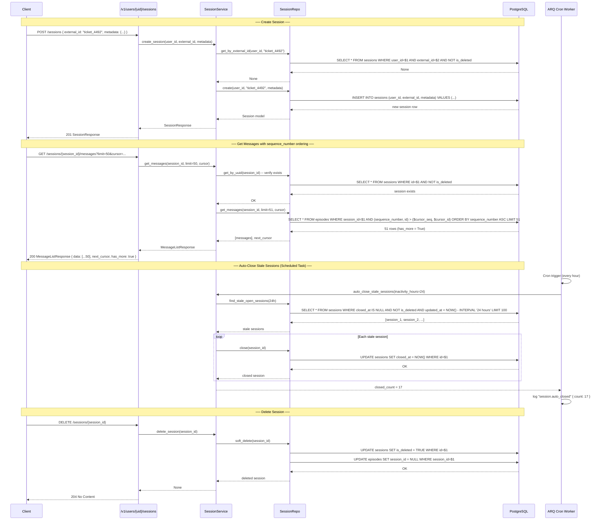

# Session CRUD — Implementation Guide

> **Domain:** User & Session Management
> **SRS Phase:** Phase 1 — Core Memory (Week 3)
> **Requirements:** SES-01 through SES-05, ING-05, ING-06
> **Doc Dependencies:** [01-user-crud.md](01-user-crud.md), [01-postgresql-schema.md](../01-data-models/01-postgresql-schema.md), [03-pagination.md](../08-api-gateway/03-pagination.md), [06-scheduled-tasks.md](../06-worker-system/06-scheduled-tasks.md)

---

## 1. Overview

Sessions group conversation messages into logical units — a support ticket, a coding session, a chat thread. Every message belongs to exactly one session. Sessions provide the grouping dimension for context retrieval, fact attribution, and message history pagination.

### 1.1 Key Design Decisions

| Decision | Rationale |
|----------|-----------|
| **`sequence_number` for episode ordering** | Using `created_at` for ordering causes ties when multiple messages arrive in the same millisecond. `sequence_number` is an auto-incrementing integer per session that provides deterministic, tie-free ordering. |
| **`__default__` session** | When callers send messages without a `session_id`, the system auto-assigns them to a `__default__` session per user. This avoids forcing every integration to create a session before sending the first message. |
| **Auto-close after 24h inactivity** | Sessions with no new messages for 24 hours are automatically closed (set `closed_at`). Closed sessions are excluded from default context retrieval but remain queryable. |
| **Metadata merge (not replace)** | On PATCH or when adding messages, `metadata` is JSONB deep-merged into existing session metadata. Same pattern as user metadata. |
| **No hard-delete cascade on session delete** | Deleting a session sets `is_deleted = true` and unlinks episodes from it. Episodes are preserved as orphaned history for audit purposes, then purged by the GDPR worker. |

### 1.2 Data Model (from SRS §7.1)

```sql
CREATE TABLE sessions (
    id              UUID PRIMARY KEY DEFAULT gen_random_uuid(),
    user_id         UUID NOT NULL REFERENCES users(id) ON DELETE CASCADE,
    external_id     TEXT NOT NULL,
    metadata        JSONB DEFAULT '{}',
    created_at      TIMESTAMPTZ NOT NULL DEFAULT now(),
    updated_at      TIMESTAMPTZ NOT NULL DEFAULT now(),
    closed_at       TIMESTAMPTZ,
    is_deleted      BOOLEAN NOT NULL DEFAULT FALSE,
    UNIQUE (user_id, external_id)
);
```

**Additional indexes:**

```sql
-- For auto-close queries: find sessions with no recent activity
CREATE INDEX idx_sessions_open_recent
    ON sessions (user_id, updated_at)
    WHERE closed_at IS NULL AND is_deleted = FALSE;

-- For listing sessions by user with pagination
CREATE INDEX idx_sessions_user_created
    ON sessions (user_id, created_at DESC, id)
    WHERE is_deleted = FALSE;

-- For default session lookup
CREATE INDEX idx_sessions_default
    ON sessions (user_id, external_id)
    WHERE external_id = '__default__';
```

### 1.3 Episode `sequence_number` Column

The `episodes` table (from the data models doc) requires a `sequence_number` column:

```sql
ALTER TABLE episodes ADD COLUMN sequence_number INTEGER NOT NULL DEFAULT 0;

-- Per-session sequence: unique within (session_id, sequence_number)
CREATE UNIQUE INDEX idx_episodes_session_sequence
    ON episodes (session_id, sequence_number);

-- Function to generate next sequence number for a session
CREATE SEQUENCE IF NOT EXISTS episode_seq_number;
```

In the SQLAlchemy model:

```python
# models/episode.py
class Episode(TimestampMixin, Base):
    __tablename__ = "episodes"

    id: Mapped[uuid.UUID] = mapped_column(primary_key=True, default=uuid.uuid4)
    session_id: Mapped[uuid.UUID] = mapped_column(
        ForeignKey("sessions.id", ondelete="SET NULL"),  # Orphan on session delete
        nullable=True,
        index=True,
    )
    user_id: Mapped[uuid.UUID] = mapped_column(
        ForeignKey("users.id", ondelete="CASCADE"), nullable=False, index=True
    )
    role: Mapped[str] = mapped_column(String(50), nullable=False)
    content: Mapped[str] = mapped_column(Text, nullable=False)
    metadata: Mapped[dict] = mapped_column(JSONB, default=dict)
    sequence_number: Mapped[int] = mapped_column(
        Integer, nullable=False, default=0,
        comment="Monotonically increasing per-session sequence number for deterministic ordering.",
    )
    embedding: Mapped[list[float] | None] = mapped_column(Vector(1536), nullable=True)
    graphiti_node_id: Mapped[str | None] = mapped_column(String(255), nullable=True)
```

---

## 2. Pydantic Schemas

Located in `services/api/schemas/sessions.py`.

### 2.1 CreateSessionRequest

```python
from datetime import datetime
from typing import Any
from uuid import UUID

from pydantic import BaseModel, Field


class CreateSessionRequest(BaseModel):
    """Request body for POST /v1/users/{user_id}/sessions."""

    external_id: str = Field(
        ...,
        description="Caller-defined session identifier. Must be unique per user.",
        min_length=1,
        max_length=255,
        examples=["session_abc", "ticket_4492", "chat_8f3a"],
    )
    metadata: dict[str, Any] = Field(
        default_factory=dict,
        description="Optional metadata for the session. Deep-merged on subsequent updates.",
        examples=[{"channel": "web", "language": "en", "agent_version": "2.1.0"}],
    )
```

### 2.2 SessionResponse

```python
class SessionResponse(BaseModel):
    """Response body for single-session endpoints."""

    id: UUID = Field(..., description="Internal MemGraph session UUID.")
    user_id: UUID = Field(..., description="User UUID this session belongs to.")
    external_id: str = Field(..., description="Caller-defined session identifier.")
    metadata: dict[str, Any] = Field(
        default_factory=dict, description="Session metadata JSON."
    )
    created_at: datetime = Field(..., description="Session creation timestamp (UTC).")
    updated_at: datetime = Field(..., description="Last activity timestamp (UTC).")
    closed_at: datetime | None = Field(
        default=None,
        description="Timestamp when session was auto-closed or manually closed. Null if open.",
    )
    is_deleted: bool = Field(
        default=False,
        description="Soft-delete flag. True when session has been deleted.",
    )

    model_config = {"from_attributes": True}
```

### 2.3 SessionResponseWithStats

```python
class SessionResponseWithStats(SessionResponse):
    """Extended session response with aggregate statistics."""

    message_count: int = Field(
        default=0, description="Total number of messages (episodes) in this session."
    )
    fact_count: int = Field(
        default=0,
        description="Total number of facts extracted from this session's messages.",
    )
    last_message_at: datetime | None = Field(
        default=None,
        description="Timestamp of the most recent message in this session.",
    )
    is_open: bool = Field(
        default=True,
        description="True if the session has not been closed and has recent activity.",
    )
```

### 2.4 MessageResponse

```python
class MessageResponse(BaseModel):
    """A single message (episode) within a session."""

    id: UUID = Field(..., description="Internal episode UUID.")
    role: str = Field(..., description="Message role: user/assistant/system/tool.")
    content: str = Field(..., description="Message body text.")
    metadata: dict[str, Any] = Field(
        default_factory=dict, description="Per-message metadata."
    )
    sequence_number: int = Field(
        ..., description="Zero-indexed position within the session."
    )
    created_at: datetime = Field(..., description="Message creation timestamp (UTC).")

    model_config = {"from_attributes": True}


class MessageListResponse(BaseModel):
    """Paginated response for session messages."""

    data: list[MessageResponse] = Field(
        ..., description="List of messages for the current page."
    )
    next_cursor: str | None = Field(
        default=None,
        description="Cursor for the next page. Null if no more results.",
    )
    has_more: bool = Field(
        default=False,
        description="True if there are additional pages beyond this one.",
    )
```

### 2.5 SessionListResponse

```python
class SessionListResponse(BaseModel):
    """Paginated response for GET /v1/users/{user_id}/sessions."""

    data: list[SessionResponse] = Field(
        ..., description="List of sessions for the current page."
    )
    next_cursor: str | None = Field(
        default=None,
        description="Cursor for the next page. Null if no more results.",
    )
    has_more: bool = Field(
        default=False,
        description="True if additional pages exist.",
    )
```

---

## 3. Repository Layer

Located in `services/api/repositories/session_repository.py`.

### 3.1 Core CRUD

```python
from collections.abc import Sequence
from datetime import datetime, timedelta, timezone
from typing import Any
from uuid import UUID

from sqlalchemy import Select, func, or_, select
from sqlalchemy.ext.asyncio import AsyncSession
from sqlalchemy.orm import joinedload

from app.models.episode import Episode
from app.models.fact import Fact
from app.models.session import Session


class SessionRepository:
    """All database access for sessions.

    Every session query is scoped to a user_id (which itself is
    tenant-scoped via the users table).
    """

    def __init__(self, db: AsyncSession) -> None:
        self._db = db

    # ── Create ──────────────────────────────────────────────────────

    async def create(
        self,
        user_id: UUID,
        external_id: str,
        metadata: dict[str, Any] | None = None,
    ) -> Session:
        """Create a new session for a user.

        Raises IntegrityError on duplicate (user_id, external_id).
        """
        session = Session(
            user_id=user_id,
            external_id=external_id,
            metadata=metadata or {},
        )
        self._db.add(session)
        await self._db.flush()
        await self._db.refresh(session)
        return session

    async def get_or_create_default(self, user_id: UUID, db: AsyncSession) -> Session:
        """Get or create the `__default__` session for a user.

        This is called during message ingestion when no session_id
        is provided. The default session is an implementation detail
        and is not exposed in session list endpoints.
        """
        session = await self.get_by_external_id(user_id, "__default__")
        if session is not None:
            return session

        # Race-safe: unique constraint on (user_id, external_id)
        from sqlalchemy.exc import IntegrityError

        session = Session(
            user_id=user_id,
            external_id="__default__",
            metadata={"auto_created": True},
        )
        self._db.add(session)
        try:
            await self._db.flush()
            await self._db.refresh(session)
        except IntegrityError:
            await self._db.rollback()
            session = await self.get_by_external_id(user_id, "__default__")
            if session is None:
                raise RuntimeError("Failed to get-or-create default session")

        return session

    # ── Read ────────────────────────────────────────────────────────

    async def get_by_external_id(
        self, user_id: UUID, external_id: str
    ) -> Session | None:
        """Look up a session by user_id and external_id."""
        result = await self._db.execute(
            select(Session).where(
                Session.user_id == user_id,
                Session.external_id == external_id,
                Session.is_deleted.is_(False),
            )
        )
        return result.scalar_one_or_none()

    async def get_by_uuid(self, session_id: UUID) -> Session | None:
        """Look up a session by internal UUID."""
        result = await self._db.execute(
            select(Session).where(
                Session.id == session_id,
                Session.is_deleted.is_(False),
            )
        )
        return result.scalar_one_or_none()

    # ── List ────────────────────────────────────────────────────────

    async def list(
        self,
        user_id: UUID,
        limit: int = 50,
        cursor: str | None = None,
        include_closed: bool = False,
        exclude_default: bool = True,
    ) -> tuple[list[Session], str | None]:
        """List sessions for a user with cursor-based pagination.

        By default: excludes `__default__` and closed sessions.
        """
        effective_limit = min(limit, 200) + 1

        query = select(Session).where(
            Session.user_id == user_id,
            Session.is_deleted.is_(False),
        )

        if exclude_default:
            query = query.where(Session.external_id != "__default__")

        if not include_closed:
            query = query.where(Session.closed_at.is_(None))

        # Cursor: composite (created_at DESC, id) for most-recent-first
        if cursor is not None:
            cursor_at, cursor_id = self._decode_cursor(cursor)
            query = query.where(
                or_(
                    Session.created_at < cursor_at,
                    Session.created_at == cursor_at,
                    Session.id > cursor_id,
                )
            )

        query = query.order_by(
            Session.created_at.desc(), Session.id.asc()
        ).limit(effective_limit)

        result = await self._db.execute(query)
        rows = result.scalars().all()

        has_more = len(rows) == effective_limit
        sessions = rows[:limit] if has_more else list(rows)

        next_cursor = None
        if has_more and sessions:
            last = sessions[-1]
            next_cursor = self._encode_cursor(last.created_at, last.id)

        return sessions, next_cursor

    # ── Get Messages (with sequence_number ordering) ────────────────

    async def get_messages(
        self,
        session_id: UUID,
        limit: int = 100,
        cursor: str | None = None,
    ) -> tuple[list[Episode], str | None]:
        """Get paginated messages for a session, ordered by sequence_number.

        Uses sequence_number for deterministic ordering — avoids
        timestamp-tie issues when multiple messages arrive in the
        same millisecond.
        """
        effective_limit = min(limit, 500) + 1

        query = select(Episode).where(
            Episode.session_id == session_id,
        )

        # Cursor: composite (sequence_number, id)
        if cursor is not None:
            cursor_seq, cursor_id = self._decode_message_cursor(cursor)
            query = query.where(
                or_(
                    Episode.sequence_number > cursor_seq,
                    Episode.sequence_number == cursor_seq,
                    Episode.id > cursor_id,
                )
            )

        query = query.order_by(
            Episode.sequence_number.asc(), Episode.id.asc()
        ).limit(effective_limit)

        result = await self._db.execute(query)
        rows = result.scalars().all()

        has_more = len(rows) == effective_limit
        messages = rows[:limit] if has_more else list(rows)

        next_cursor = None
        if has_more and messages:
            last = messages[-1]
            next_cursor = self._encode_message_cursor(
                last.sequence_number, last.id
            )

        return messages, next_cursor

    # ── Update Metadata ─────────────────────────────────────────────

    async def update_metadata(
        self,
        session_id: UUID,
        metadata: dict[str, Any],
    ) -> Session | None:
        """Deep-merge metadata into a session's existing metadata.

        New keys are added. Existing keys are overridden. Set a key
        to None to remove it.
        """
        result = await self._db.execute(
            select(Session).where(
                Session.id == session_id,
                Session.is_deleted.is_(False),
            )
        )
        session = result.scalar_one_or_none()
        if session is None:
            return None

        existing = dict(session.metadata or {})
        for k, v in metadata.items():
            if v is None:
                existing.pop(k, None)
            elif isinstance(v, dict) and isinstance(existing.get(k), dict):
                existing[k] = {**existing[k], **v}
            else:
                existing[k] = v
        session.metadata = existing

        await self._db.flush()
        await self._db.refresh(session)
        return session

    # ── Close ───────────────────────────────────────────────────────

    async def close(self, session_id: UUID) -> Session | None:
        """Mark a session as closed by setting closed_at = now()."""
        result = await self._db.execute(
            select(Session).where(
                Session.id == session_id,
                Session.is_deleted.is_(False),
            )
        )
        session = result.scalar_one_or_none()
        if session is None:
            return None

        session.closed_at = datetime.now(timezone.utc)
        await self._db.flush()
        await self._db.refresh(session)
        return session

    # ── Soft Delete ─────────────────────────────────────────────────

    async def soft_delete(self, session_id: UUID) -> Session | None:
        """Soft-delete a session. Episodes are unlinked but preserved."""
        result = await self._db.execute(
            select(Session).where(
                Session.id == session_id,
                Session.is_deleted.is_(False),
            )
        )
        session = result.scalar_one_or_none()
        if session is None:
            return None

        session.is_deleted = True
        # Unlink episodes: set session_id to NULL (FK ondelete=SET NULL)
        await self._db.execute(
            Episode.__table__.update()
            .where(Episode.session_id == session_id)
            .values(session_id=None)
        )
        await self._db.flush()
        await self._db.refresh(session)
        return session

    # ── Stats ───────────────────────────────────────────────────────

    async def get_stats(self, session_id: UUID) -> dict[str, Any]:
        """Return aggregate counts for a session.

        Single query — no N+1.
        """
        stmt = select(
            func.count(Episode.id).label("message_count"),
            func.count(Fact.id).label("fact_count"),
            func.max(Episode.created_at).label("last_message_at"),
        ).select_from(Session).outerjoin(
            Episode, Episode.session_id == Session.id
        ).outerjoin(
            Fact, Fact.source_episode_id == Episode.id
        ).where(Session.id == session_id).group_by(Session.id)

        result = await self._db.execute(stmt)
        row = result.one_or_none()

        if row is None:
            return {
                "message_count": 0,
                "fact_count": 0,
                "last_message_at": None,
            }

        return {
            "message_count": row.message_count or 0,
            "fact_count": row.fact_count or 0,
            "last_message_at": row.last_message_at,
        }

    # ── Auto-Close (for scheduled task) ─────────────────────────────

    async def find_stale_open_sessions(
        self, inactivity_hours: int = 24, batch_size: int = 100
    ) -> list[Session]:
        """Find sessions with no activity in the given window.

        Used by the auto-close scheduled task to close stale sessions.
        """
        cutoff = datetime.now(timezone.utc) - timedelta(hours=inactivity_hours)
        result = await self._db.execute(
            select(Session)
            .where(
                Session.closed_at.is_(None),
                Session.is_deleted.is_(False),
                Session.external_id != "__default__",
                Session.updated_at < cutoff,
            )
            .limit(batch_size)
        )
        return list(result.scalars().all())

    # ── Count ───────────────────────────────────────────────────────

    async def message_count(self, session_id: UUID) -> int:
        """Get total message count for a session."""
        result = await self._db.execute(
            select(func.count(Episode.id)).where(
                Episode.session_id == session_id
            )
        )
        return result.scalar() or 0

    # ── Next Sequence Number ────────────────────────────────────────

    async def next_sequence_number(self, session_id: UUID) -> int:
        """Get the next sequence number for a session.

        Uses SELECT COALESCE(MAX(sequence_number), -1) + 1.
        Thread-safe because increment is within the same transaction
        as the INSERT.
        """
        result = await self._db.execute(
            select(func.coalesce(func.max(Episode.sequence_number), -1) + 1).where(
                Episode.session_id == session_id
            )
        )
        return result.scalar()

    # ── Cursor Helpers ──────────────────────────────────────────────

    @staticmethod
    def _encode_cursor(created_at: datetime, session_id: UUID) -> str:
        import base64
        raw = f"{created_at.isoformat()}|{session_id.hex}"
        return base64.urlsafe_b64encode(raw.encode()).decode().rstrip("=")

    @staticmethod
    def _decode_cursor(cursor: str) -> tuple[datetime, UUID]:
        import base64
        try:
            padding = 4 - len(cursor) % 4
            if padding != 4:
                cursor += "=" * padding
            raw = base64.urlsafe_b64decode(cursor.encode()).decode()
            at_str, id_hex = raw.split("|", 1)
            return datetime.fromisoformat(at_str), UUID(hex=id_hex)
        except (ValueError, TypeError) as e:
            raise ValueError(f"Invalid cursor: {e}") from e

    @staticmethod
    def _encode_message_cursor(sequence_number: int, episode_id: UUID) -> str:
        import base64
        raw = f"{sequence_number}|{episode_id.hex}"
        return base64.urlsafe_b64encode(raw.encode()).decode().rstrip("=")

    @staticmethod
    def _decode_message_cursor(cursor: str) -> tuple[int, UUID]:
        import base64
        try:
            padding = 4 - len(cursor) % 4
            if padding != 4:
                cursor += "=" * padding
            raw = base64.urlsafe_b64decode(cursor.encode()).decode()
            seq_str, id_hex = raw.split("|", 1)
            return int(seq_str), UUID(hex=id_hex)
        except (ValueError, TypeError) as e:
            raise ValueError(f"Invalid cursor: {e}") from e
```

### 3.2 Key Query Patterns

```sql
-- Auto-close: find stale open sessions
SELECT id, user_id, external_id
FROM sessions
WHERE closed_at IS NULL
  AND is_deleted = FALSE
  AND external_id != '__default__'
  AND updated_at < NOW() - INTERVAL '24 hours'
LIMIT 100;

-- Next sequence number for message ordering
SELECT COALESCE(MAX(sequence_number), -1) + 1
FROM episodes
WHERE session_id = $1;

-- Session stats (single query)
SELECT COUNT(DISTINCT episodes.id) AS message_count,
       COUNT(DISTINCT facts.id) AS fact_count,
       MAX(episodes.created_at) AS last_message_at
FROM sessions
LEFT JOIN episodes ON episodes.session_id = sessions.id
LEFT JOIN facts ON facts.source_episode_id = episodes.id
WHERE sessions.id = $1
GROUP BY sessions.id;
```

---

## 4. Service Layer

Located in `services/api/services/session_service.py`.

```python
from datetime import datetime, timezone
from typing import Any
from uuid import UUID

from app.repositories.session_repository import SessionRepository
from app.core.exceptions import (
    DuplicateResourceError,
    ResourceNotFoundError,
    ValidationError,
)


class SessionService:
    """Business logic for session management."""

    def __init__(self, repo: SessionRepository) -> None:
        self._repo = repo

    # ── Create ──────────────────────────────────────────────────────

    async def create_session(
        self,
        user_id: UUID,
        external_id: str,
        metadata: dict[str, Any] | None = None,
    ) -> SessionResponse:
        """Create a new session for a user.

        Raises:
            DuplicateResourceError: Session with this external_id
                already exists for the user.
        """
        existing = await self._repo.get_by_external_id(user_id, external_id)
        if existing is not None:
            raise DuplicateResourceError(
                f"Session '{external_id}' already exists for user {user_id}"
            )

        session = await self._repo.create(
            user_id=user_id,
            external_id=external_id,
            metadata=metadata,
        )
        return SessionResponse.model_validate(session)

    # ── Get ─────────────────────────────────────────────────────────

    async def get_session(
        self, session_id: UUID
    ) -> SessionResponseWithStats:
        """Get session by UUID with aggregate stats.

        Raises:
            ResourceNotFoundError: Session not found or deleted.
        """
        session = await self._repo.get_by_uuid(session_id)
        if session is None:
            raise ResourceNotFoundError(f"Session {session_id} not found")

        stats = await self._repo.get_stats(session_id)
        response = SessionResponseWithStats.model_validate(session)
        response.message_count = stats["message_count"]
        response.fact_count = stats["fact_count"]
        response.last_message_at = stats["last_message_at"]
        response.is_open = session.closed_at is None
        return response

    # ── List ────────────────────────────────────────────────────────

    async def list_sessions(
        self,
        user_id: UUID,
        limit: int = 50,
        cursor: str | None = None,
        include_closed: bool = False,
    ) -> SessionListResponse:
        """List sessions for a user with pagination.

        By default returns only open (non-closed, non-deleted) sessions,
        excluding the `__default__` session.
        """
        if limit < 1 or limit > 200:
            raise ValidationError("limit must be between 1 and 200")

        sessions, next_cursor = await self._repo.list(
            user_id=user_id,
            limit=limit,
            cursor=cursor,
            include_closed=include_closed,
        )

        return SessionListResponse(
            data=[SessionResponse.model_validate(s) for s in sessions],
            next_cursor=next_cursor,
            has_more=next_cursor is not None,
        )

    # ── Get Messages ────────────────────────────────────────────────

    async def get_messages(
        self,
        session_id: UUID,
        limit: int = 100,
        cursor: str | None = None,
    ) -> MessageListResponse:
        """Get paginated messages for a session.

        Messages are ordered by sequence_number (deterministic,
        tie-free ordering).
        """
        if limit < 1 or limit > 500:
            raise ValidationError("limit must be between 1 and 500")

        # Verify session exists
        session = await self._repo.get_by_uuid(session_id)
        if session is None:
            raise ResourceNotFoundError(f"Session {session_id} not found")

        messages, next_cursor = await self._repo.get_messages(
            session_id=session_id,
            limit=limit,
            cursor=cursor,
        )

        return MessageListResponse(
            data=[MessageResponse.model_validate(m) for m in messages],
            next_cursor=next_cursor,
            has_more=next_cursor is not None,
        )

    # ── Close ───────────────────────────────────────────────────────

    async def close_session(self, session_id: UUID) -> SessionResponse:
        """Close a session manually.

        Raises:
            ResourceNotFoundError: Session not found.
        """
        session = await self._repo.close(session_id)
        if session is None:
            raise ResourceNotFoundError(f"Session {session_id} not found")
        return SessionResponse.model_validate(session)

    # ── Delete ──────────────────────────────────────────────────────

    async def delete_session(self, session_id: UUID) -> None:
        """Soft-delete a session. Episodes are unlinked but preserved.

        Raises:
            ResourceNotFoundError: Session not found.
        """
        session = await self._repo.soft_delete(session_id)
        if session is None:
            raise ResourceNotFoundError(f"Session {session_id} not found")

    # ── Auto-Close Stale Sessions ───────────────────────────────────

    async def auto_close_stale_sessions(
        self, inactivity_hours: int = 24
    ) -> int:
        """Close all sessions with no activity in the given window.

        Called by the ARQ scheduled task. Returns the count of
        sessions closed.

        This is the scheduled task handler for periodic auto-close.
        See [06-scheduled-tasks.md](../06-worker-system/06-scheduled-tasks.md).
        """
        sessions = await self._repo.find_stale_open_sessions(
            inactivity_hours=inactivity_hours
        )
        closed_count = 0
        for session in sessions:
            await self._repo.close(session.id)
            closed_count += 1

        logger.info(
            "session.auto_closed",
            extra={
                "count": closed_count,
                "inactivity_hours": inactivity_hours,
            },
        )
        return closed_count
```

---

## 5. Router Layer

Located in `services/api/routers/sessions.py`.

```python
from uuid import UUID

from fastapi import APIRouter, Depends, Query

from app.dependencies.auth import get_organization_id, get_user_or_404
from app.dependencies.db import get_session_service
from app.schemas.sessions import (
    CreateSessionRequest,
    MessageListResponse,
    SessionListResponse,
    SessionResponse,
    SessionResponseWithStats,
)
from app.services.session_service import SessionService

router = APIRouter(
    prefix="/v1/users/{user_id}/sessions",
    tags=["Sessions"],
)


@router.post("", response_model=SessionResponse, status_code=201)
async def create_session(
    user_id: UUID,
    body: CreateSessionRequest,
    service: SessionService = Depends(get_session_service),
    _org_id: UUID = Depends(get_organization_id),
) -> SessionResponse:
    """Create a new session for a user.

    The `external_id` is caller-defined and must be unique per user.
    Returns 409 if a session with this external_id already exists.
    """
    return await service.create_session(
        user_id=user_id,
        external_id=body.external_id,
        metadata=body.metadata,
    )


@router.get("", response_model=SessionListResponse)
async def list_sessions(
    user_id: UUID,
    service: SessionService = Depends(get_session_service),
    _org_id: UUID = Depends(get_organization_id),
    limit: int = Query(default=50, ge=1, le=200),
    cursor: str | None = Query(default=None),
    include_closed: bool = Query(
        default=False,
        description="If true, include closed sessions in the results.",
    ),
) -> SessionListResponse:
    """List sessions for a user with pagination.

    Excludes the `__default__` auto-created session and closed sessions
    by default. Set `include_closed=true` to include them.
    """
    return await service.list_sessions(
        user_id=user_id,
        limit=limit,
        cursor=cursor,
        include_closed=include_closed,
    )


@router.get("/{session_id}", response_model=SessionResponseWithStats)
async def get_session(
    user_id: UUID,
    session_id: UUID,
    service: SessionService = Depends(get_session_service),
    _org_id: UUID = Depends(get_organization_id),
) -> SessionResponseWithStats:
    """Get session details including aggregate statistics.

    Returns message count, fact count, last message timestamp,
    and whether the session is open.
    """
    return await service.get_session(session_id=session_id)


@router.get("/{session_id}/messages", response_model=MessageListResponse)
async def get_session_messages(
    user_id: UUID,
    session_id: UUID,
    service: SessionService = Depends(get_session_service),
    _org_id: UUID = Depends(get_organization_id),
    limit: int = Query(default=100, ge=1, le=500),
    cursor: str | None = Query(default=None),
) -> MessageListResponse:
    """Get paginated messages for a session.

    Messages are ordered by `sequence_number` for deterministic
    ordering (not by `created_at`, which can have ties).
    """
    return await service.get_messages(
        session_id=session_id,
        limit=limit,
        cursor=cursor,
    )


@router.post("/{session_id}/close", response_model=SessionResponse)
async def close_session(
    user_id: UUID,
    session_id: UUID,
    service: SessionService = Depends(get_session_service),
    _org_id: UUID = Depends(get_organization_id),
) -> SessionResponse:
    """Close a session manually.

    Closed sessions are excluded from default context retrieval but
    remain queryable via the GET endpoint.
    """
    return await service.close_session(session_id=session_id)


@router.delete("/{session_id}", status_code=204)
async def delete_session(
    user_id: UUID,
    session_id: UUID,
    service: SessionService = Depends(get_session_service),
    _org_id: UUID = Depends(get_organization_id),
) -> None:
    """Delete a session and unlink its episodes.

    Episodes are preserved as orphaned history (session_id set to NULL).
    They will be purged by the GDPR worker or the episode retention
    policy (see 03-gdpr-compliance.md).
    """
    await service.delete_session(session_id=session_id)
```

### 5.1 Exception Mappings

| HTTP Status | Condition | Error Code |
|-------------|-----------|------------|
| 201 | Session created | — |
| 200 | Session retrieved / closed / messages listed | — |
| 204 | Session deleted | — |
| 400 | Invalid limit/cursor | `VALIDATION_ERROR` |
| 404 | Session UUID not found | `RESOURCE_NOT_FOUND` |
| 409 | Duplicate `external_id` per user | `DUPLICATE_RESOURCE` |
| 422 | Schema validation failure | — (FastAPI default) |

---

## 6. Sequence Diagram



---

## 7. Testing Guide

### 7.1 Unit Tests

File: `tests/unit/repositories/test_session_repository.py`
File: `tests/unit/services/test_session_service.py`

```python
import pytest
from datetime import datetime, timedelta, timezone
from uuid import uuid4

# ── Repository Tests ─────────────────────────────────────────────

@pytest.mark.asyncio
@pytest.mark.unit
async def test_session_create(session_repo, db_session, user_factory):
    """A created session has id, timestamps, and correct field values."""
    user = await user_factory()
    session = await session_repo.create(
        user_id=user.id,
        external_id="ticket_001",
        metadata={"channel": "web"},
    )
    assert session.id is not None
    assert session.external_id == "ticket_001"
    assert session.user_id == user.id
    assert session.metadata["channel"] == "web"
    assert session.closed_at is None
    assert session.is_deleted is False


@pytest.mark.asyncio
@pytest.mark.unit
async def test_sequence_number_increments(session_repo, db_session, user_factory):
    """sequence_number increments correctly within a session."""
    user = await user_factory()
    session = await session_repo.create(user.id, "seq_test")

    # Simulate adding episodes (normally done by episode repo)
    from app.models.episode import Episode

    for i in range(3):
        seq = await session_repo.next_sequence_number(session.id)
        ep = Episode(
            session_id=session.id,
            user_id=user.id,
            role="user",
            content=f"message_{i}",
            sequence_number=seq,
        )
        db_session.add(ep)
    await db_session.flush()

    messages, _ = await session_repo.get_messages(session.id, limit=10)
    assert len(messages) == 3
    for idx, msg in enumerate(messages):
        assert msg.sequence_number == idx


@pytest.mark.asyncio
@pytest.mark.unit
async def test_get_or_create_default_session(session_repo, db_session, user_factory):
    """Default session is created once and reused."""
    user = await user_factory()

    s1 = await session_repo.get_or_create_default(user.id, db_session)
    s2 = await session_repo.get_or_create_default(user.id, db_session)

    assert s1.id == s2.id
    assert s1.external_id == "__default__"
    assert s1.metadata.get("auto_created") is True


@pytest.mark.asyncio
@pytest.mark.unit
async def test_session_list_excludes_default(session_repo, db_session, user_factory):
    """Session list endpoint excludes __default__ by default."""
    user = await user_factory()
    await session_repo.create(user.id, "regular_session")
    await session_repo.get_or_create_default(user.id, db_session)

    sessions, _ = await session_repo.list(user.id)
    external_ids = [s.external_id for s in sessions]
    assert "regular_session" in external_ids
    assert "__default__" not in external_ids


@pytest.mark.asyncio
@pytest.mark.unit
async def test_find_stale_sessions(session_repo, db_session, user_factory):
    """find_stale_open_sessions returns sessions inactive for 24h."""
    user = await user_factory()

    # Create a fresh session
    fresh = await session_repo.create(user.id, "fresh")
    # Manually set updated_at to 2 hours ago
    fresh.updated_at = datetime.now(timezone.utc) - timedelta(hours=2)

    # Create a stale session
    stale = await session_repo.create(user.id, "stale")
    stale.updated_at = datetime.now(timezone.utc) - timedelta(hours=48)

    await db_session.flush()

    stale_sessions = await session_repo.find_stale_open_sessions(
        inactivity_hours=24
    )
    stale_ids = [s.id for s in stale_sessions]
    assert stale.id in stale_ids
    assert fresh.id not in stale_ids


# ── Service Tests ───────────────────────────────────────────────

@pytest.mark.asyncio
@pytest.mark.unit
async def test_create_session_duplicate_409(session_service, user_factory):
    """Creating duplicate external_id raises DuplicateResourceError."""
    user = await user_factory()
    await session_service.create_session(user.id, "dup")
    with pytest.raises(DuplicateResourceError):
        await session_service.create_session(user.id, "dup")


@pytest.mark.asyncio
@pytest.mark.unit
async def test_close_session(session_service, session_repo, user_factory):
    """Close sets closed_at and makes session not open."""
    user = await user_factory()
    created = await session_service.create_session(user.id, "close_me")
    assert created.closed_at is None

    closed = await session_service.close_session(created.id)
    assert closed.closed_at is not None

    # Verify via repo
    fetched = await session_repo.get_by_uuid(created.id)
    assert fetched is not None
    assert fetched.closed_at is not None
```

### 7.2 Integration Tests

File: `tests/integration/test_session_api.py`

```python
@pytest.mark.asyncio
@pytest.mark.integration
async def test_create_session_full_flow(async_client, auth_headers, user_factory):
    """POST /sessions → 201 with valid response shape."""
    user = await user_factory()
    response = await async_client.post(
        f"/v1/users/{user.id}/sessions",
        json={
            "external_id": "session_001",
            "metadata": {"channel": "api", "version": "1.0"},
        },
        headers=auth_headers,
    )
    assert response.status_code == 201
    data = response.json()
    assert data["external_id"] == "session_001"
    assert data["metadata"]["channel"] == "api"
    assert data["user_id"] == str(user.id)
    assert data["is_deleted"] is False
    assert data["closed_at"] is None


@pytest.mark.asyncio
@pytest.mark.integration
async def test_list_sessions_pagination(async_client, auth_headers, user_factory):
    """GET /sessions paginates correctly."""
    user = await user_factory()
    for i in range(5):
        await async_client.post(
            f"/v1/users/{user.id}/sessions",
            json={"external_id": f"session_{i}"},
            headers=auth_headers,
        )

    # Fetch with limit 3
    response = await async_client.get(
        f"/v1/users/{user.id}/sessions?limit=3", headers=auth_headers
    )
    assert response.status_code == 200
    body = response.json()
    assert len(body["data"]) == 3
    assert body["has_more"] is True
    assert body["next_cursor"] is not None


@pytest.mark.asyncio
@pytest.mark.integration
async def test_get_session_messages_ordered(
    async_client, auth_headers, user_factory
):
    """Messages are returned in sequence_number order."""
    user = await user_factory()
    # Create session
    sess_resp = await async_client.post(
        f"/v1/users/{user.id}/sessions",
        json={"external_id": "msg_test"},
        headers=auth_headers,
    )
    session_id = sess_resp.json()["id"]

    # Ingest messages (normally done via POST /memory)
    await async_client.post(
        f"/v1/users/{user.id}/memory",
        json={
            "session_id": session_id,
            "messages": [
                {"role": "user", "content": "First"},
                {"role": "assistant", "content": "Second"},
                {"role": "user", "content": "Third"},
            ],
        },
        headers=auth_headers,
    )

    # Fetch messages
    msg_resp = await async_client.get(
        f"/v1/users/{user.id}/sessions/{session_id}/messages",
        headers=auth_headers,
    )
    assert msg_resp.status_code == 200
    messages = msg_resp.json()["data"]
    assert len(messages) == 3
    # Verify ordering
    contents = [m["content"] for m in messages]
    assert contents == ["First", "Second", "Third"]
    # Verify sequence numbers
    for idx, m in enumerate(messages):
        assert m["sequence_number"] == idx


@pytest.mark.asyncio
@pytest.mark.integration
async def test_close_session_manually(async_client, auth_headers, user_factory):
    """POST /close closes the session and reflects in GET."""
    user = await user_factory()
    sess_resp = await async_client.post(
        f"/v1/users/{user.id}/sessions",
        json={"external_id": "close_test"},
        headers=auth_headers,
    )
    session_id = sess_resp.json()["id"]

    close_resp = await async_client.post(
        f"/v1/users/{user.id}/sessions/{session_id}/close",
        headers=auth_headers,
    )
    assert close_resp.status_code == 200
    assert close_resp.json()["closed_at"] is not None


@pytest.mark.asyncio
@pytest.mark.integration
async def test_delete_session_204(async_client, auth_headers, user_factory):
    """DELETE /sessions/{id} → 204, session no longer visible."""
    user = await user_factory()
    sess_resp = await async_client.post(
        f"/v1/users/{user.id}/sessions",
        json={"external_id": "del_test"},
        headers=auth_headers,
    )
    session_id = sess_resp.json()["id"]

    del_resp = await async_client.delete(
        f"/v1/users/{user.id}/sessions/{session_id}",
        headers=auth_headers,
    )
    assert del_resp.status_code == 204

    get_resp = await async_client.get(
        f"/v1/users/{user.id}/sessions/{session_id}",
        headers=auth_headers,
    )
    assert get_resp.status_code == 404
```

### 7.3 Test Fixtures

```python
# tests/conftest.py (additions)

@pytest_asyncio.fixture
async def session_repo(async_db_session: AsyncSession) -> SessionRepository:
    return SessionRepository(db=async_db_session)


@pytest_asyncio.fixture
async def session_service(session_repo: SessionRepository) -> SessionService:
    return SessionService(repo=session_repo)


@pytest_asyncio.fixture
async def user_factory(async_db_session: AsyncSession):
    """Create a test user with minimal fields."""
    from app.models.user import User

    async def _factory(external_id: str | None = None) -> User:
        user = User(
            organization_id=uuid4(),
            external_id=external_id or f"test_user_{uuid4().hex[:8]}",
        )
        async_db_session.add(user)
        await async_db_session.flush()
        await async_db_session.refresh(user)
        return user

    return _factory
```

---

## 8. Edge Cases & Error Handling

| Edge Case | Behaviour | Implementation Note |
|-----------|-----------|-------------------|
| **Duplicate session external_id** | Returns 409 `DUPLICATE_RESOURCE` | Unique constraint `(user_id, external_id)` is the final guard. |
| **Messages without session_id** | Auto-assigned to `__default__` session | `get_or_create_default` is called in the ingestion service before persisting episodes. |
| **session_id points to deleted session** | Message is assigned to a new session (or `__default__`) | The ingestion service checks `is_deleted` before reusing a session. |
| **Messages arriving at the same millisecond** | `sequence_number` provides deterministic ordering | `created_at` ties are broken by `sequence_number` + `id` in the ORDER BY. |
| **Session with 0 messages** | Valid — session exists as a grouping container | `message_count: 0` in stats. No error on GET /messages (returns empty list). |
| **Close an already-closed session** | No-op — returns current state | `close()` checks `closed_at` is null before updating. Idempotent. |
| **Delete an already-deleted session** | Returns 404 | `get_by_uuid` filters `is_deleted = False`. |
| **List with include_closed=false and all sessions closed** | Returns empty list | `{ data: [], next_cursor: null, has_more: false }`. No error. |
| **Auto-close with no stale sessions** | Returns 0 | No error. Logged at INFO level. |
| **Default session in list** | Explicitly excluded | `exclude_default=True` in repo `list()`. Admin can query directly via `session_id`. |
| **Sequence number overflow** | Max sequence number is 2^31-1 (~2B per session) | Never reached in practice. The session would need 2B messages. |

---

## 9. ARQ Scheduled Task: Auto-Close Sessions

File: `services/worker/tasks/session_tasks.py`

```python
from datetime import datetime, timezone

from app.services.session_service import SessionService


async def auto_close_stale_sessions(ctx: dict) -> int:
    """ARQ scheduled task: close sessions inactive for 24h.

    Runs every hour via ARQ cron:
        cron(minute=0)  # top of every hour

    Returns the number of sessions closed.
    """
    service: SessionService = ctx["session_service"]
    closed_count = await service.auto_close_stale_sessions(
        inactivity_hours=24
    )
    return closed_count
```

**Register in the ARQ worker:**

```python
# services/worker/worker.py
from arq.connections import RedisSettings
from arq import create_pool

from app.core.config import settings
from app.services.session_service import SessionService
from app.tasks.session_tasks import auto_close_stale_sessions


async def startup(ctx: dict) -> None:
    ctx["session_service"] = SessionService(
        repo=SessionRepository(db=await create_db_session())
    )


class WorkerSettings:
    redis_settings = RedisSettings.from_dsn(settings.REDIS_URL)
    on_startup = startup
    functions = [auto_close_stale_sessions]
    cron_jobs = [
        {
            "cron": "0 * * * *",  # every hour
            "func": auto_close_stale_sessions.__name__,
            "unique": True,
            "timeout": 300,  # 5 minutes max
        },
    ]
```

---

## 10. Configuration

| Variable | Default | Description |
|----------|---------|-------------|
| `SESSION_AUTO_CLOSE_HOURS` | `24` | Hours of inactivity before auto-close |
| `SESSION_AUTO_CLOSE_CRON` | `"0 * * * *"` | Cron expression for auto-close sweep |
| `SESSION_LIST_DEFAULT_LIMIT` | `50` | Default page size for session list |
| `SESSION_LIST_MAX_LIMIT` | `200` | Maximum allowed limit for session list |
| `MESSAGE_LIST_DEFAULT_LIMIT` | `100` | Default page size for message list |
| `MESSAGE_LIST_MAX_LIMIT` | `500` | Maximum allowed limit for message list |

```python
# app/core/config.py
class Settings(BaseSettings):
    # Session auto-close
    session_auto_close_hours: int = Field(
        default=24, ge=1, le=720,
        description="Hours of inactivity after which a session is auto-closed.",
    )
    session_auto_close_cron: str = Field(
        default="0 * * * *",
        description="Cron expression for the auto-close scheduled task.",
    )

    # Pagination defaults
    session_list_default_limit: int = Field(default=50, ge=1, le=200)
    session_list_max_limit: int = Field(default=200, ge=1, le=1000)
    message_list_default_limit: int = Field(default=100, ge=1, le=500)
    message_list_max_limit: int = Field(default=500, ge=1, le=5000)
```

---

## 11. SRS Traceability Matrix

| SRS ID | Requirement | Implementation |
|--------|-------------|----------------|
| SES-01 | `POST /v1/users/{user_id}/sessions` — create a named session | §2.1 `CreateSessionRequest`, §5 POST router, §3.1 `create()` |
| SES-02 | `GET /v1/users/{user_id}/sessions` — list sessions with pagination | §2.5 `SessionListResponse`, §5 GET list router, §3.1 `list()` |
| SES-03 | `GET /v1/users/{user_id}/sessions/{session_id}` — get session detail | §2.3 `SessionResponseWithStats`, §5 GET router, §3.1 `get_stats()` |
| SES-04 | `GET /v1/users/{user_id}/sessions/{session_id}/messages` — paginated messages | §2.4 `MessageListResponse`, §5 GET messages router, §3.1 `get_messages()` |
| SES-05 | `DELETE /v1/users/{user_id}/sessions/{session_id}` — delete session | §5 DELETE router, §3.1 `soft_delete()` |
| ING-05 | Optional `session_id` for grouping messages into a session | §3.1 `get_or_create_default()` handles missing session_id |
| ING-06 | Optional `metadata` dict on messages | §3.1 `update_metadata()` supports JSONB merge on update |

---

## 12. Open Questions

| # | Question | Status |
|---|----------|--------|
| 1 | Should we expose `GET /v1/users/{user_id}/sessions/{session_id}/facts` for per-session fact queries? | Deferred — facts are queryable at user level. Can be added as a filter. |
| 2 | Should the auto-close task emit a webhook/webhook event when a session closes? | P2 enhancement. Webhook system not yet defined. |
| 3 | Should sessions have a `max_duration` config per org to force-close long-running sessions? | Deferred — can be added as an optional org-level setting. |

---

*Document maintained by Technical Writing Team · TheLinkAI · Updated: 2026-06-05*
