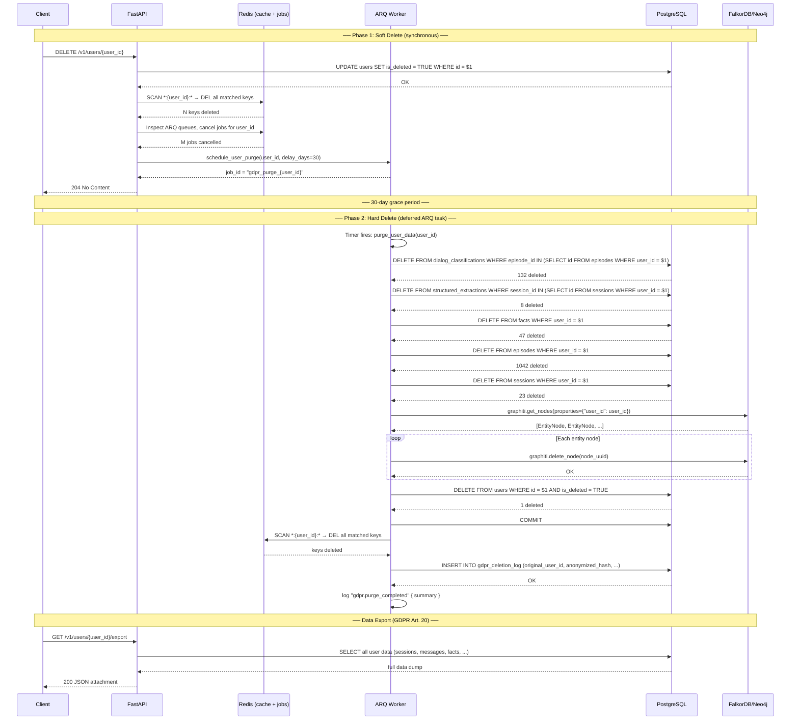

# GDPR Compliance — Implementation Guide

> **Domain:** User & Session Management
> **SRS Phase:** Phase 2 — Full Feature Parity (Week 5-7)
> **Requirements:** USR-04, SEC-04, WRK-01–WRK-07
> **Doc Dependencies:** [01-user-crud.md](01-user-crud.md), [02-session-crud.md](02-session-crud.md), [01-postgresql-schema.md](../01-data-models/01-postgresql-schema.md), [02-task-definitions.md](../06-worker-system/02-task-definitions.md), [06-scheduled-tasks.md](../06-worker-system/06-scheduled-tasks.md), [04-retry-backoff-dlq.md](../06-worker-system/04-retry-backoff-dlq.md)

---

## 1. Overview

GDPR compliance is a first-class architectural concern for OpenZep, not an afterthought. The system stores potentially sensitive personal data — conversation messages, extracted facts, entity relationships — across multiple storage backends (PostgreSQL, FalkorDB/Neo4j, Redis). Complete data deletion must be verifiable across all stores.

### 1.1 Regulatory Requirements

| GDPR Article | Requirement | OpenZep Implementation |
|-------------|-------------|------------------------|
| Art. 17 | Right to erasure ("right to be forgotten") | Two-phase deletion: soft-delete → 30-day grace → hard-delete + graph removal |
| Art. 20 | Right to data portability | `GET /v1/users/{user_id}/export` — full user data as JSON |
| Art. 5(1)(e) | Storage limitation | Episode retention: auto-purge episodes > 90 days old |
| Art. 32 | Security of processing | Log anonymization after deletion, secure cascading delete |
| Art. 12 | Exercise of rights by data subjects | Clear API endpoints with documented response formats |

### 1.2 Key Design Decisions

| Decision | Rationale |
|----------|-----------|
| **Two-phase delete** (soft → hard) | GDPR Art. 17 allows a "reasonable period" for data recovery. 30 days gives operators a window to restore accidentally deleted data while complying with the right to erasure. |
| **ARQ worker for cascade hard-delete** | Hard-deletion touches 7+ tables, a graph database, and Redis caches. Running this synchronously in the HTTP request would exceed the 200ms ingestion target. The worker provides observability, retries, and a dead-letter queue for failures. |
| **Graph deletion via Graphiti API** | Entity nodes in FalkorDB/Neo4j are deleted using Graphiti's built-in node removal, not raw Cypher/GQL. This ensures Graphiti's internal indices and temporal references are cleaned up correctly. |
| **Redis SCAN (not KEYS)** | `KEYS *:{user_id}:*` blocks Redis for large key spaces. `SCAN` is cursor-based and non-blocking, safe for production. |
| **ARQ job inspection** | Pending jobs referencing a deleted user must be cancelled to prevent processing data that no longer exists. ARQ's `inspect_job` API enables selective job cancellation. |
| **Log anonymization** | After deletion, the user_id in log entries is replaced with a SHA-256 hash. This preserves the log structure for debugging while making the data unlinkable to the original user. |
| **Episode retention as a separate policy** | Not all user deletion — the system auto-purges episodes older than 90 days regardless of user deletion status. This limits data sprawl and aligns with storage limitation obligations. |

### 1.3 Deletion Cascade Overview

```
User DELETE request
    │
    ▼
Soft-delete user (is_deleted = TRUE)
    │
    ├──► Cache invalidation (Redis SCAN + DEL)
    ├──► ARQ job inspection (cancel pending for this user)
    └──► Enqueue purge worker (30-day delay)
              │
              ▼
        [30 days later]
              │
              ▼
        ARQ purge worker:
        1. Delete dialog_classifications (by episode)
        2. Delete structured_extractions (by session)
        3. Delete facts (by user_id)
        4. Delete episodes (by user_id)
        5. Unlink & delete sessions (by user_id)
        6. Delete graph entity nodes (FalkorDB/Neo4j)
        7. Hard-delete user row
        8. Log anonymization
```

---

## 2. Two-Phase Deletion Flow

### 2.1 Phase 1: Soft Delete (HTTP Request)

Triggered by `DELETE /v1/users/{user_id}` (see [01-user-crud.md](01-user-crud.md)).

```python
# services/api/services/user_service.py

async def delete_user(self, user_id: UUID) -> None:
    """Soft-delete a user. Phase 1 of GDPR two-phase deletion.

    1. Mark user as is_deleted = TRUE (immediately invisible to queries)
    2. Invalidate all Redis caches for this user
    3. Cancel any pending ARQ jobs for this user
    4. Enqueue a purge worker task scheduled for 30 days later
    """
    user = await self._repo.soft_delete(user_id)
    if user is None:
        raise ResourceNotFoundError(f"User {user_id} not found")

    # Phase 1a: Invalidate Redis caches
    await self._cache_service.invalidate_user_caches(user_id)

    # Phase 1b: Cancel pending ARQ jobs
    await self._job_service.cancel_user_jobs(user_id)

    # Phase 1c: Enqueue purge task for 30 days later
    await schedule_user_purge(user_id, delay_days=30)

    # Log the soft-delete for audit
    logger.info(
        "user.soft_deleted",
        extra={
            "user_id": str(user_id),
            "purge_scheduled_days": 30,
        },
    )
```

### 2.2 Phase 1a: Cache Invalidation

```python
# services/api/services/cache_service.py

class CacheService:
    """Redis cache operations for GDPR compliance."""

    def __init__(self, redis: Redis) -> None:
        self._redis = redis

    async def invalidate_user_caches(self, user_id: UUID) -> int:
        """Delete all Redis keys referencing this user.

        Uses SCAN (not KEYS) to avoid blocking Redis.
        Key patterns to match:
            - context:{org_id}:{user_id}:*
            - user:{user_id}:*
            - session:{user_id}:*
            - fact:{user_id}:*
            - graph:{user_id}:*

        Returns:
            Number of keys deleted.
        """
        patterns = [
            f"*:{user_id}:*",
            f"*:{user_id}",
        ]

        total_deleted = 0
        for pattern in patterns:
            cursor = 0
            while True:
                cursor, keys = await self._redis.scan(
                    cursor=cursor, match=pattern, count=100
                )
                if keys:
                    deleted = await self._redis.delete(*keys)
                    total_deleted += deleted
                if cursor == 0:
                    break

        logger.info(
            "cache.user_invalidated",
            extra={
                "user_id": str(user_id),
                "keys_deleted": total_deleted,
            },
        )
        return total_deleted
```

### 2.3 Phase 1b: ARQ Job Inspection & Cancellation

```python
# services/api/services/job_service.py

class JobService:
    """ARQ job management for GDPR compliance."""

    def __init__(self, redis: Redis) -> None:
        self._redis = redis

    async def cancel_user_jobs(self, user_id: UUID) -> int:
        """Cancel all pending ARQ jobs for a user.

        Inspects the high and low priority queues. Any job whose
        function arguments contain the user_id is skipped (cancelled).

        This prevents enrichment workers from processing data that
        belongs to a deleted user.

        Returns:
            Number of jobs cancelled.
        """
        import arq

        pool = await arq.create_pool(self._redis)
        cancelled = 0

        for queue in ["high", "low"]:
            for job_id in await pool.queues[queue].inspect():
                job = await arq.job.Job(job_id, pool).info()
                if job is None:
                    continue

                # Check if any function argument contains this user_id
                args = job.get("args", [])
                kwargs = job.get("kwargs", {})
                if self._job_references_user(args, kwargs, user_id):
                    await pool.queues[queue].cancel(job_id)
                    cancelled += 1

        await pool.close()

        logger.info(
            "job.user_jobs_cancelled",
            extra={"user_id": str(user_id), "cancelled": cancelled},
        )
        return cancelled

    @staticmethod
    def _job_references_user(
        args: list, kwargs: dict, user_id: UUID
    ) -> bool:
        """Check if job arguments reference a user_id.

        Recursively searches args and kwargs for the user_id string.
        """
        user_id_str = str(user_id)

        for arg in args:
            if isinstance(arg, str) and user_id_str in arg:
                return True
            if isinstance(arg, dict) and _job_references_user(
                [], arg, user_id
            ):
                return True

        for value in kwargs.values():
            if isinstance(value, str) and user_id_str in value:
                return True
            if isinstance(value, dict):
                if _job_references_user([], value, user_id):
                    return True

        return False
```

### 2.4 Phase 2: Hard Delete (ARQ Worker)

File: `services/worker/tasks/gdpr_jobs.py`

```python
"""
GDPR compliance ARQ worker tasks.

All tasks in this module handle user data deletion across all storage
backends. Each task is idempotent — re-running after a partial failure
is safe.
"""

from datetime import datetime, timezone, timedelta
from uuid import UUID
from typing import Any

from arq.connections import ArqRedis
from sqlalchemy import select, text
from sqlalchemy.ext.asyncio import AsyncSession

from app.core.config import settings
from app.core.db import AsyncSessionLocal
from app.core.logging import logger
from app.models.dialog_classification import DialogClassification
from app.models.episode import Episode
from app.models.fact import Fact
from app.models.session import Session
from app.models.structured_extraction import StructuredExtraction
from app.models.user import User


# ── Public API ─────────────────────────────────────────────────


async def schedule_user_purge(
    ctx: dict, user_id: UUID, delay_days: int = 30
) -> str | None:
    """Enqueue a GDPR purge task for the given user.

    Called during Phase 1 (soft delete). The actual purge runs
    after `delay_days` via ARQ's deferred execution.

    Returns the job ID if enqueued successfully, None otherwise.
    """
    redis: ArqRedis = ctx["redis"]
    run_at = datetime.now(timezone.utc) + timedelta(days=delay_days)

    job = await redis.enqueue_job(
        "purge_user_data",
        _defer_until=run_at,
        _job_id=f"gdpr_purge_{user_id}",
        user_id=str(user_id),
    )

    logger.info(
        "gdpr.purge_scheduled",
        extra={
            "user_id": str(user_id),
            "run_at": run_at.isoformat(),
            "delay_days": delay_days,
            "job_id": job.job_id if job else None,
        },
    )

    return job.job_id if job else None


async def purge_user_data(ctx: dict, user_id: str) -> dict[str, Any]:
    """Phase 2: Hard-delete all data for a user across all stores.

    Called by ARQ worker after the 30-day grace period.

    Returns a summary dict:
    {
        "user_id": str,
        "deleted": { "episodes": int, "facts": int, ... },
        "graph_deleted": bool,
        "cache_invalidated": bool,
        "success": bool,
        "error": str | None,
    }
    """
    uid = UUID(user_id)
    result = {
        "user_id": user_id,
        "deleted": {},
        "graph_deleted": False,
        "cache_invalidated": False,
        "success": False,
        "error": None,
    }

    try:
        db: AsyncSession = ctx["db"]

        # Step 1: Delete dialog_classifications (joined to episodes)
        result["deleted"]["dialog_classifications"] = await _delete_dialog_classifications(
            db, uid
        )

        # Step 2: Delete structured_extractions (joined to sessions)
        result["deleted"]["structured_extractions"] = await _delete_structured_extractions(
            db, uid
        )

        # Step 3: Delete facts
        result["deleted"]["facts"] = await _delete_facts(db, uid)

        # Step 4: Delete episodes
        result["deleted"]["episodes"] = await _delete_episodes(db, uid)

        # Step 5: Delete sessions
        result["deleted"]["sessions"] = await _delete_sessions(db, uid)

        # Step 6: Delete graph entity nodes
        await _delete_graph_nodes(ctx, uid)
        result["graph_deleted"] = True

        # Step 7: Hard-delete the user row
        result["deleted"]["user"] = await _delete_user_row(db, uid)

        # Step 8: Invalidate remaining Redis caches
        await _invalidate_caches(ctx, uid)
        result["cache_invalidated"] = True

        # Step 9: Anonymize log references
        await _anonymize_logs(ctx, uid)

        result["success"] = True

        logger.info(
            "gdpr.purge_completed",
            extra={
                "user_id": user_id,
                **result["deleted"],
            },
        )

    except Exception as e:
        result["success"] = False
        result["error"] = str(e)
        logger.error(
            "gdpr.purge_failed",
            extra={
                "user_id": user_id,
                "error": str(e),
                "partial_deleted": result["deleted"],
            },
        )
        raise  # Let ARQ handle retry

    return result


# ── Deletion Steps ─────────────────────────────────────────────


async def _delete_dialog_classifications(
    db: AsyncSession, user_id: UUID
) -> int:
    """Delete dialog classifications via episode join.

    DELETE FROM dialog_classifications
    WHERE episode_id IN (
        SELECT id FROM episodes WHERE user_id = :user_id
    );
    """
    subq = select(Episode.id).where(Episode.user_id == user_id)
    result = await db.execute(
        text(
            "DELETE FROM dialog_classifications "
            "WHERE episode_id IN (SELECT id FROM episodes WHERE user_id = :uid)"
        ),
        {"uid": user_id},
    )
    await db.flush()
    return result.rowcount


async def _delete_structured_extractions(
    db: AsyncSession, user_id: UUID
) -> int:
    """Delete structured extractions via session join."""
    result = await db.execute(
        text(
            "DELETE FROM structured_extractions "
            "WHERE session_id IN (SELECT id FROM sessions WHERE user_id = :uid)"
        ),
        {"uid": user_id},
    )
    await db.flush()
    return result.rowcount


async def _delete_facts(db: AsyncSession, user_id: UUID) -> int:
    """Delete all facts for a user.

    DELETE FROM facts WHERE user_id = :user_id;
    """
    result = await db.execute(
        text("DELETE FROM facts WHERE user_id = :uid"),
        {"uid": user_id},
    )
    await db.flush()
    return result.rowcount


async def _delete_episodes(db: AsyncSession, user_id: UUID) -> int:
    """Delete all episodes for a user.

    DELETE FROM episodes WHERE user_id = :user_id;
    """
    result = await db.execute(
        text("DELETE FROM episodes WHERE user_id = :uid"),
        {"uid": user_id},
    )
    await db.flush()
    return result.rowcount


async def _delete_sessions(db: AsyncSession, user_id: UUID) -> int:
    """Delete all sessions for a user.

    DELETE FROM sessions WHERE user_id = :user_id;
    """
    result = await db.execute(
        text("DELETE FROM sessions WHERE user_id = :uid"),
        {"uid": user_id},
    )
    await db.flush()
    return result.rowcount


async def _delete_user_row(db: AsyncSession, user_id: UUID) -> int:
    """Hard-delete the user row.

    DELETE FROM users WHERE id = :user_id;
    """
    result = await db.execute(
        text("DELETE FROM users WHERE id = :uid AND is_deleted = TRUE"),
        {"uid": user_id},
    )
    await db.flush()
    await db.commit()
    return result.rowcount


# ── Graph Deletion ─────────────────────────────────────────────


async def _delete_graph_nodes(ctx: dict, user_id: UUID) -> None:
    """Delete all entity nodes for this user from the graph database.

    Uses Graphiti's node deletion API to ensure internal indices
    and temporal references are cleaned up correctly.

    The graph backend (FalkorDB or Neo4j) is abstracted behind the
    Graphiti client wrapper.
    """
    graphiti = ctx["graphiti_client"]

    # Find all entity nodes for this user
    # Graphiti stores user_id as a property on EntityNode nodes
    entity_nodes = await graphiti.get_nodes(
        properties={"org_id": str(ctx["org_id"]), "user_id": str(user_id)}
    )

    deleted_count = 0
    for node in entity_nodes:
        # ⚠️ Graphiti node deletion cascades to all edges connected
        # to this node. Edges are not individually enumerable.
        await graphiti.delete_node(node_uuid=node.uuid)
        deleted_count += 1

    logger.info(
        "gdpr.graph_nodes_deleted",
        extra={
            "user_id": str(user_id),
            "nodes_deleted": deleted_count,
        },
    )


# ── Cache Invalidation ─────────────────────────────────────────


async def _invalidate_caches(ctx: dict, user_id: UUID) -> int:
    """Invalidate all Redis caches for this user.

    Same pattern as Phase 1a, but run again in Phase 2 to catch
    any caches that were set during the 30-day grace period.
    """
    redis: ArqRedis = ctx["redis"]
    patterns = [f"*:{user_id}:*", f"*:{user_id}"]
    total_deleted = 0

    for pattern in patterns:
        cursor = 0
        while True:
            cursor, keys = await redis.scan(
                cursor=cursor, match=pattern, count=100
            )
            if keys:
                deleted = await redis.delete(*keys)
                total_deleted += deleted
            if cursor == 0:
                break

    return total_deleted


# ── Log Anonymization ──────────────────────────────────────────


async def _anonymize_logs(ctx: dict, user_id: UUID) -> None:
    """Anonymize user_id references in log storage.

    After user deletion, all log entries containing the original
    user_id are updated to use a SHA-256 hash of the user_id instead.

    This is a best-effort operation — log entries in Loki are
    immutable by default. The implementation strategy depends on
    the log backend:

    - **Loki**: Loki does not support log mutation. Instead, we
      add a processing rule at query time that rewrites the user_id
      field. This is configured at the Grafana Alloy level.
    - **File logs**: A post-processing script can scan log files
      and replace user_id with its hash.

    For the scope of this implementation, we log a warning at the
    application level so operators are aware of the limitation.
    """
    import hashlib

    user_id_hash = hashlib.sha256(str(user_id).encode()).hexdigest()[:16]

    logger.warning(
        "gdpr.log_anonymization_required",
        extra={
            "original_user_id": str(user_id),
            "anonymized_hash": user_id_hash,
            "note": (
                "Log entries with this user_id should be anonymized. "
                "For Loki: add a query-time rewrite rule. "
                "For file logs: run the GDPR log anonymization script."
            ),
        },
    )

    # Store the hash mapping for audit trail
    # This is stored in a separate, access-restricted table
    # and is only accessible to super-admins.
    db: AsyncSession = ctx["db"]
    await db.execute(
        text(
            "INSERT INTO gdpr_deletion_log (original_user_id, anonymized_hash, deleted_at) "
            "VALUES (:uid, :hash, NOW()) "
            "ON CONFLICT (original_user_id) DO NOTHING"
        ),
        {"uid": str(user_id), "hash": user_id_hash},
    )
    await db.flush()
```

---

## 3. Data Portability: Export Endpoint

### 3.1 Router

```python
# services/api/routers/users.py

from fastapi.responses import JSONResponse


@router.get("/{user_id}/export")
async def export_user_data(
    user_id: UUID,
    service: UserService = Depends(get_user_service),
    _org_id: UUID = Depends(get_organization_id),
) -> JSONResponse:
    """Export all data for a user in GDPR-compliant JSON format.

    Returns:
        A JSON object containing all user data:
        - profile: user record (excluding internal ids)
        - sessions: all sessions with messages
        - facts: all extracted facts
        - classifications: dialog classifications
        - extractions: structured data extractions
        - exported_at: ISO-8601 timestamp of export

    This endpoint is rate-limited to 10 requests per hour per user
    to prevent abuse.
    """
    data = await service.export_user_data(user_id=user_id)
    return JSONResponse(
        content=data,
        headers={
            "Content-Disposition": f'attachment; filename="memgraph_export_{user_id}.json"',
            "X-Export-Timestamp": datetime.now(timezone.utc).isoformat(),
        },
    )
```

### 3.2 Service

```python
# services/api/services/user_service.py

async def export_user_data(self, user_id: UUID) -> dict[str, Any]:
    """Export all user data for GDPR data portability (Art. 20).

    Collects data from all storage backends and returns a single
    JSON-serializable dictionary.

    Raises:
        ResourceNotFoundError: User not found or deleted.
    """
    user = await self._repo.get_by_uuid(user_id)
    if user is None or user.is_deleted:
        raise ResourceNotFoundError(f"User {user_id} not found")

    export = {
        "exported_at": datetime.now(timezone.utc).isoformat(),
        "format_version": "1.0",
        "profile": {
            "external_id": user.external_id,
            "name": user.name,
            "email": user.email,
            "metadata": user.metadata,
            "created_at": user.created_at.isoformat(),
        },
        "sessions": await self._export_sessions(user_id),
        "facts": await self._export_facts(user_id),
        "classifications": await self._export_classifications(user_id),
        "extractions": await self._export_extractions(user_id),
    }

    return export


async def _export_sessions(self, user_id: UUID) -> list[dict]:
    """Export all sessions with their messages."""
    sessions = await self._session_repo.list_all(user_id)
    result = []
    for session in sessions:
        messages, _ = await self._session_repo.get_messages(
            session.id, limit=10000  # high limit for export
        )
        result.append({
            "external_id": session.external_id,
            "metadata": session.metadata,
            "created_at": session.created_at.isoformat(),
            "closed_at": session.closed_at.isoformat() if session.closed_at else None,
            "is_deleted": session.is_deleted,
            "messages": [
                {
                    "role": m.role,
                    "content": m.content,
                    "metadata": m.metadata,
                    "sequence_number": m.sequence_number,
                    "created_at": m.created_at.isoformat(),
                }
                for m in messages
            ],
        })
    return result


async def _export_facts(self, user_id: UUID) -> list[dict]:
    """Export all extracted facts for a user."""
    facts = await self._fact_repo.list_all(user_id)
    return [
        {
            "content": f.content,
            "subject": f.subject,
            "predicate": f.predicate,
            "object": f.object,
            "confidence": f.confidence,
            "valid_from": f.valid_from.isoformat() if f.valid_from else None,
            "valid_to": f.valid_to.isoformat() if f.valid_to else None,
            "created_at": f.created_at.isoformat(),
        }
        for f in facts
    ]


async def _export_classifications(self, user_id: UUID) -> list[dict]:
    """Export all dialog classifications."""
    classifications = await self._classification_repo.list_by_user(user_id)
    return [
        {
            "intent": c.intent,
            "emotion": c.emotion,
            "valence": c.valence,
            "arousal": c.arousal,
            "raw": c.raw,
            "created_at": c.created_at.isoformat(),
        }
        for c in classifications
    ]


async def _export_extractions(self, user_id: UUID) -> list[dict]:
    """Export all structured extractions."""
    extractions = await self._extraction_repo.list_by_user(user_id)
    return [
        {
            "data": e.data,
            "created_at": e.created_at.isoformat(),
        }
        for e in extractions
    ]
```

---

## 4. Episode Retention Policy

Episodes older than the retention window are automatically purged, regardless of user deletion status. This limits data sprawl and satisfies GDPR Art. 5(1)(e) — storage limitation.

### 4.1 Scheduled Purge Task

```python
# services/worker/tasks/retention_tasks.py

from datetime import datetime, timedelta, timezone

from app.core.config import settings
from app.core.logging import logger


async def purge_old_episodes(ctx: dict) -> dict[str, int]:
    """ARQ scheduled task: purge episodes older than the retention window.

    Retention is configurable via EPISODE_RETENTION_DAYS (default: 90).

    DELETE FROM episodes
    WHERE created_at < NOW() - INTERVAL ':days days';

    Also deletes orphaned child data:
    - dialog_classifications for deleted episodes
    - facts referencing deleted episodes (source_episode_id)

    Runs daily via ARQ cron:
        cron(minute=0, hour=2)  # 2 AM daily

    Returns:
        Dict with deletion counts.
    """
    db: AsyncSession = ctx["db"]
    retention_days = settings.episode_retention_days
    cutoff = datetime.now(timezone.utc) - timedelta(days=retention_days)

    # Step 1: Delete dialog classifications for old episodes
    dc_result = await db.execute(
        text(
            "DELETE FROM dialog_classifications "
            "WHERE episode_id IN ("
            "  SELECT id FROM episodes WHERE created_at < :cutoff"
            ")"
        ),
        {"cutoff": cutoff},
    )

    # Step 2: Delete facts referencing old episodes
    facts_result = await db.execute(
        text(
            "DELETE FROM facts "
            "WHERE source_episode_id IN ("
            "  SELECT id FROM episodes WHERE created_at < :cutoff"
            ")"
        ),
        {"cutoff": cutoff},
    )

    # Step 3: Delete old episodes
    episodes_result = await db.execute(
        text("DELETE FROM episodes WHERE created_at < :cutoff"),
        {"cutoff": cutoff},
    )

    await db.commit()

    counts = {
        "dialog_classifications_deleted": dc_result.rowcount,
        "facts_deleted": facts_result.rowcount,
        "episodes_deleted": episodes_result.rowcount,
        "retention_days": retention_days,
        "cutoff": cutoff.isoformat(),
    }

    logger.info("retention.episodes_purged", extra=counts)
    return counts


async def purge_orphaned_graph_nodes(ctx: dict) -> dict[str, int]:
    """Purge graph entity nodes that belong to deleted users.

    This is a cleanup task for edge cases where graph nodes were
    not deleted during the GDPR purge (e.g., Graphiti API failure
    that was not retried).

    Scans for EntityNodes that reference a user_id no longer present
    in the PostgreSQL users table.

    Runs weekly via ARQ cron:
        cron(minute=0, hour=3, day_of_week=0)  # Sunday 3 AM
    """
    graphiti = ctx["graphiti_client"]
    db = ctx["db"]

    # Get all graph nodes with user_id property
    all_nodes = await graphiti.get_nodes(label="EntityNode")

    # Filter to nodes whose user_id is not in PostgreSQL
    deleted_count = 0
    for node in all_nodes:
        user_id = node.properties.get("user_id")
        if user_id is None:
            continue

        result = await db.execute(
            text("SELECT 1 FROM users WHERE id = :uid"),
            {"uid": UUID(user_id)},
        )
        if result.scalar_one_or_none() is None:
            # User doesn't exist — orphaned graph node
            await graphiti.delete_node(node_uuid=node.uuid)
            deleted_count += 1

    logger.info(
        "retention.orphaned_graph_nodes_purged",
        extra={"deleted_count": deleted_count},
    )

    return {"orphaned_graph_nodes_deleted": deleted_count}
```

### 4.2 Registering Retention Tasks in ARQ Worker

```python
# services/worker/worker.py

class WorkerSettings:
    redis_settings = RedisSettings.from_dsn(settings.REDIS_URL)
    on_startup = startup
    functions = [
        auto_close_stale_sessions,
        purge_user_data,
        purge_old_episodes,
        purge_orphaned_graph_nodes,
    ]
    cron_jobs = [
        # Auto-close stale sessions (hourly)
        {"cron": "0 * * * *", "func": "auto_close_stale_sessions",
         "unique": True, "timeout": 300},

        # GDPR purge tasks run daily at 2 AM
        {"cron": "0 2 * * *", "func": "purge_old_episodes",
         "unique": True, "timeout": 600},

        # Orphaned graph node cleanup runs weekly on Sunday 3 AM
        {"cron": "0 3 * * 0", "func": "purge_orphaned_graph_nodes",
         "unique": True, "timeout": 600},

        # User purge tasks are scheduled dynamically (not cron)
        # via schedule_user_purge() which uses _defer_until
    ]
```

---

## 5. Database Schema: GDPR Audit Trail

The system maintains a `gdpr_deletion_log` table to track all GDPR deletion events. This is an immutable audit trail.

```sql
-- migrations/versions/YYYYMMDD_gdpr_audit.py

CREATE TABLE gdpr_deletion_log (
    id                  UUID PRIMARY KEY DEFAULT gen_random_uuid(),
    original_user_id    UUID NOT NULL UNIQUE,
    anonymized_hash     TEXT NOT NULL,
    soft_deleted_at     TIMESTAMPTZ NOT NULL DEFAULT now(),
    purge_scheduled_at  TIMESTAMPTZ,
    purge_completed_at  TIMESTAMPTZ,
    purge_job_id        TEXT,
    purge_result        JSONB,
    deleted_by          UUID,  -- admin user who triggered deletion, NULL if self-service
    created_at          TIMESTAMPTZ NOT NULL DEFAULT now()
);

COMMENT ON TABLE gdpr_deletion_log IS
    'Immutable audit trail for GDPR deletion requests. Records are never deleted.';
COMMENT ON COLUMN gdpr_deletion_log.original_user_id IS
    'Original user UUID before deletion. Stored for audit only — not accessible via any API.';
```

---

## 6. Sequence Diagram



---

## 7. Testing Guide

### 7.1 Unit Tests

```python
# tests/unit/tasks/test_gdpr_purge.py

import pytest
from datetime import datetime, timedelta, timezone
from uuid import uuid4

from app.workers.tasks.gdpr_jobs import purge_user_data
from app.models.user import User
from app.models.session import Session
from app.models.episode import Episode
from app.models.fact import Fact


@pytest.mark.asyncio
@pytest.mark.integration
async def test_purge_user_data_cascade(
    arq_ctx, async_db_session, user_factory
):
    """purge_user_data deletes all data across all tables."""
    # Create a user with associated data
    org_id = uuid4()
    user = await user_factory()
    user.is_deleted = True  # Simulate Phase 1

    session = Session(
        user_id=user.id, external_id="gdpr_test", metadata={}
    )
    async_db_session.add(session)
    await async_db_session.flush()

    episode = Episode(
        session_id=session.id,
        user_id=user.id,
        role="user",
        content="GDPR test message",
        sequence_number=0,
    )
    async_db_session.add(episode)
    await async_db_session.flush()

    fact = Fact(
        user_id=user.id,
        content="Test fact",
        source_episode_id=episode.id,
    )
    async_db_session.add(fact)
    await async_db_session.flush()

    # Run the purge
    result = await purge_user_data(arq_ctx, str(user.id))

    # Verify all data is gone
    assert result["success"] is True
    assert result["deleted"]["facts"] >= 1
    assert result["deleted"]["episodes"] >= 1
    assert result["deleted"]["sessions"] >= 1
    assert result["deleted"]["user"] == 1

    # Verify user no longer exists
    user_check = await async_db_session.get(User, user.id)
    assert user_check is None


@pytest.mark.asyncio
@pytest.mark.unit
async def test_purge_already_deleted_user_is_idempotent(
    arq_ctx, async_db_session
):
    """Purging a non-existent user returns gracefully (no error)."""
    fake_id = uuid4()
    result = await purge_user_data(arq_ctx, str(fake_id))
    assert result["success"] is True
    assert result["deleted"]["user"] == 0  # No rows to delete


@pytest.mark.asyncio
@pytest.mark.unit
async def test_schedule_user_purge_creates_job(arq_ctx, user_factory):
    """schedule_user_purge enqueues a deferred ARQ job."""
    user = await user_factory()
    job_id = await schedule_user_purge(arq_ctx, user.id, delay_days=1)
    assert job_id is not None
    assert "gdpr_purge" in job_id
```

### 7.2 Integration Tests

```python
# tests/integration/test_gdpr_api.py

@pytest.mark.asyncio
@pytest.mark.integration
async def test_delete_user_cascade(async_client, auth_headers, user_factory):
    """DELETE /v1/users/{id} → user and all data become inaccessible."""
    # Create user with session and messages
    user_resp = await async_client.post(
        "/v1/users",
        json={"external_id": "gdpr_user"},
        headers=auth_headers,
    )
    user_id = user_resp.json()["id"]

    # Create a session
    await async_client.post(
        f"/v1/users/{user_id}/sessions",
        json={"external_id": "gdpr_session"},
        headers=auth_headers,
    )

    # Ingest a message
    await async_client.post(
        f"/v1/users/{user_id}/memory",
        json={
            "session_id": "gdpr_session",
            "messages": [{"role": "user", "content": "GDPR test"}],
        },
        headers=auth_headers,
    )

    # Delete the user
    del_resp = await async_client.delete(
        f"/v1/users/{user_id}", headers=auth_headers
    )
    assert del_resp.status_code == 204

    # Verify user is gone
    get_resp = await async_client.get(
        f"/v1/users/{user_id}", headers=auth_headers
    )
    assert get_resp.status_code == 404


@pytest.mark.asyncio
@pytest.mark.integration
async def test_export_user_data(
    async_client, auth_headers, user_factory
):
    """GET /v1/users/{user_id}/export returns comprehensive data."""
    # Create user with data
    user_resp = await async_client.post(
        "/v1/users",
        json={
            "external_id": "export_user",
            "name": "Alice Export",
            "email": "alice@export.com",
        },
        headers=auth_headers,
    )
    user_id = user_resp.json()["id"]

    # Export
    export_resp = await async_client.get(
        f"/v1/users/{user_id}/export", headers=auth_headers
    )
    assert export_resp.status_code == 200
    data = export_resp.json()

    assert data["format_version"] == "1.0"
    assert data["profile"]["external_id"] == "export_user"
    assert data["profile"]["name"] == "Alice Export"
    assert data["exported_at"] is not None
    assert "sessions" in data
    assert "facts" in data
    assert "classifications" in data
    assert "extractions" in data


@pytest.mark.asyncio
@pytest.mark.integration
async def test_export_deleted_user_returns_404(
    async_client, auth_headers, user_factory
):
    """Exporting a deleted user returns 404."""
    user_resp = await async_client.post(
        "/v1/users",
        json={"external_id": "export_deleted"},
        headers=auth_headers,
    )
    user_id = user_resp.json()["id"]

    await async_client.delete(f"/v1/users/{user_id}", headers=auth_headers)

    export_resp = await async_client.get(
        f"/v1/users/{user_id}/export", headers=auth_headers
    )
    assert export_resp.status_code == 404
```

### 7.3 Test Fixtures

```python
# tests/conftest.py (additions)

@pytest_asyncio.fixture
async def arq_ctx(async_db_session, redis_client, graphiti_client) -> dict:
    """Simulated ARQ worker context for testing GDPR tasks."""
    return {
        "db": async_db_session,
        "redis": redis_client,
        "graphiti_client": graphiti_client,
        "org_id": uuid4(),
    }


@pytest_asyncio.fixture
async def redis_client():
    """Integration test Redis client (via testcontainers)."""
    from testcontainers.redis import RedisContainer

    with RedisContainer("redis:7-alpine") as redis_container:
        redis_client = redis_container.get_client()
        yield redis_client
        redis_client.flushall()


@pytest_asyncio.fixture
async def graphiti_client():
    """Mock Graphiti client for testing."""
    from unittest.mock import AsyncMock, MagicMock

    client = MagicMock()
    client.get_nodes = AsyncMock(return_value=[])
    client.delete_node = AsyncMock(return_value=True)
    return client
```

---

## 8. Edge Cases & Error Handling

| Edge Case | Behaviour | Implementation Note |
|-----------|-----------|-------------------|
| **User re-created during grace period** | Treated as a new user | The soft-deleted user remains in the DB. A new `external_id` that matches the old one creates a new row. The old row is purged after 30 days. |
| **ARQ worker fails mid-cascade** | Next retry picks up where it left off | Each deletion step is idempotent. Facts are re-deleted (no-op). Episodes are re-deleted (no-op). The user row is only deleted if `is_deleted = TRUE`. |
| **Graph deletion partial failure** | Entity nodes that fail to delete are logged and retried | The worker logs failed node UUIDs. The orphaned graph node cleanup task (`purge_orphaned_graph_nodes`) catches leftovers. |
| **Concurrent delete + ingest** | Ingestion fails with 404 because user is already deleted | The service checks `is_deleted` before accepting ingestion. Race window is < 1ms. |
| **Export of user with 100K+ messages** | Streamed response or paginated export | For very large exports, the endpoint should use a streaming JSON response. The current implementation loads everything into memory — a streaming version can be added for large datasets. |
| **Cache keys created after Phase 1 invalidation** | Handled by Phase 2 re-invalidation | The `purge_user_data` task re-runs cache invalidation at the end of Phase 2. |
| **Log anonymization in Loki (immutable)** | Query-time rewrite rule | Loki does not support log mutation. A Grafana Alloy processing stage rewrites `user_id` at query time using the stored hash. |
| **gdpr_deletion_log privacy** | Only accessible to super-admins | The table is excluded from all tenant-scoped queries. Access is via admin-only endpoints. |
| **Retention task deletes episodes a user wanted to keep** | Configurable retention window with sensible default (90 days) | Users can configure `EPISODE_RETENTION_DAYS` per org. Set to 0 to disable auto-purge. |

---

## 9. Configuration

| Variable | Default | Description |
|----------|---------|-------------|
| `GDPR_PURGE_DELAY_DAYS` | `30` | Days between soft-delete and hard-delete |
| `EPISODE_RETENTION_DAYS` | `90` | Auto-purge episodes older than this (set 0 to disable) |
| `EXPORT_RATE_LIMIT_PER_HOUR` | `10` | Max export requests per user per hour |
| `CACHE_SCAN_COUNT` | `100` | Redis SCAN batch size for cache invalidation |
| `PURGE_WORKER_TIMEOUT` | `300` | Max seconds for purge task before ARQ kills it |
| `PURGE_WORKER_MAX_RETRIES` | `3` | Max retries for failed purge tasks |

```python
# app/core/config.py

class Settings(BaseSettings):
    # GDPR
    gdpr_purge_delay_days: int = Field(
        default=30, ge=1, le=365,
        description="Days between soft-delete and permanent deletion.",
    )

    # Episode retention
    episode_retention_days: int = Field(
        default=90, ge=0, le=3650,
        description="Auto-purge episodes older than this. 0 = disabled.",
    )

    # Export rate limiting
    export_rate_limit_per_hour: int = Field(
        default=10, ge=1, le=100,
        description="Max GDPR data export requests per user per hour.",
    )

    # Redis cache scan
    cache_scan_count: int = Field(
        default=100, ge=10, le=1000,
        description="Redis SCAN batch size for cache invalidation.",
    )

    # Purge worker
    purge_worker_timeout: int = Field(
        default=300, ge=60, le=3600,
        description="ARQ job timeout for GDPR purge tasks (seconds).",
    )
    purge_worker_max_retries: int = Field(
        default=3, ge=0, le=10,
        description="Max retries for failed GDPR purge tasks.",
    )
```

---

## 10. Retry Policy

The GDPR purge worker inherits the standard ARQ retry policy (see [04-retry-backoff-dlq.md](../06-worker-system/04-retry-backoff-dlq.md)):

```python
# arq worker settings for GDPR tasks
class WorkerSettings:
    # ...
    job_retry = {
        "purge_user_data": {
            "max_retries": settings.purge_worker_max_retries,
            "retry_delay": 300,  # 5 minutes between retries
            "backoff": True,     # exponential: 5min, 10min, 20min
        }
    }
```

After exhausting retries, the failed job enters the dead-letter queue. Operators are alerted via Grafana (see [02-metrics-definitions.md](../12-observability/02-metrics-definitions.md)):

```promql
# Alert: GDPR purge failure
rate(memgraph_worker_tasks_total{task="purge_user_data", status="failure"}[5m]) > 0
```

---

## 11. SRS Traceability Matrix

| SRS ID | Requirement | Implementation |
|--------|-------------|----------------|
| USR-04 | `DELETE /v1/users/{user_id}` — delete user and all associated data | §2.1 Phase 1 soft-delete + §2.4 Phase 2 hard-delete |
| SEC-04 | User deletion cascades to all tables and deletes graph nodes | §2.4 cascade through 7+ tables + FalkorDB `delete_node()` |
| WRK-01 | All NLP enrichment runs asynchronously via ARQ | GDPR purge is an ARQ task (see §2.4) |
| WRK-02 | Worker tasks are idempotent | All deletion steps use idempotent DELETE + SELECT patterns |
| WRK-03 | Exponential backoff on failures | §10 retry policy: 5min, 10min, 20min |
| WRK-04 | Queue depth exposed as Prometheus metrics | `memgraph_worker_queue_depth` gauge |
| WRK-06 | Dead-letter queue for failed tasks | After max retries, task goes to DLQ |

**GDPR-Specific Compliance:**

| GDPR Article | Requirement | Implementation Section |
|-------------|-------------|----------------------|
| Art. 17 | Right to erasure | §2 Two-phase deletion (soft → hard) |
| Art. 20 | Right to data portability | §3 Export endpoint (`/v1/users/{user_id}/export`) |
| Art. 5(1)(e) | Storage limitation | §4 Episode retention (purge_old_episodes) |
| Art. 32 | Security of processing | §2.3 Job cancellation, §2.2 Cache invalidation, §2.4 Log anonymization |

---

## 12. Open Questions

| # | Question | Status |
|---|----------|--------|
| 1 | Should we support a "dry-run" mode for GDPR purge to show what would be deleted? | P2 enhancement. Useful for admin dashboard. |
| 2 | How do we handle the case where a user's data is referenced by a community summary that includes other users? | Community summaries are anonymous aggregated clusters. Individual user deletion does not regenerate them. The community summarisation task handles this on its next run. |
| 3 | Should we implement data masking (pseudonymization) as an alternative to deletion for PII fields? | Can be added as a P2 feature. PII masking in messages (via the NLP pipeline's PII detection) is a separate concern. |
| 4 | Do we need a webhook notification when GDPR deletion completes? | Can be added. The `gdpr_deletion_log` table tracks completion timestamps — a polling approach works for now. |

---

*Document maintained by Technical Writing Team · TheLinkAI · Updated: 2026-06-05*
