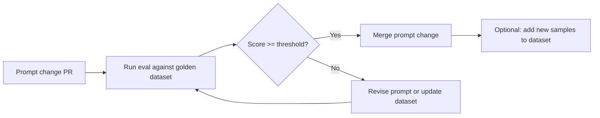

# Golden Datasets

| | |
|---|---|
| **Document** | 14-testing/03-golden-datasets.md |
| **Phase** | 5 — Hardening |
| **Author** | Technical Writing |
| **Status** | Draft |

---

## 1. Overview

Golden datasets are versioned, hand-annotated test fixtures used to evaluate LLM extraction quality and retrieval accuracy. They are the ground truth against which prompt changes and model upgrades are measured.

**Every prompt change requires a regression eval against the relevant golden dataset.** If the eval score drops, the prompt change is rejected.

---

## 2. Dataset Inventory

| Dataset | Format | Size | Description |
|---|---|---|---|
| `entity_extraction_v1` | JSON Lines | 100 conversations | Multi-turn convos with annotated entities (id, name, type, spans) |
| `fact_extraction_v1` | JSON Lines | 100 conversations | Convos with annotated fact triples (subject, predicate, object, confidence) |
| `classification_v1` | JSON Lines | 200 turns | Turns with annotated intent + emotion labels |
| `structured_extraction_v1` | JSON Lines | 50 sessions | Sessions with expected structured JSON output per schema |
| `retrieval_queries_v1` | JSON Lines | 50 queries | Queries with expected context content annotations and recall@k judgments |
| `cross_tenant_matrix` | JSON | 1 file | Tenant pairs, resource types, access methods for isolation testing |

### File Location

All datasets live under `tests/fixtures/datasets/`:

```
tests/fixtures/datasets/
├── entity_extraction_v1.jsonl
├── fact_extraction_v1.jsonl
├── classification_v1.jsonl
├── structured_extraction_v1.jsonl
├── retrieval_queries_v1.jsonl
└── cross_tenant_matrix.json
```

---

## 3. Dataset Specifications

### 3.1 `entity_extraction_v1.jsonl`

**Purpose:** Evaluate the entity extraction prompt's ability to identify named entities and their relationships from multi-turn conversations.

**Schema (per line):**

```json
{
  "id": "conv_001",
  "conversation": [
    {"role": "user", "content": "Hi, I'm Alice and I work at Acme Corp as a software engineer."},
    {"role": "assistant", "content": "Nice to meet you, Alice! How long have you been at Acme?"},
    {"role": "user", "content": "About 3 years now. I primarily work with Python and Golang."}
  ],
  "expected_entities": [
    {"name": "Alice", "type": "Person", "mentions": ["Alice", "I"]},
    {"name": "Acme Corp", "type": "Organization", "mentions": ["Acme Corp", "Acme"]},
    {"name": "Python", "type": "Technology", "mentions": ["Python"]},
    {"name": "Golang", "type": "Technology", "mentions": ["Golang"]}
  ],
  "expected_relationships": [
    {"subject": "Alice", "predicate": "works_at", "object": "Acme Corp"},
    {"subject": "Alice", "predicate": "uses", "object": "Python"},
    {"subject": "Alice", "predicate": "uses", "object": "Golang"}
  ],
  "meta": {
    "difficulty": "easy",
    "domain": "software",
    "has_coreference": true
  }
}
```

**Distribution of difficulty:**

| Difficulty | Count | Description |
|---|---|---|
| Easy | 40 | Explicit entities, clear relationships, no ambiguity |
| Medium | 35 | Coreferences, implicit relationships, mixed domains |
| Hard | 25 | Multiple entities (8+), domain-specific terms, sarcasm/negation |

**Metrics computed:**

- **Entity F1** (exact match on name + type)
- **Entity F1** (loose match — name normalized, type ignored)
- **Relationship recall** — fraction of expected relationships extracted
- **Hallucination rate** — extracted entities/relationships not in expected set

**Usage in tests:**

```python
# tests/evals/test_entity_extraction_eval.py
async def test_entity_extraction_accuracy(mock_llm, entity_dataset):
    results = await run_extraction_pipeline(mock_llm, entity_dataset)
    metrics = compute_entity_metrics(results, entity_dataset)
    assert metrics["entity_f1_exact"] >= 0.85
    assert metrics["hallucination_rate"] <= 0.10
```

### 3.2 `fact_extraction_v1.jsonl`

**Purpose:** Evaluate zero-shot fact extraction from conversations. Facts are (subject, predicate, object) triples with confidence scores.

**Schema (per line):**

```json
{
  "id": "fact_001",
  "conversation": [
    {"role": "user", "content": "I just bought the Pro plan. It cost $49 per month."},
    {"role": "assistant", "content": "Great choice! The Pro plan includes unlimited API calls."}
  ],
  "expected_facts": [
    {
      "content": "User purchased Pro plan",
      "subject": "user",
      "predicate": "purchased",
      "object": "Pro plan",
      "confidence": 1.0
    },
    {
      "content": "Pro plan costs $49 per month",
      "subject": "Pro plan",
      "predicate": "has_cost",
      "object": "$49 per month",
      "confidence": 0.95
    }
  ],
  "meta": {
    "domain": "billing",
    "num_facts": 2,
    "implicit_facts": 0
  }
}
```

**Distribution:**

| Domain | Count |
|---|---|
| Billing/subscriptions | 25 |
| Technical preferences | 25 |
| Personal information | 20 |
| Scheduling/events | 15 |
| Mixed/complex | 15 |

**Metrics:**

- **Fact recall@k** — proportion of expected facts found in top-k extracted facts
- **Fact precision** — proportion of extracted facts that match expected set
- **Confidence calibration** — correlation between model confidence and correctness

**Usage in tests:**

```python
async def test_fact_extraction_recall(mock_llm, fact_dataset):
    results = await run_fact_extraction(mock_llm, fact_dataset)
    metrics = compute_fact_metrics(results, fact_dataset)
    assert metrics["recall_at_5"] >= 0.80
```

### 3.3 `classification_v1.jsonl`

**Purpose:** Evaluate dialog classification — intent detection and emotion labelling per conversation turn.

**Schema (per line):**

```json
{
  "id": "turn_001",
  "conversation_context": [
    {"role": "user", "content": "I've been waiting for my order for 2 weeks!"},
    {"role": "assistant", "content": "I apologize for the delay. Let me check on that."}
  ],
  "target_turn": {
    "role": "user",
    "content": "I've been waiting for my order for 2 weeks!",
    "expected_intent": "complaint",
    "expected_emotion": "negative",
    "expected_valence": "negative",
    "expected_arousal": "high"
  },
  "meta": {
    "domain": "customer_support",
    "intent_ambiguous": false
  }
}
```

**Distribution of intents:**

| Intent | Count |
|---|---|
| question | 60 |
| complaint | 30 |
| chitchat | 30 |
| purchase_intent | 25 |
| feedback | 20 |
| greeting | 15 |
| farewell | 10 |
| request_for_help | 10 |

**Distribution of emotions:**

| Emotion | Count |
|---|---|
| positive | 60 |
| neutral | 80 |
| negative | 60 |

**Metrics:**

- **Intent accuracy** — correct intent label
- **Emotion accuracy** — correct emotion label
- **Valence accuracy** — correct valence (positive/neutral/negative)
- **Arousal accuracy** — correct arousal (low/high)

**Usage in tests:**

```python
async def test_classification_accuracy(mock_llm, classification_dataset):
    results = await run_classification_pipeline(mock_llm, classification_dataset)
    metrics = compute_classification_metrics(results, classification_dataset)
    assert metrics["intent_accuracy"] >= 0.88
    assert metrics["emotion_accuracy"] >= 0.85
```

### 3.4 `structured_extraction_v1.jsonl`

**Purpose:** Evaluate structured data extraction against a user-defined JSON Schema.

**Schema (per line):**

```json
{
  "id": "struct_001",
  "session": [
    {"role": "user", "content": "My name is John Doe, email is john@example.com, and I'm calling about order #12345"},
    {"role": "assistant", "content": "I can help with that. What seems to be the issue?"},
    {"role": "user", "content": "The order was supposed to arrive yesterday but it's still marked as processing."}
  ],
  "schema": {
    "type": "object",
    "properties": {
      "caller_name": {"type": "string"},
      "caller_email": {"type": "string", "format": "email"},
      "order_id": {"type": "string"},
      "issue_type": {"type": "string", "enum": ["late_delivery", "wrong_item", "damaged", "other"]},
      "urgency": {"type": "string", "enum": ["low", "medium", "high"]}
    },
    "required": ["caller_name", "order_id", "issue_type"]
  },
  "expected_output": {
    "caller_name": "John Doe",
    "caller_email": "john@example.com",
    "order_id": "12345",
    "issue_type": "late_delivery",
    "urgency": "high"
  },
  "meta": {
    "domain": "customer_support",
    "schema_complexity": "medium"
  }
}
```

**Distribution of schemas:**

| Complexity | Count | Description |
|---|---|---|
| Simple (≤ 5 fields) | 20 | Flat schema, primitive types only |
| Medium (6-10 fields) | 20 | Nested objects, enums, optional fields |
| Complex (11+ fields) | 10 | Deep nesting, arrays of objects, conditional required fields |

**Metrics:**

- **JSON Schema compliance** — does output validate against schema? (target: 100%)
- **Field accuracy** — proportion of fields with correct value
- **Complete extraction rate** — all required fields present

**Usage in tests:**

```python
async def test_structured_extraction(mock_llm, structured_dataset):
    results = await run_structured_extraction(mock_llm, structured_dataset)
    metrics = compute_structured_metrics(results, structured_dataset)
    assert metrics["schema_compliance"] == 1.0
    assert metrics["field_accuracy"] >= 0.90
```

### 3.5 `retrieval_queries_v1.jsonl`

**Purpose:** Evaluate the hybrid retrieval engine's ability to return relevant context for a given query.

**Schema (per line):**

```json
{
  "id": "query_001",
  "user_id": "eval_user_001",
  "query": "What programming language does Alice prefer?",
  "expected_context": {
    "relevant_facts": [
      {"fact_id": "fact_003", "content": "Alice prefers Python over JavaScript", "relevance": "high"},
      {"fact_id": "fact_017", "content": "Alice has 5 years of Python experience", "relevance": "medium"}
    ],
    "relevant_entities": ["entity_001"],
    "relevant_episodes": ["episode_012"],
    "irrelevant_facts": ["fact_001", "fact_002"]
  },
  "judgments": {
    "recall_at_1": 1.0,
    "recall_at_3": 1.0,
    "recall_at_5": 1.0,
    "ndcg_at_5": 0.95
  },
  "meta": {
    "query_type": "entity_attribute",
    "difficulty": "easy",
    "domain": "technology"
  }
}
```

**Query types:**

| Type | Count | Example |
|---|---|---|
| Entity attribute | 15 | "What language does Alice prefer?" |
| Temporal fact | 10 | "What project was Bob working on in March?" |
| Relationship | 10 | "Who does Alice work with?" |
| Complex (multi-hop) | 10 | "Which team members use Python and are based in London?" |
| Ambiguous | 5 | "Tell me about the project" (needs disambiguation) |

**Metrics:**

- **Recall@k** (k = 1, 3, 5) — proportion of relevant items in top-k results
- **nDCG@k** — normalized Discounted Cumulative Gain at k
- **MRR** — Mean Reciprocal Rank of first relevant result

**Usage in tests:**

```python
async def test_retrieval_recall(async_client, retrieval_dataset, seed_user_data):
    for entry in retrieval_dataset:
        response = await async_client.get(
            f"/v1/users/{entry['user_id']}/search",
            params={"query": entry["query"], "limit": 5},
        )
        metrics = compute_retrieval_metrics(response.json(), entry)
        assert metrics["recall_at_5"] >= entry["judgments"]["recall_at_5"]
```

### 3.6 `cross_tenant_matrix.json`

**Purpose:** Define tenant pairs, resource types, and access methods for cross-tenant isolation testing. See [04-cross-tenant-test-matrix.md](./04-cross-tenant-test-matrix.md) for the full test specification.

**Schema:**

```json
{
  "tenants": {
    "tenant_a": {"org_id": "org-a-0001", "api_key": "mg_test_tenant_a_key"},
    "tenant_b": {"org_id": "org-b-0002", "api_key": "mg_test_tenant_b_key"},
    "tenant_c": {"org_id": "org-c-0003", "api_key": "mg_test_tenant_c_key"}
  },
  "resources": {
    "users": {"endpoint": "/v1/users/{resource_id}", "list_endpoint": "/v1/users"},
    "sessions": {"endpoint": "/v1/users/{owner_id}/sessions/{resource_id}"},
    "facts": {"endpoint": "/v1/users/{owner_id}/facts/{resource_id}"},
    "episodes": {"endpoint": "/v1/users/{owner_id}/sessions/{session_id}/messages"},
    "graph_nodes": {"endpoint": "/v1/users/{owner_id}/graph/nodes/{resource_id}"},
    "search": {"endpoint": "/v1/users/{owner_id}/search", "is_search": true}
  },
  "access_methods": {
    "direct_id": {"description": "Access by known resource ID"},
    "enumeration": {"description": "List all resources"},
    "search": {"description": "Search by content"}
  },
  "test_cases": [
    {
      "id": "tc-001",
      "attacker": "tenant_a",
      "victim": "tenant_b",
      "resource_type": "users",
      "access_method": "direct_id",
      "expected_status": 404
    }
  ]
}
```

---

## 4. Dataset Versioning and Maintenance

### 4.1 Versioning Scheme

Datasets are versioned with a `_v{N}` suffix in the filename:

```
entity_extraction_v1.jsonl   → current version
entity_extraction_v2.jsonl   → next version (coexists during migration)
```

Version bumps occur when:
- An extraction prompt changes significantly
- A new entity type or ontology is added
- The eval threshold needs recalibration

### 4.2 Maintenance Process



**Process:**

1. **Adding new samples:** A new sample must be reviewed by two engineers — one who writes the conversation and expected output, one who validates it blind.
2. **Updating annotations:** If an annotation error is found, fix in a PR, document the change in a `CHANGELOG.md` alongside the dataset.
3. **Version migration:** When dataset v2 is introduced, keep v1 for at least 2 weeks. Run both evals in parallel. Drop v1 only when all active prompts are evaluated against v2.
4. **Sensitive data:** No real user data in golden datasets. All conversations are synthetic. If real data is required, it must be scrubbed of PII and approved by the tech lead.

### 4.3 Dataset Integrity Checks

Each dataset file includes an integrity header comment with a SHA-256 hash:

```jsonl
# entity_extraction_v1.jsonl
# version: 1
# created: 2026-06-05
# samples: 100
# sha256: a1b2c3d4e5f6a7b8c9d0e1f2a3b4c5d6e7f8a9b0c1d2e3f4a5b6c7d8e9f0a1b
# maintainer: @tech-lead
{...}
{...}
```

CI verifies the SHA-256 of the dataset file against the header hash on every eval run to detect accidental modifications.

---

## 5. Generating New Datasets

### 5.1 Script

A helper script lives at `scripts/generate_eval_dataset.py`:

```bash
python scripts/generate_eval_dataset.py \
    --type entity_extraction \
    --output tests/fixtures/datasets/entity_extraction_v2.jsonl \
    --samples 50 \
    --domains software,healthcare,finance
```

The script generates synthetic conversations using templated patterns and random assignment of entity/relationship types. Generated data must **always** be reviewed and corrected by a human before committing.

### 5.2 Quality Checklist for New Dataset Versions

- [ ] All conversations are synthetically generated (no real user data)
- [ ] Each sample has been reviewed by at least one engineer other than the author
- [ ] Annotated outputs are unambiguous — two reviewers would agree on the annotations
- [ ] Dataset covers edge cases: empty content, very long content, non-English content, multiple entity types in a single turn
- [ ] Negative examples included (conversations with no extractable facts)
- [ ] SHA-256 hash is updated in the header comment
- [ ] CHANGELOG entry describes what changed and why
- [ ] Old version is not deleted until migration period expires
