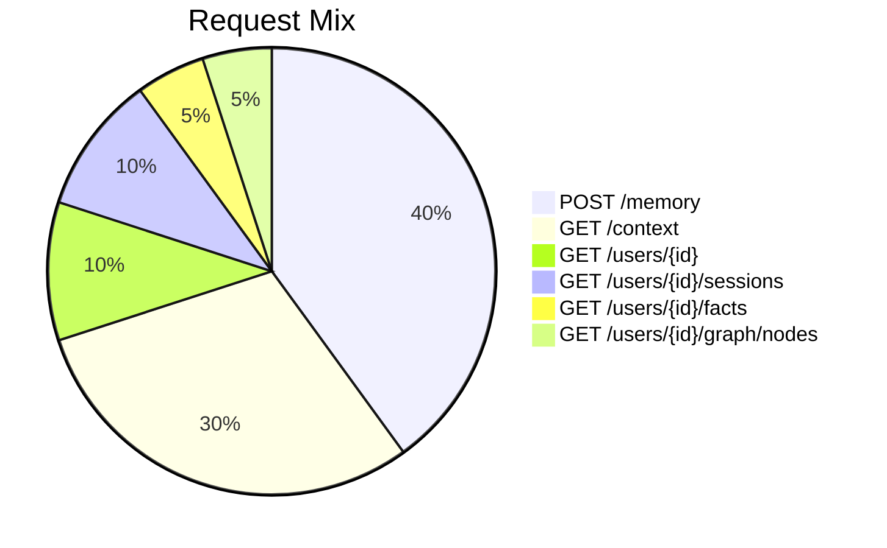

# Load Test Specification

| | |
|---|---|
| **Document** | 14-testing/05-load-test-spec.md |
| **Phase** | 5 — Hardening |
| **Author** | Technical Writing |
| **Status** | Draft |

---

## 1. Objective

Verify that OpenZep meets the Phase 5 performance targets (SRS §6.1):

| Metric | Target | Condition |
|---|---|---|
| `GET /context` p50 latency | ≤ 50ms | Warm cache |
| `GET /context` p99 latency | ≤ 300ms | Warm cache |
| `GET /context` p99 latency | ≤ 1500ms | Cold cache |
| `POST /memory` p99 ack | ≤ 200ms | Async 202 response |
| Sustained throughput | ≥ 500 req/s | Single API node |
| Error rate | < 0.1% | All request types |

---

## 2. Tool Selection: Locust

**Decision: Locust over k6.**

| Factor | Locust | k6 |
|---|---|---|
| Language | Python (team standard) | JavaScript |
| Team familiarity | High (already used at TheLinkAI) | Low |
| Declarative ramp profiles | Built-in `wait_time` + `constant_throughput` | Manual via `rampArrivals` |
| Distributed execution | Built-in (master/worker mode) | Built-in (k6-operator) |
| CI integration | Headless mode + CSV output | Native CI support |
| Custom Python logic | Full Python in test scenarios | JS only |

Locust runs in **headless mode** for CI and **web UI mode** for interactive debugging.

---

## 3. Test Hardware Specification

### 3.1 CI/Staging Environment (Nightly)

| Component | Spec | Notes |
|---|---|---|
| API server (1 node) | 4 vCPU, 8 GB RAM, SSD | Single node — test horizontal scaling separately |
| Worker (1 node) | 2 vCPU, 4 GB RAM | Matches production worker spec |
| PostgreSQL | Same host as API (or testcontainer) | pgvector/pgvector:pg15 with SSD |
| FalkorDB | Same host as API | falkordb/falkordb:latest |
| Redis | Same host as API | redis:7-alpine |
| Load generator | 2 vCPU, 4 GB RAM, separate instance | Locust master node |
| Network | 10 Gbps (within CI cluster) | Eliminate network bottleneck |

### 3.2 Local Baseline (Development)

Running `docker compose up` on a developer machine (16 GB M-series MacBook) can serve as a **baseline reference**, but the official pass/fail is determined on the CI staging environment. Document both sets of results.

---

## 4. Dataset Seed

The seed database must be populated before the load run begins. The seed script creates:

| Entity | Count | Details |
|---|---|---|
| Organizations | 10 | 10 distinct tenant orgs |
| Users | 1000 | 100 users per org |
| Sessions | 5000 | 5 sessions per user average (range: 3-7) |
| Episodes | 50000 | 10 episodes per session (5 user + 5 assistant turns) |
| Facts | 10000 | 2 facts per session average |
| Entity nodes | 5000 | 1 entity node per session average |

### 4.1 Seed Script

```python
# tests/performance/seed_data.py
"""Pre-populate the database with test data for load testing.
Run this before executing locust."""

import asyncio
from app.core.db import AsyncSessionLocal
from tests.factories.bulk import seed_performance_data

async def main():
    async with AsyncSessionLocal() as db:
        ids = await seed_performance_data(
            db=db,
            num_orgs=10,
            num_users=1000,
            sessions_per_user=5,
            episodes_per_session=10,
            facts_per_session=2,
            entity_nodes_per_session=1,
        )
        print(f"Seeded: {ids['user_count']} users, {ids['fact_count']} facts")

if __name__ == "__main__":
    asyncio.run(main())
```

**Seed time target:** < 60 seconds using bulk INSERT statements (not ORM). The `seed_performance_data` function uses raw SQL multi-row inserts wrapped in a single transaction.

### 4.2 Data Distribution for Realism

- **Session age distribution:** 60% recent (last 7 days), 30% medium (7-30 days), 10% old (30+ days)
- **Episode content:** varied topics across conversations (tech, lifestyle, support, sales) — pulled from a pool of 5000 templated conversation phrases to avoid duplicate detection optimizations
- **Fact confidence:** normally distributed around 0.85, σ = 0.10, clipped to [0.3, 1.0]
- **Graph connectivity:** small-world topology — 80% of relationships within the same org, 20% cross-org references (this is intentional: graph traversal should still respect org boundaries)

---

## 5. Request Mix

### 5.1 Traffic Distribution



| Endpoint | Weight | Details |
|---|---|---|
| `POST /v1/users/{user_id}/memory` | 40% | 2 messages per request (alternating user/assistant). Async 202 response |
| `GET /v1/users/{user_id}/context?query={text}` | 30% | Queries drawn from the retrieval_queries_v1 golden dataset. Varied query lengths (5-50 chars) |
| `GET /v1/users/{user_id}` | 10% | User profile retrieval |
| `GET /v1/users/{user_id}/sessions` | 10% | Session list, cursor-based pagination (limit=20) |
| `GET /v1/users/{user_id}/facts` | 5% | Fact list, with random confidence filters |
| `GET /v1/users/{user_id}/graph/nodes` | 5% | Graph node list, entity type filter |

### 5.2 User Distribution

- **User selection**: weighted random — 20% of users receive 80% of requests (Pareto distribution)
- **Organization selection**: uniform across all 10 orgs
- **Session selection**: recent sessions more likely to be queried (exponential decay from seed date)
- **Query content**: drawn from `retrieval_queries_v1.jsonl` golden dataset, randomly selected per context request

---

## 6. Ramp Profile

### 6.1 Phase 5 Target Profile

```
 500 req/s ┤                                          ╱╲
          ┤                                         ╱  ╲
          ┤                                        ╱    ╲
          ┤                                       ╱      ╲           Hold
 200 req/s ┤                                     ╱        ╲   ╔═══════════╗
          ┤                                    ╱          ╲   ║           ║
          ┤                                   ╱            ╲  ║           ║
 100 req/s ┤                     ╱╲         ╱              ╲ ║           ║
          ┤                    ╱  ╲       ╱                ╲ ║           ║
          ┤                   ╱    ╲     ╱                  ╲║           ║
          ┤      ╱╲         ╱      ╲   ╱                    ║║           ║
   0 req/s ┤─────╱──╲───────╱────────╲─╱─────────────────────║║───────────║──▶
          └──────┬──────────┬────────────────────────────────┬┬───────────┬──
                 0s         60s        120s                 180s        480s
                Start    Warm-up   Ramp to peak            Hold       Complete
                                                                   (5 min peak)
```

| Phase | Duration | Target RPS | Description |
|---|---|---|---|
| Ramp-up 1 | 0 → 60s | 0 → 100 | Linear ramp to baseline load |
| Hold 1 | 60 → 180s | 100 | Steady state at moderate load |
| Ramp-up 2 | 180 → 240s | 100 → 500 | Linear ramp to peak load |
| Hold 2 (peak) | 240 → 540s | 500 | Sustained peak load for 5 minutes |
| Cooldown | 540 → 570s | 500 → 0 | Graceful ramp down |

**Total duration:** 9 minutes 30 seconds.

### 6.2 Locust Configuration

```python
# tests/performance/locustfile.py
from locust import HttpUser, task, constant_throughput, between
from locust.user import wait_time

class MemGraphUser(HttpUser):
    """Simulates an API consumer sending realistic traffic."""

    # Wait time: dynamically adjusted to hit target RPS
    wait_time = constant_throughput(1)  # 1 req/s per user, scale users for RPS

    def on_start(self):
        """Pick a random user_id from the seed data to 'own' during this session."""
        self.user_id = self._pick_user()
        self.session_id = self._pick_session(self.user_id)
        self.api_key = self._pick_api_key()

        # Set auth header for all requests
        self.client.headers.update({
            "Authorization": f"Bearer {self.api_key}"
        })

    def _pick_user(self) -> str:
        # In production, loaded from a pre-generated list
        return f"user_{random.randint(1, 1000)}"

    def _pick_session(self, user_id: str) -> str:
        return f"session_{random.randint(1, 5000)}"

    def _pick_api_key(self) -> str:
        # 10 orgs, each with their own key
        return f"mg_live_loadtest_org_{random.randint(1, 10)}"

    @task(40)
    def post_memory(self):
        """POST /memory — ingest 2 messages."""
        self.client.post(
            f"/v1/users/{self.user_id}/memory",
            json={
                "session_id": self.session_id,
                "messages": [
                    {
                        "role": "user",
                        "content": random.choice(CONVERSATION_STARTERS),
                    },
                    {
                        "role": "assistant",
                        "content": random.choice(ASSISTANT_REPLIES),
                    },
                ],
            },
            name="POST /memory",
        )

    @task(30)
    def get_context(self):
        """GET /context — retrieve assembled context."""
        self.client.get(
            f"/v1/users/{self.user_id}/context",
            params={"query": random.choice(SEARCH_QUERIES)},
            name="GET /context",
        )

    @task(10)
    def get_user(self):
        """GET /users/{id} — user profile."""
        self.client.get(
            f"/v1/users/{self.user_id}",
            name="GET /users/{id}",
        )

    @task(10)
    def get_sessions(self):
        """GET /users/{id}/sessions — list sessions."""
        self.client.get(
            f"/v1/users/{self.user_id}/sessions",
            params={"limit": 20},
            name="GET /users/{id}/sessions",
        )

    @task(5)
    def get_facts(self):
        """GET /users/{id}/facts — list facts."""
        self.client.get(
            f"/v1/users/{self.user_id}/facts",
            params={"limit": 20},
            name="GET /users/{id}/facts",
        )

    @task(5)
    def get_graph_nodes(self):
        """GET /users/{id}/graph/nodes — list entity nodes."""
        self.client.get(
            f"/v1/users/{self.user_id}/graph/nodes",
            params={"limit": 20, "type": "Person"},
            name="GET /users/{id}/graph/nodes",
        )
```

### 6.3 Spawn Rate

| Scenario | Users | Spawn Rate | Worker Count |
|---|---|---|---|
| Pre-peak (100 RPS) | 100 | 10/s | 1 Locust worker |
| Peak (500 RPS) | 500 | 20/s | 4 Locust workers (distributed) |

```bash
# Pre-peak (single node)
locust -f tests/performance/locustfile.py \
    --headless \
    --host http://localhost:8000 \
    --users 100 \
    --spawn-rate 10 \
    --run-time 3m \
    --csv=results/prepeak \
    --html=report_prepeak.html

# Peak (distributed, 1 master + 4 workers)
# Start master
locust -f tests/performance/locustfile.py \
    --master \
    --headless \
    --host http://api:8000 \
    --users 500 \
    --spawn-rate 20 \
    --run-time 6m \
    --csv=results/peak \
    --html=report_peak.html \
    --expect-workers=4

# Start workers (in parallel, 4 terminals or CI steps)
locust -f tests/performance/locustfile.py --worker --master-host=locust-master
```

---

## 7. Pass Criteria

### 7.1 Primary Metrics

| Metric | Threshold | Calculation |
|---|---|---|
| `GET /context` p50 latency | ≤ 50ms | From Locust response time percentiles |
| `GET /context` p99 latency | ≤ 300ms | From Locust response time percentiles |
| `POST /memory` p99 ack latency | ≤ 200ms | From Locust response time percentiles (202 only) |
| Overall error rate | < 0.1% | From Locust failure stats |
| Sustained throughput | ≥ 500 req/s over 5 min | From Locust RPS at peak hold phase |
| Worker task completion rate | ≥ 99% within 30s | From ARQ metrics (Prometheus) |

### 7.2 Secondary Metrics (Informational, Not Gating)

| Metric | Purpose |
|---|---|
| `GET /context` cold cache p99 | Benchmark for cache miss penalty |
| `GET /context` p99 by query type | Identify slow query patterns |
| P99 latency by endpoint | Ranking: which endpoints need optimization |
| CPU/Memory utilization | Capacity planning data |
| DB connection pool usage | Identify pool exhaustion under load |
| Redis cache hit ratio | Validate cache effectiveness |
| Worker queue depth | Identify backlog under peak ingestion |
| Context assembly breakdown | Time spent in retrieval vs. fusion vs. formatting |

### 7.3 Failure Conditions

The test is marked **FAIL** if any:

1. `GET /context` p99 > 300ms during the peak hold phase
2. Error rate ≥ 0.1% during any 60-second window in the peak hold phase
3. Any endpoint returns 5xx errors due to resource exhaustion (not normal 4xx)
4. Auth failures spike due to rate limiting overlap (rate limiter is incorrectly throttling valid requests)
5. Locust itself crashes or the load generator cannot maintain target RPS

---

## 8. Measurement and Reporting

### 8.1 Locust Output

```bash
# CSV results (all samples)
locust --csv=results/loadtest --csv-full-history

# HTML report (summary with charts)
locust --html=report.html

# These produce:
# results/loadtest_stats.csv          — aggregated stats
# results/loadtest_stats_history.csv  — time-series
# results/loadtest_failures.csv       — failure details
# results/loadtest_exceptions.csv     — exception tracebacks
# report.html                         — interactive charts
```

### 8.2 Prometheus Metrics (for cross-referencing)

During the load test, scrape the API's `/metrics` endpoint to correlate Locust results with application-level metrics:

| Prometheus Metric | Maps to |
|---|---|
| `memgraph_http_request_duration_seconds` | Locust response time percentiles |
| `memgraph_http_requests_total` | Locust RPS |
| `memgraph_worker_queue_depth` | Worker backlog |
| `memgraph_llm_tokens_total` | LLM cost estimate |

### 8.3 Report Template

Each load test run produces a standardized report section:

```
## Load Test Report — {date}

### Test Configuration
- API server: {spec}
- Load generator: {spec}
- Seed data: {orgs} orgs, {users} users, {episodes} episodes
- Ramp profile: {description}
- Peak target: {target_rps}

### Results

| Metric | Target | Actual | Status |
|---|---|---|---|
| GET /context p50 | ≤ 50ms | {p50}ms | ✅/❌ |
| GET /context p99 | ≤ 300ms | {p99}ms | ✅/❌ |
| POST /memory p99 ack | ≤ 200ms | {p99_ack}ms | ✅/❌ |
| Error rate | < 0.1% | {err}% | ✅/❌ |
| Peak throughput | ≥ 500 req/s | {rps} req/s | ✅/❌ |

### Anomalies
{list any 5xx, timeouts, or unexpected patterns}
```

---

## 9. Run Frequency

| Trigger | Action | Notes |
|---|---|---|
| **Nightly (scheduled)** | Full load test (peak + steady-state) | Against CI staging environment |
| **Per-commit (PR only)** | Quick smoke load test | 30s at 100 RPS, check p99 < 500ms. Tag `perf:impact` required for PRs that touch context assembly, retrieval, or cache code |
| **Weekly** | Extended load test | 15 min at 500 RPS to check for memory leaks and connection pool exhaustion |
| **Pre-release** | Full matrix | All scenarios (cold cache, peak, ingestion flood), all graph backends (FalkorDB, Neo4j) |

### 9.1 Perf-Impact PR Label

PRs that modify any of the following must carry the `perf:impact` label and trigger a quick smoke load test:

- `services/context_service.py` — context assembly logic
- `services/retrieval_service.py` — hybrid retrieval (RRF, BFS depth)
- `core/rrf.py` — RRF algorithm
- `repositories/episode_repository.py` — episode query patterns
- `dependencies/cache.py` — Redis cache config
- Any Alembic migration that adds/removes indexes
- Any change to `prompts/` (prompt changes affect LLM call latency)

---

## 10. Troubleshooting Common Issues

| Symptom | Likely Cause | Fix |
|---|---|---|
| p99 latency climbs linearly during ramp | Connection pool exhaustion | Increase `pool_size` / `max_overflow` in DB config |
| p99 latency spikes but p50 is fine | GC pauses or cold start | Enable PyPy or tune GC; pre-warm connections |
| Error rate spikes at exactly 500 RPS | Configuration cap or rate limiter | Check `MAX_WORKERS`, `pool_size`, rate limit thresholds |
| `POST /memory` errors are 502/503 | ARQ queue full; Redis connection pool exhausted | Increase Redis pool size; scale worker replicas |
| Locust reports 0 RPS | Load generator can't reach target; check network | Verify load generator spec; reduce spawning concurrency |
| Seed script takes > 60 seconds | ORM overhead; use raw INSERT | Switch to `bulk_insert_mappings` or raw SQL multi-row INSERT |
| Context results are all empty | Cache warming issue; no seed data for query terms | Ensure seed data includes content matching query terms |
