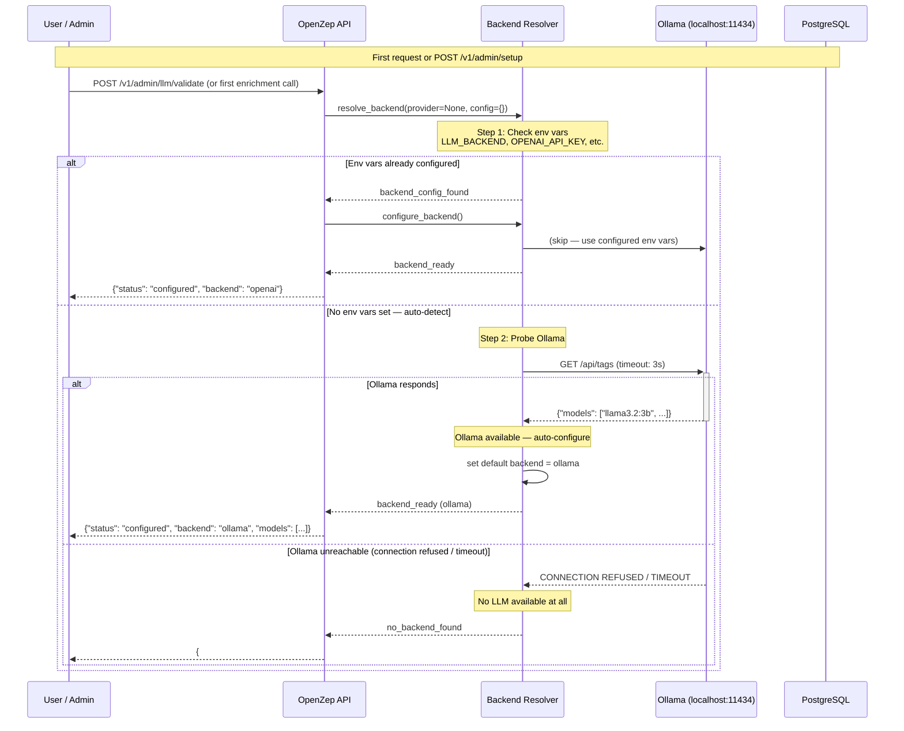

# Bring Your Own Key (BYOK) — LLM Strategy

> **Phase:** 0 (Foundation — required before any NLP enrichment can run)
> **SRS References:** OQ-03 (LLM cost at scale), PORT-04 (air-gapped deployment), PORT-01 (pgvector dependency), OQ-04 (BYOK requirement)
> **Index:** 17 — Cross-cutting: every NLP pipeline doc (5.2–5.7) depends on this
> **Design Authority:** @senior-dev (backend implementations), @architect (abstraction design), @devops (env var config, air-gapped deployment)

---

## 1. Overview

OpenZep ships with **zero bundled API keys**. The system does not hardcode a default LLM provider, embed a trial key, or assume any particular cloud backend. Instead, users bring their own LLM — whether that is a local Ollama instance, an OpenAI account, Azure OpenAI, Anthropic, or a custom provider.

This design is not optional. It is driven by:

| Driver | Why |
|--------|-----|
| **Zero default cost** | Users should not pay for infrastructure they did not choose. Ollama is free, local, and private. |
| **Air-gapped deployment** | Enterprise users running in isolated networks cannot reach OpenAI. Ollama or a custom backend is the only option. |
| **Per-org isolation** | Multitenant deployments may have Org A on OpenAI (richer extraction) and Org B on Ollama (budget-constrained). Both coexist. |
| **Future-proofing** | The LLM landscape changes quarterly. A pluggable backend means new providers (e.g., Google Gemini, AWS Bedrock, Mistral API) can be added without changing the enrichment pipeline. |
| **No key leakage risk** | Since no default key ships, there is nothing to leak in the source code, Docker image, or CI artifacts. |

### 1.1 Architecture

```
┌─────────────────────────────────────────────────────────────────┐
│                     LLMBackend (ABC)                            │
│  chat() · embed() · model_name · embedding_dim                  │
└──────┬──────────────────────┬──────────────────────┬───────────┘
       │                      │                      │
       ▼                      ▼                      ▼
┌──────────────┐    ┌──────────────────┐    ┌──────────────────┐
│ OllamaBackend│    │  OpenAIBackend   │    │ AnthropicBackend │
│ (no key)     │    │  (API key from   │    │ (API key from    │
│              │    │   env var)       │    │   env var)       │
└──────────────┘    └──────────────────┘    └──────────────────┘
       │                      │                      │
       ▼                      ▼                      ▼
┌─────────────────────────────────────────────────────────────────┐
│                    LLMBackendRegistry                             │
│  register(name, class) · get(name) · list_available()            │
│  Holds all registered backends; one active per org at runtime    │
└─────────────────────────────────────────────────────────────────┘
```

### 1.2 Key Design Decisions

| Decision | Choice | Rationale |
|----------|--------|-----------|
| **Abstract base class** | `LLMBackend(ABC)` with `chat()` and `embed()` | Single interface for all providers; enrichment workers never know which backend they are calling |
| **Backend selection** | From `organizations.llm_config` JSONB at runtime | Per-org provider choice without per-org processes; env var fallback for single-tenant deployments |
| **Secrets storage** | Never in DB — only env var names | DB compromise should not leak API keys; keys live in process environment or secret manager at runtime |
| **Default backend** | Auto-detect Ollama on first run | Zero-config for local/dev deployments; falls back to prompting user for other providers |
| **Embedding provider** | Independent of chat provider | Org may want Ollama for cheap embeddings and GPT-4o for extraction quality |
| **Startup validation** | No — validate on first use | Allows deployment without LLM configured; dashboard works, API keys can be added later |

---

## 2. LLM Abstraction Interface

### 2.1 Core Types

```python
# packages/core/llm/base.py

from __future__ import annotations

from abc import ABC, abstractmethod
from dataclasses import dataclass, field
from typing import Any


@dataclass(frozen=True)
class TokenUsage:
    """Token consumption for a single LLM call.

    All backends must report these three fields. Unknown values
    default to 0 — never None.
    """
    prompt_tokens: int = 0
    completion_tokens: int = 0
    total_tokens: int = 0

    def __post_init__(self) -> None:
        if self.total_tokens == 0 and (self.prompt_tokens > 0 or self.completion_tokens > 0):
            object.__setattr__(self, "total_tokens", self.prompt_tokens + self.completion_tokens)


@dataclass(frozen=True)
class ChatResponse:
    """Normalised response from any LLM chat backend.

    The `content` field is always the final assistant message text.
    Backend-specific metadata (e.g., finish_reason, system_fingerprint)
    is carried in the optional `meta` dict.
    """
    content: str
    model: str
    usage: TokenUsage = field(default_factory=TokenUsage)
    meta: dict[str, Any] = field(default_factory=dict)


@dataclass(frozen=True)
class EmbeddingResponse:
    """Normalised embedding response.

    `embeddings` is always a list of float vectors, one per input text.
    `dim` is the vector dimension (must match pgvector column definition).
    """
    embeddings: list[list[float]]
    model: str
    dim: int
    usage: TokenUsage = field(default_factory=TokenUsage)
```

### 2.2 Abstract Base Class

```python
# packages/core/llm/base.py (continued)

class LLMBackend(ABC):
    """Abstract interface for all LLM providers.

    Every backend must implement chat() and embed(). The enrichment
    pipeline calls these methods exclusively — it never touches
    backend-specific SDKs or API formats.

    Backends are stateless singletons per process. Configuration is
    set at construction time and never mutated.
    """

    # Human-readable provider name (e.g., "ollama", "openai", "anthropic")
    provider: str = "unknown"

    # Whether this backend requires an API key to function
    requires_api_key: bool = False

    @abstractmethod
    async def chat(
        self,
        messages: list[dict[str, str]],
        **kwargs: Any,
    ) -> ChatResponse:
        """Send a chat completion request.

        Args:
            messages: List of message dicts with 'role' and 'content' keys.
                Standard roles: 'system', 'user', 'assistant'.
                Backends translate this into their native format internally.
            **kwargs: Backend-specific overrides:
                - temperature (float): Sampling temperature (0.0–2.0)
                - max_tokens (int): Maximum output tokens
                - stop (list[str]): Stop sequences
                - stream (bool): Enable streaming (default: False)

        Returns:
            ChatResponse with the assistant's reply content and token usage.

        Raises:
            LLMConnectionError: Backend unreachable.
            LLMAuthenticationError: Invalid or expired API key.
            LLMRateLimitError: Rate limited by provider.
            LLMInvalidResponseError: Provider returned malformed or empty response.
        """
        ...

    @abstractmethod
    async def embed(
        self,
        texts: list[str],
        **kwargs: Any,
    ) -> EmbeddingResponse:
        """Generate embeddings for a list of texts.

        Args:
            texts: List of strings to embed. Backends handle batching
                internally; callers should send all texts at once.
            **kwargs: Backend-specific overrides:
                - model (str): Override the default embedding model
                - dimensions (int): Requested embedding dimensions (if supported)

        Returns:
            EmbeddingResponse where embeddings[i] corresponds to texts[i].

        Raises:
            LLMConnectionError: Backend unreachable.
            LLMAuthenticationError: Invalid or expired API key.
            LLMInvalidResponseError: Provider returned wrong number of embeddings.
        """
        ...

    @property
    @abstractmethod
    def model_name(self) -> str:
        """The active chat model name (e.g., 'gpt-4o-mini', 'llama3.2:3b')."""
        ...

    @property
    @abstractmethod
    def embedding_dim(self) -> int:
        """The embedding dimension for this backend's embedding model.

        Must match the pgvector column definition in the database.
        """
        ...

    # ⚠️ PRODUCTION REQUIREMENT: Every backend must raise LLM exceptions
    # from this hierarchy. Never let raw httpx/requests exceptions
    # propagate to the enrichment pipeline.
```

### 2.3 Exception Hierarchy

```python
# packages/core/llm/exceptions.py

class LLMError(Exception):
    """Base for all LLM-related errors."""
    pass

class LLMConfigurationError(LLMError):
    """Backend is misconfigured (missing env var, invalid URL, etc.)."""
    pass

class LLMConnectionError(LLMError):
    """Backend is unreachable (connection refused, timeout, DNS failure)."""
    pass

class LLMAuthenticationError(LLMError):
    """Invalid or expired API key."""
    pass

class LLMRateLimitError(LLMError):
    """Rate limited by provider (HTTP 429 or equivalent)."""
    pass

class LLMInvalidResponseError(LLMError):
    """Provider returned malformed, empty, or unexpected response."""
    pass

class LLMContextLengthError(LLMError):
    """Input exceeds the model's context window."""
    pass
```

### 2.4 Backend Registry

```python
# packages/core/llm/registry.py

from __future__ import annotations

import structlog
from typing import TYPE_CHECKING

if TYPE_CHECKING:
    from packages.core.llm.base import LLMBackend

logger = structlog.get_logger(__name__)


class LLMBackendRegistry:
    """Registry of all available LLM backends.

    Backends self-register at import time. The registry is used to
    resolve the active backend for an org at runtime.

    Usage:
        LLMBackendRegistry.register("ollama", OllamaBackend)
        LLMBackendRegistry.register("openai", OpenAIBackend)
        ...
        backend_class = LLMBackendRegistry.get("ollama")
        backend = backend_class(config)
    """

    _backends: dict[str, type[LLMBackend]] = {}

    @classmethod
    def register(cls, name: str, backend_cls: type[LLMBackend]) -> None:
        """Register a backend class under a provider name.

        Args:
            name: Provider identifier (lowercase, e.g., 'openai', 'anthropic').
            backend_cls: The backend class (must subclass LLMBackend).

        Raises:
            ValueError: If a backend with the same name is already registered.
        """
        if name in cls._backends:
            raise ValueError(f"Backend '{name}' is already registered")
        cls._backends[name] = backend_cls
        logger.info("llm.backend_registered", provider=name)

    @classmethod
    def get(cls, name: str) -> type[LLMBackend]:
        """Get a registered backend class by name.

        Args:
            name: Provider identifier.

        Returns:
            The backend class.

        Raises:
            KeyError: If no backend is registered with the given name.
        """
        if name not in cls._backends:
            raise KeyError(
                f"Unknown LLM backend '{name}'. "
                f"Available: {', '.join(sorted(cls._backends))}"
            )
        return cls._backends[name]

    @classmethod
    def list_available(cls) -> list[str]:
        """List all registered provider names."""
        return sorted(cls._backends)

    @classmethod
    def resolve(cls, provider: str | None, config: dict) -> LLMBackend:
        """Resolve provider name to an instantiated backend.

        If provider is None, auto-detect (check env vars, then Ollama).

        Args:
            provider: Provider name or None for auto-detect.
            config: Backend configuration dict (model, timeout, etc.).

        Returns:
            An instantiated LLMBackend ready for use.

        Raises:
            LLMConfigurationError: If no backend can be resolved.
        """
        from packages.core.llm.resolver import resolve_backend

        return resolve_backend(provider, config)
```

---

## 3. Implementations

### 3.1 OllamaBackend

```python
# packages/core/llm/backends/ollama.py

from __future__ import annotations

import httpx
import structlog
from typing import Any

from packages.core.llm.base import LLMBackend, ChatResponse, EmbeddingResponse, TokenUsage
from packages.core.llm.exceptions import (
    LLMConnectionError,
    LLMInvalidResponseError,
)

logger = structlog.get_logger(__name__)

OLLAMA_DEFAULT_CHAT_MODEL = "llama3.2:3b"
OLLAMA_DEFAULT_EMBED_MODEL = "nomic-embed-text"
OLLAMA_DEFAULT_EMBED_DIM = 768  # nomic-embed-text


class OllamaBackend(LLMBackend):
    """LLM backend using a local Ollama instance.

    Requires zero API keys. Connects to a local or remote Ollama
    server at OLLAMA_BASE_URL (default: http://localhost:11434).

    Auto-discovers available models on first connect. Falls back to
    sensible defaults if the requested model is not installed.
    """

    provider = "ollama"
    requires_api_key = False

    def __init__(
        self,
        *,
        base_url: str = "http://localhost:11434",
        chat_model: str | None = None,
        embed_model: str | None = None,
        chat_timeout: int = 60,
        embed_timeout: int = 30,
    ) -> None:
        self._base_url = base_url.rstrip("/")
        self._chat_model = chat_model or OLLAMA_DEFAULT_CHAT_MODEL
        self._embed_model = embed_model or OLLAMA_DEFAULT_EMBED_MODEL
        self._chat_timeout = chat_timeout
        self._embed_timeout = embed_timeout

        # Cache the available models list (refreshed on connection error)
        self._available_models: list[str] | None = None

        logger.info(
            "llm.ollama.init",
            base_url=self._base_url,
            chat_model=self._chat_model,
            embed_model=self._embed_model,
        )

    async def chat(
        self,
        messages: list[dict[str, str]],
        **kwargs: Any,
    ) -> ChatResponse:
        """Send a chat completion request to Ollama.

        The Ollama API uses a single /api/chat endpoint.
        We map the standard message format directly.
        """
        await self._ensure_available()

        model = kwargs.pop("model", self._chat_model)
        payload = {
            "model": model,
            "messages": messages,
            "stream": False,
            "options": {
                "temperature": kwargs.get("temperature", 0.7),
                "num_predict": kwargs.get("max_tokens", 4096),
            },
        }

        if "stop" in kwargs:
            payload["options"]["stop"] = kwargs["stop"]

        try:
            async with httpx.AsyncClient(timeout=self._chat_timeout) as client:
                response = await client.post(
                    f"{self._base_url}/api/chat",
                    json=payload,
                )
                response.raise_for_status()
                data = response.json()
        except httpx.ConnectError as e:
            raise LLMConnectionError(
                f"Cannot connect to Ollama at {self._base_url}. "
                f"Is Ollama running? Install: https://ollama.com/download"
            ) from e
        except httpx.TimeoutException as e:
            raise LLMConnectionError(
                f"Ollama timed out after {self._chat_timeout}s "
                f"(model: {model}, connection: {self._base_url})"
            ) from e
        except httpx.HTTPStatusError as e:
            if e.response.status_code == 404:
                raise LLMInvalidResponseError(
                    f"Model '{model}' not found in Ollama. "
                    f"Run: ollama pull {model}"
                ) from e
            raise LLMConnectionError(
                f"Ollama returned HTTP {e.response.status_code}: {e.response.text}"
            ) from e

        content = (data.get("message") or {}).get("content", "")
        if not content:
            raise LLMInvalidResponseError(
                f"Ollama returned empty content for model '{model}'"
            )

        return ChatResponse(
            content=content,
            model=data.get("model", model),
            usage=TokenUsage(
                prompt_tokens=data.get("prompt_eval_count", 0),
                completion_tokens=data.get("eval_count", 0),
            ),
            meta={"provider": "ollama", "base_url": self._base_url},
        )

    async def embed(
        self,
        texts: list[str],
        **kwargs: Any,
    ) -> EmbeddingResponse:
        """Generate embeddings via Ollama's /api/embed endpoint.

        Ollama handles batching internally. We send all texts
        in a single request.
        """
        await self._ensure_available()

        model = kwargs.pop("model", self._embed_model)

        try:
            async with httpx.AsyncClient(timeout=self._embed_timeout) as client:
                response = await client.post(
                    f"{self._base_url}/api/embed",
                    json={"model": model, "input": texts},
                )
                response.raise_for_status()
                data = response.json()
        except httpx.ConnectError as e:
            raise LLMConnectionError(
                f"Cannot connect to Ollama at {self._base_url}"
            ) from e
        except httpx.TimeoutException as e:
            raise LLMConnectionError(
                f"Ollama embedding timed out after {self._embed_timeout}s"
            ) from e
        except httpx.HTTPStatusError as e:
            raise LLMConnectionError(
                f"Ollama embedding returned HTTP {e.response.status_code}: {e.response.text}"
            ) from e

        embeddings = data.get("embeddings", [])
        if len(embeddings) != len(texts):
            raise LLMInvalidResponseError(
                f"Expected {len(texts)} embeddings, got {len(embeddings)}"
            )

        dim = len(embeddings[0]) if embeddings else self.embedding_dim
        return EmbeddingResponse(
            embeddings=embeddings,
            model=data.get("model", model),
            dim=dim,
        )

    async def _ensure_available(self) -> None:
        """Check if Ollama is reachable and has the required model.

        Lazily pings the /api/tags endpoint on first call and caches
        the available models list. Refreshes on connection errors.
        """
        if self._available_models is not None:
            return

        try:
            async with httpx.AsyncClient(timeout=5) as client:
                response = await client.get(f"{self._base_url}/api/tags")
                response.raise_for_status()
                data = response.json()
                self._available_models = [
                    m["name"] for m in data.get("models", [])
                ]
        except httpx.ConnectError as e:
            raise LLMConnectionError(
                f"Ollama is not running at {self._base_url}. "
                "Install and start Ollama:\n"
                "  curl -fsSL https://ollama.com/install.sh | sh\n"
                "  ollama serve\n\n"
                "Or set a different LLM_BACKEND in your environment."
            ) from e

        logger.info(
            "llm.ollama.models_available",
            models=self._available_models,
            base_url=self._base_url,
        )

    @property
    def model_name(self) -> str:
        return self._chat_model

    @property
    def embedding_dim(self) -> int:
        # nomic-embed-text is 768d; other models vary.
        # We could query Ollama for the actual dim, but that adds latency.
        # Use EMBEDDING_DIM env var to override.
        return OLLAMA_DEFAULT_EMBED_DIM
```

### 3.2 OpenAIBackend

```python
# packages/core/llm/backends/openai.py

from __future__ import annotations

import time
import structlog
from typing import Any

import httpx
from openai import APIError, AsyncOpenAI, RateLimitError

from packages.core.llm.base import LLMBackend, ChatResponse, EmbeddingResponse, TokenUsage
from packages.core.llm.exceptions import (
    LLMAuthenticationError,
    LLMConfigurationError,
    LLMConnectionError,
    LLMContextLengthError,
    LLMInvalidResponseError,
    LLMRateLimitError,
)

logger = structlog.get_logger(__name__)

OPENAI_DEFAULT_CHAT_MODEL = "gpt-4o-mini"
OPENAI_DEFAULT_EMBED_MODEL = "text-embedding-3-small"
OPENAI_DEFAULT_EMBED_DIM = 1536  # text-embedding-3-small
OPENAI_DEFAULT_BASE_URL = "https://api.openai.com/v1"


class OpenAIBackend(LLMBackend):
    """LLM backend using the OpenAI API.

    Requires OPENAI_API_KEY environment variable (user-provided).
    Supports all OpenAI chat and embedding models.

    Compatible with any OpenAI-compatible API (e.g., Together AI,
    Groq, DeepSeek, vLLM) by overriding OPENAI_BASE_URL.
    """

    provider = "openai"
    requires_api_key = True

    def __init__(
        self,
        *,
        api_key: str | None = None,
        base_url: str | None = None,
        chat_model: str | None = None,
        embed_model: str | None = None,
        chat_timeout: int = 60,
        embed_timeout: int = 30,
        max_retries: int = 3,
    ) -> None:
        self._api_key = api_key
        self._base_url = base_url or OPENAI_DEFAULT_BASE_URL
        self._chat_model = chat_model or OPENAI_DEFAULT_CHAT_MODEL
        self._embed_model = embed_model or OPENAI_DEFAULT_EMBED_MODEL
        self._chat_timeout = chat_timeout
        self._embed_timeout = embed_timeout

        # Validate API key at construction — fail fast
        if not self._api_key:
            raise LLMConfigurationError(
                "OPENAI_API_KEY is required for the OpenAI backend. "
                "Set it in your environment or configure via the admin API."
            )

        self._client = AsyncOpenAI(
            api_key=self._api_key,
            base_url=self._base_url,
            timeout=httpx.Timeout(chat_timeout, connect=10),
            max_retries=0,  # We handle retries ourselves for observability
        )

        # Separate client for embeddings to avoid timeout conflicts
        self._embed_client = AsyncOpenAI(
            api_key=self._api_key,
            base_url=self._base_url,
            timeout=httpx.Timeout(embed_timeout, connect=10),
            max_retries=0,
        )

        self._max_retries = max_retries

        logger.info(
            "llm.openai.init",
            base_url=self._base_url,
            chat_model=self._chat_model,
            embed_model=self._embed_model,
        )

    async def chat(
        self,
        messages: list[dict[str, str]],
        **kwargs: Any,
    ) -> ChatResponse:
        """Send a chat completion to OpenAI.

        Retries on 429 and 5xx with exponential backoff.
        """
        model = kwargs.pop("model", self._chat_model)
        request_kwargs = {
            "model": model,
            "messages": messages,
            "temperature": kwargs.get("temperature", 0.7),
            "max_tokens": kwargs.get("max_tokens", 4096),
        }
        if "stop" in kwargs:
            request_kwargs["stop"] = kwargs["stop"]

        last_error: Exception | None = None
        for attempt in range(1, self._max_retries + 1):
            try:
                response = await self._client.chat.completions.create(
                    **request_kwargs
                )
                break  # success
            except RateLimitError as e:
                last_error = LLMRateLimitError(
                    f"OpenAI rate limited (attempt {attempt}/{self._max_retries}): {e}"
                )
                if attempt < self._max_retries:
                    wait = 2 ** attempt  # exponential: 2, 4, 8s
                    logger.warning(
                        "llm.openai.rate_limited",
                        model=model,
                        attempt=attempt,
                        wait_seconds=wait,
                    )
                    await self._sleep(wait)
            except APIError as e:
                status = getattr(e, "status_code", 0)
                if status >= 500 and attempt < self._max_retries:
                    wait = 2 ** attempt
                    logger.warning(
                        "llm.openai.server_error",
                        model=model,
                        attempt=attempt,
                        status=status,
                    )
                    await self._sleep(wait)
                    continue
                last_error = self._map_api_error(e, model)
                break  # non-retryable
            except Exception as e:
                last_error = LLMConnectionError(
                    f"OpenAI connection failed (attempt {attempt}/{self._max_retries}): {e}"
                )
                if attempt < self._max_retries:
                    await self._sleep(2 ** attempt)

        if last_error:
            raise last_error

        # Safely unpack the response
        choice = response.choices[0] if response.choices else None
        if not choice or not choice.message or not choice.message.content:
            raise LLMInvalidResponseError(
                f"OpenAI returned empty response for model '{model}'"
            )

        usage = response.usage
        return ChatResponse(
            content=choice.message.content,
            model=response.model,
            usage=TokenUsage(
                prompt_tokens=usage.prompt_tokens if usage else 0,
                completion_tokens=usage.completion_tokens if usage else 0,
            ),
            meta={
                "provider": "openai",
                "finish_reason": choice.finish_reason,
                "system_fingerprint": getattr(response, "system_fingerprint", None),
            },
        )

    async def embed(
        self,
        texts: list[str],
        **kwargs: Any,
    ) -> EmbeddingResponse:
        """Generate embeddings via OpenAI.

        OpenAI supports a `dimensions` parameter for text-embedding-3 models.
        """
        model = kwargs.pop("model", self._embed_model)
        request_kwargs: dict[str, Any] = {
            "model": model,
            "input": texts,
        }
        if "dimensions" in kwargs:
            request_kwargs["dimensions"] = kwargs["dimensions"]

        try:
            response = await self._embed_client.embeddings.create(
                **request_kwargs
            )
        except RateLimitError as e:
            raise LLMRateLimitError(f"OpenAI embedding rate limited: {e}") from e
        except APIError as e:
            raise self._map_api_error(e, model) from e
        except Exception as e:
            raise LLMConnectionError(f"OpenAI embedding failed: {e}") from e

        # Sort by index to preserve input order
        sorted_embeddings = sorted(
            response.data, key=lambda x: x.index
        )
        embeddings = [e.embedding for e in sorted_embeddings]

        if len(embeddings) != len(texts):
            raise LLMInvalidResponseError(
                f"Expected {len(texts)} embeddings, got {len(embeddings)}"
            )

        dim = len(embeddings[0]) if embeddings else self.embedding_dim
        return EmbeddingResponse(
            embeddings=embeddings,
            model=response.model,
            dim=dim,
            usage=TokenUsage(
                prompt_tokens=response.usage.prompts if response.usage else 0,
                total_tokens=response.usage.total_tokens if response.usage else 0,
            ),
        )

    def _map_api_error(self, error: APIError, model: str) -> LLMError:
        """Map OpenAI API errors to our exception hierarchy."""
        status = getattr(error, "status_code", 0)
        body = getattr(error, "body", None)

        if status == 401:
            return LLMAuthenticationError(
                "OpenAI authentication failed. Check your OPENAI_API_KEY."
            )
        if status == 429:
            return LLMRateLimitError(f"OpenAI rate limited: {error}")
        if status == 400 and "context_length_exceeded" in str(error).lower():
            return LLMContextLengthError(
                f"Input exceeds context window for model '{model}': {error}"
            )
        return LLMConnectionError(
            f"OpenAI API error (HTTP {status}): {error}"
        )

    async def _sleep(self, seconds: float) -> None:
        """Async sleep helper (injectable for testing)."""
        import asyncio
        await asyncio.sleep(seconds)

    @property
    def model_name(self) -> str:
        return self._chat_model

    @property
    def embedding_dim(self) -> int:
        return OPENAI_DEFAULT_EMBED_DIM
```

### 3.3 AzureBackend

```python
# packages/core/llm/backends/azure.py

from __future__ import annotations

import structlog
from typing import Any

from openai import AsyncAzureOpenAI, APIError
import httpx

from packages.core.llm.base import ChatResponse, EmbeddingResponse, TokenUsage
from packages.core.llm.backends.openai import OpenAIBackend
from packages.core.llm.exceptions import (
    LLMAuthenticationError,
    LLMConfigurationError,
    LLMConnectionError,
)

logger = structlog.get_logger(__name__)


class AzureBackend(OpenAIBackend):
    """LLM backend using Azure OpenAI Service.

    Uses the same OpenAI SDK but with Azure-specific endpoint and auth.
    Supports API key and Microsoft Entra ID (managed identity) auth.

    Required config (one of the following auth methods):
      - AZURE_OPENAI_KEY (API key)
      - AZURE_OPENAI_AD_TOKEN (Entra ID token) + client identity env vars
    """

    provider = "azure"
    requires_api_key = False  # Can use managed identity instead

    def __init__(
        self,
        *,
        endpoint: str | None = None,
        api_key: str | None = None,
        api_version: str | None = None,
        chat_deployment: str | None = None,
        embed_deployment: str | None = None,
        chat_model: str | None = None,
        embed_model: str | None = None,
        chat_timeout: int = 60,
        embed_timeout: int = 30,
        max_retries: int = 3,
        ad_token: str | None = None,
    ) -> None:
        # Store Azure-specific config
        self._endpoint = endpoint
        self._api_version = api_version or "2024-10-01-preview"
        self._chat_deployment = chat_deployment
        self._embed_deployment = embed_deployment
        self._ad_token = ad_token

        if not self._endpoint:
            raise LLMConfigurationError(
                "AZURE_OPENAI_ENDPOINT is required for the Azure backend."
            )
        if not api_key and not ad_token:
            raise LLMConfigurationError(
                "Either AZURE_OPENAI_KEY or AZURE_OPENAI_AD_TOKEN is required "
                "for the Azure backend."
            )
        if not chat_deployment and not embed_deployment:
            raise LLMConfigurationError(
                "At least one of AZURE_OPENAI_CHAT_DEPLOYMENT or "
                "AZURE_OPENAI_EMBED_DEPLOYMENT is required."
            )

        # We do NOT call super().__init__() because we construct
        # AsyncAzureOpenAI instead of AsyncOpenAI.

        self._chat_model = chat_model or "gpt-4o-mini"
        self._embed_model = embed_model or "text-embedding-3-small"
        self._chat_timeout = chat_timeout
        self._embed_timeout = embed_timeout
        self._max_retries = max_retries

        # Build the Azure client
        client_kwargs: dict[str, Any] = {
            "azure_endpoint": self._endpoint,
            "api_version": self._api_version,
            "timeout": httpx.Timeout(chat_timeout, connect=10),
            "max_retries": 0,
        }
        if api_key:
            client_kwargs["api_key"] = api_key
        elif ad_token:
            client_kwargs["azure_ad_token"] = ad_token

        self._client = AsyncAzureOpenAI(**client_kwargs)
        self._embed_client = AsyncAzureOpenAI(
            **{**client_kwargs, "timeout": httpx.Timeout(embed_timeout, connect=10)},
        )

        logger.info(
            "llm.azure.init",
            endpoint=self._endpoint,
            chat_deployment=self._chat_deployment,
            embed_deployment=self._embed_deployment,
        )

    async def chat(
        self,
        messages: list[dict[str, str]],
        **kwargs: Any,
    ) -> ChatResponse:
        """Send chat completion via Azure OpenAI deployment."""
        model = kwargs.pop("model", self._chat_deployment or self._chat_model)
        request_kwargs = {
            "model": model,  # Azure uses deployment name, not model name
            "messages": messages,
            "temperature": kwargs.get("temperature", 0.7),
            "max_tokens": kwargs.get("max_tokens", 4096),
        }
        if "stop" in kwargs:
            request_kwargs["stop"] = kwargs["stop"]

        try:
            response = await self._client.chat.completions.create(
                **request_kwargs
            )
        except APIError as e:
            status = getattr(e, "status_code", 0)
            if status == 401:
                raise LLMAuthenticationError(
                    "Azure OpenAI authentication failed. "
                    "Check AZURE_OPENAI_KEY or AZURE_OPENAI_AD_TOKEN."
                ) from e
            raise LLMConnectionError(
                f"Azure OpenAI API error (HTTP {status}): {e}"
            ) from e

        choice = response.choices[0] if response.choices else None
        if not choice or not choice.message or not choice.message.content:
            raise LLMInvalidResponseError(
                f"Azure returned empty response for deployment '{model}'"
            )

        usage = response.usage
        return ChatResponse(
            content=choice.message.content,
            model=response.model,
            usage=TokenUsage(
                prompt_tokens=usage.prompt_tokens if usage else 0,
                completion_tokens=usage.completion_tokens if usage else 0,
            ),
            meta={"provider": "azure", "deployment": model},
        )

    @property
    def model_name(self) -> str:
        return self._chat_deployment or self._chat_model

    @property
    def embedding_dim(self) -> int:
        return 1536  # text-embedding-3-small default
```

### 3.4 AnthropicBackend

```python
# packages/core/llm/backends/anthropic.py

from __future__ import annotations

import structlog
from typing import Any

import httpx

from packages.core.llm.base import LLMBackend, ChatResponse, EmbeddingResponse, TokenUsage
from packages.core.llm.exceptions import (
    LLMAuthenticationError,
    LLMConfigurationError,
    LLMConnectionError,
    LLMContextLengthError,
    LLMInvalidResponseError,
    LLMRateLimitError,
)

logger = structlog.get_logger(__name__)

ANTHROPIC_DEFAULT_CHAT_MODEL = "claude-sonnet-4-20250514"
ANTHROPIC_DEFAULT_BASE_URL = "https://api.anthropic.com/v1"
ANTHROPIC_API_VERSION = "2023-06-01"


class AnthropicBackend(LLMBackend):
    """LLM backend using Anthropic's Claude API.

    Requires ANTHROPIC_API_KEY environment variable.
    Handles Anthropic-specific API format:
    - System message is sent as a separate parameter
    - Messages alternate user/assistant
    """

    provider = "anthropic"
    requires_api_key = True

    # Anthropic does not have an official embedding API.
    # Users must use a different backend for embeddings.
    supports_embeddings = False

    def __init__(
        self,
        *,
        api_key: str | None = None,
        base_url: str | None = None,
        chat_model: str | None = None,
        chat_timeout: int = 120,  # Claude is often slower
        max_retries: int = 3,
    ) -> None:
        self._api_key = api_key
        self._base_url = base_url or ANTHROPIC_DEFAULT_BASE_URL
        self._chat_model = chat_model or ANTHROPIC_DEFAULT_CHAT_MODEL
        self._chat_timeout = chat_timeout
        self._max_retries = max_retries

        if not self._api_key:
            raise LLMConfigurationError(
                "ANTHROPIC_API_KEY is required for the Anthropic backend."
            )

        logger.info(
            "llm.anthropic.init",
            base_url=self._base_url,
            chat_model=self._chat_model,
        )

    async def chat(
        self,
        messages: list[dict[str, str]],
        **kwargs: Any,
    ) -> ChatResponse:
        """Send a chat completion to Anthropic.

        Anthropic separates system and messages. We extract the
        system message from the messages list if present.
        """
        model = kwargs.pop("model", self._chat_model)
        max_tokens = kwargs.get("max_tokens", 4096)
        temperature = kwargs.get("temperature", 0.7)

        # Anthropic requires alternating user/assistant messages.
        # Extract system message if present.
        system_msg = None
        chat_messages = []
        for msg in messages:
            if msg["role"] == "system":
                system_msg = msg["content"]
            else:
                chat_messages.append(msg)

        # Ensure messages start with 'user'
        if chat_messages and chat_messages[0]["role"] != "user":
            raise LLMInvalidResponseError(
                "Anthropic requires the first message to have role 'user'."
            )

        payload: dict[str, Any] = {
            "model": model,
            "messages": chat_messages,
            "max_tokens": max_tokens,
            "temperature": temperature,
        }
        if system_msg:
            payload["system"] = system_msg
        if "stop" in kwargs:
            payload["stop_sequences"] = kwargs["stop"]

        headers = {
            "x-api-key": self._api_key,
            "anthropic-version": ANTHROPIC_API_VERSION,
            "content-type": "application/json",
        }

        last_error: Exception | None = None
        for attempt in range(1, self._max_retries + 1):
            try:
                async with httpx.AsyncClient(timeout=self._chat_timeout) as client:
                    response = await client.post(
                        f"{self._base_url}/messages",
                        headers=headers,
                        json=payload,
                    )
                    response.raise_for_status()
                    data = response.json()
                break
            except httpx.HTTPStatusError as e:
                if e.response.status_code == 401:
                    raise LLMAuthenticationError(
                        "Anthropic authentication failed. Check your ANTHROPIC_API_KEY."
                    ) from e
                if e.response.status_code == 429:
                    last_error = LLMRateLimitError(
                        f"Anthropic rate limited (attempt {attempt}): {e.response.text}"
                    )
                elif e.response.status_code == 400 and "context_length" in e.response.text:
                    raise LLMContextLengthError(
                        f"Input exceeds Claude's context window: {e.response.text}"
                    ) from e
                else:
                    last_error = LLMConnectionError(
                        f"Anthropic HTTP {e.response.status_code}: {e.response.text}"
                    )

                if attempt < self._max_retries:
                    import asyncio
                    await asyncio.sleep(2 ** attempt)
                else:
                    raise last_error
            except httpx.TimeoutException as e:
                last_error = LLMConnectionError(
                    f"Anthropic timed out after {self._chat_timeout}s"
                )
                if attempt < self._max_retries:
                    import asyncio
                    await asyncio.sleep(2 ** attempt)
                else:
                    raise last_error
            except Exception as e:
                raise LLMConnectionError(f"Anthropic connection failed: {e}") from e

        content_blocks = data.get("content", [])
        text_content = " ".join(
            block.get("text", "") for block in content_blocks
            if block.get("type") == "text"
        )
        if not text_content:
            raise LLMInvalidResponseError(
                f"Anthropic returned empty content for model '{model}'"
            )

        usage = data.get("usage", {})
        return ChatResponse(
            content=text_content,
            model=data.get("model", model),
            usage=TokenUsage(
                prompt_tokens=usage.get("input_tokens", 0),
                completion_tokens=usage.get("output_tokens", 0),
            ),
            meta={"provider": "anthropic", "stop_reason": data.get("stop_reason")},
        )

    async def embed(
        self,
        texts: list[str],
        **kwargs: Any,
    ) -> EmbeddingResponse:
        """Not supported by Anthropic API.

        Raises LLMConfigurationError with instructions to configure
        a separate embedding backend.
        """
        raise LLMConfigurationError(
            "Anthropic does not provide an embedding API. "
            "Set a different EMBEDDING_BACKEND (e.g., openai or ollama)."
        )

    @property
    def model_name(self) -> str:
        return self._chat_model

    @property
    def embedding_dim(self) -> int:
        raise NotImplementedError("Anthropic does not support embeddings")
```

### 3.5 CustomBackend (Pluggable Extensibility)

Users can implement their own backend by subclassing `LLMBackend` and registering it:

```python
# packages/core/llm/backends/custom_example.py

from packages.core.llm.base import LLMBackend, ChatResponse, EmbeddingResponse
from packages.core.llm.registry import LLMBackendRegistry


class MyCustomBackend(LLMBackend):
    """Example of a user-implemented custom backend.

    Users write this in their own codebase, then register it.
    """

    provider = "my_provider"
    requires_api_key = True

    def __init__(self, *, api_key: str, base_url: str = "https://api.example.com/v1", **kwargs):
        self._api_key = api_key
        self._base_url = base_url.rstrip("/")

    async def chat(self, messages, **kwargs) -> ChatResponse:
        # Implement using httpx, requests, or any HTTP client
        ...

    async def embed(self, texts, **kwargs) -> EmbeddingResponse:
        ...

    @property
    def model_name(self) -> str:
        return "my-model-v1"

    @property
    def embedding_dim(self) -> int:
        return 1024


# Registration — typically called at app startup
LLMBackendRegistry.register("my_provider", MyCustomBackend)
```

**Registration at app startup:**

```python
# main.py — app lifespan
from contextlib import asynccontextmanager
from fastapi import FastAPI
from packages.core.llm.registry import LLMBackendRegistry
from packages.core.llm.backends.ollama import OllamaBackend
from packages.core.llm.backends.openai import OpenAIBackend
from packages.core.llm.backends.azure import AzureBackend
from packages.core.llm.backends.anthropic import AnthropicBackend


def register_builtin_backends() -> None:
    """Register all built-in LLM backends.

    Called once at app startup. Custom backends are registered
    by the deployment's own initialization code.
    """
    LLMBackendRegistry.register("ollama", OllamaBackend)
    LLMBackendRegistry.register("openai", OpenAIBackend)
    LLMBackendRegistry.register("azure", AzureBackend)
    LLMBackendRegistry.register("anthropic", AnthropicBackend)


@asynccontextmanager
async def lifespan(app: FastAPI):
    register_builtin_backends()
    yield
```

---

## 4. First-Run Detection & Setup Flow

### 4.1 Sequence Diagram



### 4.2 API Endpoints

#### `POST /v1/admin/llm/validate`

Validates a candidate LLM configuration without persisting it.

```python
# routers/admin_llm.py

from fastapi import APIRouter, Depends, HTTPException
from pydantic import BaseModel

router = APIRouter(prefix="/v1/admin/llm", tags=["admin-llm"])


class ValidateLLMConfigRequest(BaseModel):
    """Request to validate an LLM configuration.

    The system will attempt to make a test call to the configured
    backend and report success or failure.
    """
    backend: str  # "openai", "azure", "anthropic", "ollama", or custom
    config: dict = {}  # Backend-specific overrides (model, timeout, etc.)


class ValidateLLMConfigResponse(BaseModel):
    """Validation result."""
    success: bool
    backend: str
    model: str
    message: str
    error: str | None = None


@router.post("/validate", response_model=ValidateLLMConfigResponse)
async def validate_llm_config(
    request: ValidateLLMConfigRequest,
) -> ValidateLLMConfigResponse:
    """Validate an LLM configuration with a test call.

    Attempts to make a minimal chat completion (or embedding) to
    verify the backend is reachable and the credentials are valid.
    Does NOT persist the configuration.
    """
    from packages.core.llm.registry import LLMBackendRegistry
    from packages.core.llm.exceptions import LLMError

    try:
        backend_cls = LLMBackendRegistry.get(request.backend)
    except KeyError:
        raise HTTPException(
            status_code=400,
            detail=f"Unknown backend '{request.backend}'. "
                   f"Available: {LLMBackendRegistry.list_available()}",
        )

    # Instantiate with the provided config merged with env var defaults
    try:
        backend = backend_cls(**request.config)
    except LLMError as e:
        return ValidateLLMConfigResponse(
            success=False,
            backend=request.backend,
            model="",
            message="Configuration error",
            error=str(e),
        )

    # Make a test call — minimal prompt, expect a short reply
    try:
        response = await backend.chat(
            messages=[{"role": "user", "content": "Reply with just 'ok'."}],
            max_tokens=10,
        )
        return ValidateLLMConfigResponse(
            success=True,
            backend=request.backend,
            model=response.model,
            message="LLM backend configured and reachable",
        )
    except LLMError as e:
        return ValidateLLMConfigResponse(
            success=False,
            backend=request.backend,
            model="",
            message="Validation failed",
            error=str(e),
        )
```

#### `POST /v1/admin/llm/config`

Persists an LLM configuration for an organization.

```python
# routers/admin_llm.py (continued)


class SetLLMConfigRequest(BaseModel):
    """Persist LLM configuration.

    Only env var NAMES are stored in the database — never values.
    The actual keys must be set as environment variables at deploy time.
    """
    backend: str
    config: dict = {}
    env_vars: list[str] = []  # Names of env vars this config requires


class SetLLMConfigResponse(BaseModel):
    success: bool
    message: str
    backend: str


@router.post("/config", response_model=SetLLMConfigResponse)
async def set_llm_config(
    request: SetLLMConfigRequest,
    org_id: str = Depends(get_current_org),  # noqa: B008
) -> SetLLMConfigResponse:
    """Persist LLM configuration for the current organization.

    First validates the config, then stores it in the org's
    llm_config JSONB column. Secret keys are not stored — only
    env var names are recorded.
    """
    # Validate first
    validation = await validate_llm_config(
        ValidateLLMConfigRequest(backend=request.backend, config=request.config)
    )
    if not validation.success:
        raise HTTPException(
            status_code=400,
            detail=validation.error,
        )

    # Persist to organization record
    from packages.core.db import get_session
    from packages.core.repositories.organization import OrganizationRepository

    async with get_session() as session:
        repo = OrganizationRepository(session)
        await repo.update_llm_config(
            org_id=org_id,
            llm_config={
                "backend": request.backend,
                "config": request.config,
                "env_vars": request.env_vars,
                "validated_at": datetime.utcnow().isoformat(),
            },
        )

    return SetLLMConfigResponse(
        success=True,
        message="LLM configuration saved",
        backend=request.backend,
    )
```

#### `GET /v1/admin/llm/status`

Returns the current LLM configuration status.

```python
@router.get("/status")
async def get_llm_status() -> dict:
    """Return current LLM configuration status.

    Returns the active backend, model, and whether a test call succeeds.
    """
    from packages.core.llm.resolver import get_active_backend

    try:
        backend = get_active_backend()
        test = await backend.chat(
            messages=[{"role": "user", "content": "Reply with just 'ok'."}],
            max_tokens=10,
        )
        return {
            "configured": True,
            "provider": backend.provider,
            "model": backend.model_name,
            "embedding_dim": backend.embedding_dim,
            "test_call_succeeded": True,
        }
    except Exception as e:
        return {
            "configured": False,
            "error": str(e),
        }
```

### 4.3 Backend Resolver

```python
# packages/core/llm/resolver.py

from __future__ import annotations

import os
import structlog
from typing import TYPE_CHECKING

from packages.core.llm.exceptions import LLMConfigurationError

if TYPE_CHECKING:
    from packages.core.llm.base import LLMBackend
    from packages.core.llm.registry import LLMBackendRegistry

logger = structlog.get_logger(__name__)

# Singleton — cached after first resolution
_active_backend: LLMBackend | None = None


def resolve_backend(
    provider: str | None = None,
    config: dict | None = None,
    *,
    force: bool = False,
) -> LLMBackend:
    """Resolve the active LLM backend.

    Resolution order:
    1. Explicit provider argument (from org-level config)
    2. LLM_BACKEND env var
    3. Auto-detect: Probe Ollama at localhost:11434
    4. If nothing works → LLMConfigurationError

    Args:
        provider: Explicit provider name (from org config or API call).
        config: Backend configuration overrides.
        force: If True, re-resolve even if cached.

    Returns:
        An instantiated LLMBackend.

    Raises:
        LLMConfigurationError: If no backend can be resolved.
    """
    global _active_backend
    if _active_backend is not None and not force:
        return _active_backend

    from packages.core.llm.registry import LLMBackendRegistry

    # Step 1: Use explicit provider
    if provider:
        config = config or {}
        backend_cls = LLMBackendRegistry.get(provider)
        _active_backend = _instantiate_backend(backend_cls, config)
        return _active_backend

    # Step 2: Check environment variables
    provider = os.environ.get("LLM_BACKEND")
    if provider:
        backend_cls = LLMBackendRegistry.get(provider)
        config = _build_config_from_env(provider)
        _active_backend = _instantiate_backend(backend_cls, config)
        return _active_backend

    # Step 3: Auto-detect Ollama
    if _detect_ollama():
        backend_cls = LLMBackendRegistry.get("ollama")
        config = {
            "base_url": os.environ.get("OLLAMA_BASE_URL", "http://localhost:11434"),
            "chat_model": os.environ.get("LLM_MODEL"),
            "embed_model": os.environ.get("EMBEDDING_MODEL"),
        }
        _active_backend = _instantiate_backend(backend_cls, config)
        logger.info("llm.auto_detect.ollama_configured")
        return _active_backend

    # Step 4: Nothing works
    raise LLMConfigurationError(
        "No LLM backend configured. "
        "Set LLM_BACKEND and the corresponding API key environment variables, "
        "or install Ollama for a local zero-cost backend.\n\n"
        "Quick start with Ollama:\n"
        "  curl -fsSL https://ollama.com/install.sh | sh\n"
        "  ollama pull llama3.2:3b\n"
        "  ollama pull nomic-embed-text\n\n"
        "Or set environment variables for a cloud provider, e.g.:\n"
        "  LLM_BACKEND=openai\n"
        "  OPENAI_API_KEY=sk-...\n"
    )


def get_active_backend() -> LLMBackend:
    """Get the cached active backend, resolving if needed."""
    global _active_backend
    if _active_backend is None:
        return resolve_backend()
    return _active_backend


def _detect_ollama() -> bool:
    """Check if Ollama is running at the default or configured URL."""
    import httpx

    base_url = os.environ.get("OLLAMA_BASE_URL", "http://localhost:11434").rstrip("/")

    try:
        import anyio

        response = httpx.get(f"{base_url}/api/tags", timeout=3)
        return response.status_code == 200
    except (httpx.ConnectError, httpx.TimeoutError, ImportError):
        return False


def _build_config_from_env(provider: str) -> dict:
    """Build backend config dict from the shared env var namespace.

    Each backend picks what it needs from the env. Unknown keys
    are ignored.
    """
    config = {
        "chat_model": os.environ.get("LLM_MODEL"),
        "embed_model": os.environ.get("EMBEDDING_MODEL"),
        "chat_timeout": int(os.environ.get("LLM_TIMEOUT", "60")),
        "max_retries": int(os.environ.get("LLM_MAX_RETRIES", "3")),
    }

    if provider == "openai":
        config["api_key"] = os.environ.get("OPENAI_API_KEY")
        config["base_url"] = os.environ.get("OPENAI_BASE_URL")
        config["chat_model"] = config["chat_model"] or os.environ.get("OPENAI_MODEL")
    elif provider == "azure":
        config["endpoint"] = os.environ.get("AZURE_OPENAI_ENDPOINT")
        config["api_key"] = os.environ.get("AZURE_OPENAI_KEY")
        config["chat_deployment"] = os.environ.get("AZURE_OPENAI_CHAT_DEPLOYMENT")
        config["embed_deployment"] = os.environ.get("AZURE_OPENAI_EMBED_DEPLOYMENT")
        config["ad_token"] = os.environ.get("AZURE_OPENAI_AD_TOKEN")
    elif provider == "anthropic":
        config["api_key"] = os.environ.get("ANTHROPIC_API_KEY")
        config["chat_model"] = config["chat_model"] or os.environ.get("ANTHROPIC_MODEL")
    elif provider == "ollama":
        config["base_url"] = os.environ.get("OLLAMA_BASE_URL", "http://localhost:11434")

    return config


def _instantiate_backend(backend_cls: type[LLMBackend], config: dict) -> LLMBackend:
    """Instantiate a backend, stripping None values.

    We pass the config dict as keyword arguments. Backends ignore
    unknown kwargs if they accept **kwargs in __init__.
    """
    filtered = {k: v for k, v in config.items() if v is not None}
    return backend_cls(**filtered)
```

---

## 5. Configuration Storage

### 5.1 Database Schema

```sql
-- LLM configuration is stored in the organizations table
-- as a JSONB column named llm_config.

ALTER TABLE organizations ADD COLUMN llm_config JSONB NOT NULL DEFAULT '{}'::jsonb;
CREATE INDEX idx_organizations_llm_config ON organizations USING gin (llm_config);

-- If the column already exists from setup, ensure it has the default.
```

### 5.2 Document Shape

```json
{
  "backend": "openai",
  "config": {
    "chat_model": "gpt-4o-mini",
    "embed_model": "text-embedding-3-small",
    "chat_timeout": 60
  },
  "env_vars": ["OPENAI_API_KEY"],
  "embedding_backend": "openai",
  "embedding_config": {
    "model": "text-embedding-3-small",
    "dimensions": 1536
  },
  "validated_at": "2026-06-05T14:30:00Z",
  "validated_by": "admin_user_id_or_system"
}
```

### 5.3 Fallback Hierarchy

When the system resolves the active LLM backend, it uses this priority:

```
┌─────────────────────────────────────────────────────────────────┐
│ 1. Org-level llm_config (from DB)                               │
│    ├── backend name                                              │
│    ├── config overrides (model, timeout)                         │
│    └── env_var names (keys read from env at runtime)             │
├─────────────────────────────────────────────────────────────────┤
│ 2. Environment variables (LLM_BACKEND, OPENAI_API_KEY, etc.)    │
│    → Applied if no org-level config exists                       │
│    → Also serves as fallback VALUES for env vars named in #1     │
├─────────────────────────────────────────────────────────────────┤
│ 3. Auto-detect Ollama                                            │
│    → Applied if neither #1 nor #2 has a configured backend       │
│    → Probes localhost:11434; if reachable, use it                │
├─────────────────────────────────────────────────────────────────┤
│ 4. LLMConfigurationError raised                                  │
│    → No LLM available; enrichment tasks return "skipped"         │
│    → Dashboard still works; admin can configure LLM via API      │
└─────────────────────────────────────────────────────────────────┘
```

### 5.4 Secret Key Policy

**Secret keys are NEVER stored in the database.** The `env_vars` array in `llm_config` stores only the *names* of environment variables that contain the actual secrets:

```python
# packages/core/repositories/organization.py

class OrganizationRepository:
    """Repository for organization CRUD."""

    async def update_llm_config(
        self,
        org_id: UUID,
        llm_config: dict,
    ) -> None:
        """Update org llm_config. Secret values must NOT be in the dict.

        Args:
            org_id: Organization UUID.
            llm_config: Configuration dict. Must NOT contain secret values.

        Raises:
            ValueError: If the config contains values that look like secrets
                (e.g., keys starting with 'sk-', values matching API key patterns).
        """
        # Validate no secrets in the config
        llm_config_str = json.dumps(llm_config)
        secret_patterns = [
            r"sk-[a-zA-Z0-9]{20,}",       # OpenAI key format
            r"sk-ant-[a-zA-Z0-9]{20,}",    # Anthropic key format
        ]
        for pattern in secret_patterns:
            if re.search(pattern, llm_config_str):
                raise ValueError(
                    "Secret detected in llm_config. Store only env var names, "
                    "not the actual secret values."
                )

        await self._db.execute(
            text("""
                UPDATE organizations
                SET llm_config = :llm_config::jsonb,
                    updated_at = now()
                WHERE id = :org_id
            """),
            {"org_id": org_id, "llm_config": json.dumps(llm_config)},
        )
        await self._db.flush()

    async def get_llm_config(self, org_id: UUID) -> dict:
        """Get org llm_config, merged with env var defaults.

        Returns:
            Dict with keys: backend, config, env_vars, embedding_backend, etc.
            If no org-level config exists, returns empty dict (env vars used).
        """
        result = await self._db.execute(
            text("SELECT llm_config FROM organizations WHERE id = :org_id"),
            {"org_id": org_id},
        )
        row = result.scalar_one_or_none()
        return row or {}
```

### 5.5 Reading Secrets at Runtime

```python
# packages/core/llm/secret_reader.py

import os
import structlog

logger = structlog.get_logger(__name__)


class SecretReader:
    """Reads LLM secret values from environment variables.

    Never caches secrets — always reads from environment on demand
    so that rotated keys take effect without restart.
    """

    @staticmethod
    def get(env_var_name: str) -> str | None:
        """Read a secret from the environment.

        Args:
            env_var_name: Name of the environment variable (e.g., 'OPENAI_API_KEY').

        Returns:
            The secret value, or None if not set.
        """
        value = os.environ.get(env_var_name)
        if not value:
            logger.warning("llm.secret_missing", env_var=env_var_name)
        return value

    @staticmethod
    def resolve_for_org(org_config: dict) -> dict:
        """Resolve env var names in org config to actual values.

        Takes the org's llm_config dict and reads the referenced
        env vars from the process environment.

        Args:
            org_config: Org-level LLM config with env_vars list.

        Returns:
            Config dict with secrets resolved. Backend can use
            this directly as kwargs.
        """
        from packages.core.llm.resolver import _build_config_from_env

        env_var_names = org_config.get("env_vars", [])
        secrets = {}
        for name in env_var_names:
            value = SecretReader.get(name)
            if value is not None:
                secrets[name.lower().replace("_openai_", "_").replace("_anthropic_", "_")] = value

        # Merge: org config overrides → env var values → env defaults
        base_config = _build_config_from_env(org_config.get("backend", ""))
        base_config.update(secrets)
        base_config.update(org_config.get("config", {}))
        return base_config
```

---

## 6. Graceful Degradation

### 6.1 Retry Policy

Every LLM backend implements the same retry policy:

| Condition | Behaviour |
|-----------|-----------|
| `429` (rate limited) | Retry with exponential backoff: 2s, 4s, 8s. Log warning at each attempt. |
| `5xx` (server error) | Retry with exponential backoff: 2s, 4s, 8s. Log warning at each attempt. |
| `401` (auth failure) | **No retry.** Raise `LLMAuthenticationError` immediately. |
| `400` (bad request) | **No retry.** Raise `LLMInvalidResponseError` immediately. |
| Connection refused | Retry with exponential backoff (Ollama may be starting). |
| Timeout | Retry with exponential backoff. Log timeout value for diagnostics. |
| Empty response | **No retry.** Raise `LLMInvalidResponseError`. Corrupt response is not fixable by retrying. |

### 6.2 Enrichment Failure Handling

```python
# Inside enrichment worker tasks — example for entity extraction

from packages.core.llm.exceptions import LLMError, LLMConfigurationError


async def extract_entities_worker(ctx, task_input):
    """Worker task: extract entities from a message.

    If the LLM is unreachable, the enrichment is skipped and the
    episode's enrichment_status remains at the previous step.
    """
    from packages.core.llm.resolver import get_active_backend

    try:
        backend = get_active_backend()
    except LLMConfigurationError:
        logger.error(
            "task.skipped.no_llm_backend",
            task="entity_extraction",
            org_id=str(task_input.org_id),
        )
        return {
            "status": "skipped",
            "reason": "llm_not_configured",
        }

    try:
        response = await backend.chat(
            messages=build_extraction_prompt(task_input.text),
            temperature=0.1,
        )
    except LLMError as e:
        logger.error(
            "task.failed.llm_unreachable",
            task="entity_extraction",
            org_id=str(task_input.org_id),
            error=str(e),
            error_type=type(e).__name__,
        )
        # ⚠️ Important: do NOT fail the message ingestion.
        # The message is already stored. Enrichment can be retried later.
        return {
            "status": "failed",
            "reason": "llm_unreachable",
            "error": str(e),
            "retryable": True,
        }

    # ... parse response and persist entities ...
    return {"status": "success", "entities": parsed}
```

### 6.3 Enrichment Lifecycle States

```
Message Ingestion
    │
    ▼
┌──────────────────┐
│ enrichment_status │  ← pending (initial state after ingestion)
│ = "pending"       │
└──────────────────┘
    │
    ▼
┌──────────────────┐
│ enrichment_status │  ← processing (locked by worker)
│ = "processing"    │
└──────────────────┘
    │
    ├── Success ──────► ┌──────────────────┐
    │                    │ enrichment_status │  ← entities extracted
    │                    │ = "completed"     │
    │                    └──────────────────┘
    │
    └── LLM failure ──► ┌──────────────────┐
                         │ enrichment_status │  ← enrichment NOT lost
                         │ = "pending"       │  ← will be retried on next schedule
                         └──────────────────┘
```

### 6.4 Admin Alerting

Set up a Grafana alert on enrichment failure rate:

```promql
# Alert: enrichment failure rate > 5% over 5 minutes
sum(rate(memgraph_enrichment_failures_total[5m]))
/
sum(rate(memgraph_enrichment_attempts_total[5m]))
> 0.05
```

```yaml
# Grafana alert rule
groups:
  - name: llm_enrichment
    rules:
      - alert: EnrichmentFailureRateHigh
        expr: |
          sum(rate(memgraph_enrichment_failures_total{reason="llm_unreachable"}[5m]))
          /
          sum(rate(memgraph_enrichment_attempts_total[5m]))
          > 0.05
        for: 2m
        labels:
          severity: critical
        annotations:
          summary: "LLM enrichment failure rate > 5%"
          description: "LLM backend may be down. Failure rate: {{ $value | humanizePercentage }}"
```

### 6.5 Optional Webhook for LLM Downtime

Organizations can configure a webhook URL to receive LLM downtime notifications:

```json
// In organizations.llm_config
{
  "backend": "openai",
  "downtime_webhook": "https://hooks.slack.com/services/...",
  // ... other fields
}
```

```python
async def notify_llm_downtime(org_id: UUID, error: str) -> None:
    """Send a downtime notification if the org has a webhook configured."""
    from packages.core.repositories.organization import OrganizationRepository

    async with get_session() as session:
        repo = OrganizationRepository(session)
        config = await repo.get_llm_config(org_id)
        webhook_url = config.get("downtime_webhook")

    if not webhook_url:
        return

    try:
        async with httpx.AsyncClient(timeout=5) as client:
            await client.post(webhook_url, json={
                "event": "llm_downtime",
                "org_id": str(org_id),
                "backend": config.get("backend", "unknown"),
                "error": error,
                "timestamp": datetime.utcnow().isoformat(),
            })
    except Exception as e:
        logger.warning(
            "llm.downtime_webhook_failed",
            org_id=str(org_id),
            error=str(e),
        )
```

---

## 7. Embedding Provider

### 7.1 Same BYOK Pattern

The embedding provider follows exactly the same BYOK pattern as the chat provider. It can be:

- **Same provider as chat** (recommended): one API key for both chat and embeddings
- **Different provider**: Ollama for cheap embeddings, GPT-4o for extraction quality
- **None configured**: enrichment tasks that need embeddings (entity extraction, hybrid retrieval) will fail

### 7.2 Configuration

```python
# Embedding backend resolution

from packages.core.llm.registry import LLMBackendRegistry


def resolve_embedding_backend(
    org_config: dict | None = None,
) -> LLMBackend:
    """Resolve the embedding backend.

    Resolution order:
    1. EMBEDDING_BACKEND env var (overrides everything)
    2. org_config.embedding_backend (per-org override)
    3. Same as LLM_BACKEND (if that backend supports embeddings)
    4. Same as auto-detected Ollama
    """
    from packages.core.llm.resolver import resolve_backend, _build_config_from_env, _detect_ollama

    # Step 1: Explicit env var
    embed_provider = os.environ.get("EMBEDDING_BACKEND")
    if embed_provider:
        backend_cls = LLMBackendRegistry.get(embed_provider)
        config = _build_config_from_env(embed_provider)
        return _instantiate_backend(backend_cls, config)

    # Step 2: Org-level embedding config
    if org_config and org_config.get("embedding_backend"):
        embed_provider = org_config["embedding_backend"]
        backend_cls = LLMBackendRegistry.get(embed_provider)
        config = {
            **org_config.get("embedding_config", {}),
            **_build_config_from_env(embed_provider),
        }
        return _instantiate_backend(backend_cls, config)

    # Step 3: Same as LLM backend (if it supports embeddings)
    try:
        chat_backend = resolve_backend()
        # Anthropic does not support embeddings
        if chat_backend.provider != "anthropic":
            return chat_backend
    except LLMConfigurationError:
        pass

    # Step 4: Auto-detect Ollama
    if _detect_ollama():
        from packages.core.llm.backends.ollama import OllamaBackend
        return OllamaBackend(
            base_url=os.environ.get("OLLAMA_BASE_URL", "http://localhost:11434"),
            embed_model=os.environ.get("EMBEDDING_MODEL"),
        )

    raise LLMConfigurationError(
        "No embedding backend configured. "
        "Set EMBEDDING_BACKEND and the corresponding API key, "
        "or install Ollama for local embeddings."
    )
```

### 7.3 Startup Dimension Validation

```python
# packages/core/llm/validation.py

import structlog
from packages.core.llm.resolver import get_active_backend, resolve_embedding_backend

logger = structlog.get_logger(__name__)

EXPECTED_EMBEDDING_DIM = int(os.environ.get("EMBEDDING_DIM", "1536"))


async def validate_embedding_dimension() -> None:
    """Validate that the embedding backend's dimension matches the DB column.

    Run at startup during the application lifespan. Mismatches are logged
    as errors — the application will still start, but retrieval queries
    will fail with dimension mismatch errors.

    This validation makes a single embedding call to confirm.
    """
    try:
        backend = resolve_embedding_backend()
    except Exception as e:
        logger.error(
            "llm.validation.embedding_backend_unavailable",
            error=str(e),
        )
        return

    try:
        response = await backend.embed(["validation test"])
    except Exception as e:
        logger.error(
            "llm.validation.embedding_call_failed",
            error=str(e),
        )
        return

    actual_dim = response.dim
    config_dim = int(os.environ.get("EMBEDDING_DIM", str(actual_dim)))

    if actual_dim != config_dim:
        logger.error(
            "llm.validation.dimension_mismatch",
            actual_dim=actual_dim,
            config_dim=config_dim,
        )
    else:
        logger.info(
            "llm.validation.dimension_ok",
            dim=actual_dim,
            model=response.model,
        )

    if actual_dim != EXPECTED_EMBEDDING_DIM:
        logger.warning(
            "llm.validation.expected_dim_mismatch",
            actual=actual_dim,
            expected=EXPECTED_EMBEDDING_DIM,
            hint=f"Set EMBEDDING_DIM={actual_dim} to match the actual embedding dimension.",
        )
```

---

## 8. Configuration Reference

### 8.1 Complete Env Var Table

| Variable | Required | Default | Description |
|----------|----------|---------|-------------|
| `LLM_BACKEND` | No | auto-detect | Provider: `ollama`, `openai`, `azure`, `anthropic`, or custom-registered name |
| `LLM_MODEL` | No | per-backend default | Chat model name (overrides backend default) |
| `LLM_TIMEOUT` | No | `60` | Chat completion timeout in seconds |
| `LLM_MAX_RETRIES` | No | `3` | Max retries on API failure (429/5xx/timeout) |
| `LLM_MAX_TOKENS` | No | `4096` | Max output tokens per chat call |
| `EMBEDDING_BACKEND` | No | matches `LLM_BACKEND` | Provider for embeddings (may differ from chat) |
| `EMBEDDING_MODEL` | No | per-backend default | Model name for embeddings |
| `EMBEDDING_DIM` | No | auto | Vector dimension (must match pgvector column). Set explicitly if using custom models. |
| `OLLAMA_BASE_URL` | No | `http://localhost:11434` | Ollama server URL |
| `OPENAI_API_KEY` | Conditional | — | Required for OpenAI backend |
| `OPENAI_MODEL` | No | `gpt-4o-mini` | OpenAI chat model |
| `OPENAI_EMBEDDING_MODEL` | No | `text-embedding-3-small` | OpenAI embedding model |
| `OPENAI_BASE_URL` | No | `https://api.openai.com/v1` | OpenAI API base URL (for proxies or compatible APIs like Together, Groq, DeepSeek) |
| `AZURE_OPENAI_ENDPOINT` | Conditional | — | Azure OpenAI endpoint URL (required for Azure backend) |
| `AZURE_OPENAI_KEY` | Conditional | — | Azure OpenAI API key (mutually exclusive with AD token) |
| `AZURE_OPENAI_AD_TOKEN` | Conditional | — | Azure Entra ID token (mutually exclusive with API key) |
| `AZURE_OPENAI_CHAT_DEPLOYMENT` | Conditional | — | Azure deployment name for chat (required) |
| `AZURE_OPENAI_EMBED_DEPLOYMENT` | Conditional | — | Azure deployment name for embeddings |
| `AZURE_OPENAI_API_VERSION` | No | `2024-10-01-preview` | Azure OpenAI API version |
| `ANTHROPIC_API_KEY` | Conditional | — | Required for Anthropic backend |
| `ANTHROPIC_MODEL` | No | `claude-sonnet-4-20250514` | Anthropic chat model |

### 8.2 Per-Backend Default Models

| Backend | Default Chat Model | Default Embedding Model | Default Embed Dim |
|---------|-------------------|------------------------|-------------------|
| `ollama` | `llama3.2:3b` | `nomic-embed-text` | 768 |
| `openai` | `gpt-4o-mini` | `text-embedding-3-small` | 1536 |
| `azure` | First deployment | First deployment | 1536 |
| `anthropic` | `claude-sonnet-4-20250514` | N/A (not supported) | N/A |

### 8.3 Docker Compose Examples

**Minimal (Ollama only):**
```yaml
version: "3.8"
services:
  openzep:
    image: openzep/server:latest
    environment:
      - LLM_BACKEND=ollama
      - OLLAMA_BASE_URL=http://ollama:11434
    depends_on:
      ollama:
        condition: service_healthy

  ollama:
    image: ollama/ollama:latest
    volumes:
      - ollama_data:/root/.ollama
    ports:
      - "11434:11434"
    healthcheck:
      test: ["CMD", "ollama", "ps"]
      interval: 30s
      timeout: 5s
      retries: 3

volumes:
  ollama_data:
```

**Production (OpenAI + separate embedding):**
```yaml
version: "3.8"
services:
  openzep:
    image: openzep/server:latest
    environment:
      - LLM_BACKEND=openai
      - OPENAI_API_KEY=${OPENAI_API_KEY}
      - LLM_MODEL=gpt-4o-mini
      - EMBEDDING_BACKEND=ollama
      - EMBEDDING_MODEL=nomic-embed-text
      - OLLAMA_BASE_URL=http://ollama:11434

  ollama:
    image: ollama/ollama:latest
    volumes:
      - ollama_data:/root/.ollama
    deploy:
      resources:
        reservations:
          devices:
            - driver: nvidia
              count: 1
              capabilities: [gpu]

volumes:
  ollama_data:
```

**Air-gapped (all local):**
```yaml
version: "3.8"
services:
  openzep:
    image: openzep/server:air-gapped
    environment:
      - LLM_BACKEND=ollama
      - OLLAMA_BASE_URL=http://ollama:11434

  ollama:
    image: ollama/ollama:air-gapped
    volumes:
      - ./models:/root/.ollama  # Pre-loaded model files
```

---

## 9. Testing

### 9.1 MockLLM Fixture

```python
# tests/unit/llm/test_mock_fixture.py

from __future__ import annotations

import hashlib
from typing import Any

import pytest

from packages.core.llm.base import LLMBackend, ChatResponse, EmbeddingResponse, TokenUsage


class MockLLMBackend(LLMBackend):
    """Deterministic mock backend for unit tests.

    Returns canned responses based on the prompt content hash.
    This makes tests deterministic — no randomness from the LLM.

    Usage:
        backend = MockLLMBackend()
        backend.add_response("hello", "Hi there!")
        resp = await backend.chat([{"role": "user", "content": "hello"}])
        assert resp.content == "Hi there!"
    """

    provider = "mock"
    requires_api_key = False

    def __init__(
        self,
        *,
        chat_model: str = "mock-model",
        embed_dim: int = 4,
    ) -> None:
        self._chat_model = chat_model
        self._embed_dim = embed_dim
        self._chat_responses: dict[str, str] = {}
        self._embed_responses: dict[str, list[float]] = {}
        self._call_log: list[dict[str, Any]] = []

    def add_response(self, prompt_contains: str, response: str) -> None:
        """Register a canned chat response keyed by substring match."""
        self._chat_responses[prompt_contains] = response

    def add_embedding(self, text_contains: str, embedding: list[float]) -> None:
        """Register a canned embedding keyed by substring match."""
        self._embed_responses[text_contains] = embedding

    def add_default_embedding(self, embedding: list[float] | None = None) -> None:
        """Set a default embedding returned when no specific match exists."""
        if embedding is None:
            embedding = [0.1, 0.2, 0.3, 0.4]
        self._default_embedding = embedding

    async def chat(
        self,
        messages: list[dict[str, str]],
        **kwargs: Any,
    ) -> ChatResponse:
        self._call_log.append({
            "type": "chat",
            "messages": messages,
            "kwargs": kwargs,
        })

        last_content = messages[-1]["content"] if messages else ""
        for key, response in self._chat_responses.items():
            if key in last_content:
                return ChatResponse(
                    content=response,
                    model=self._chat_model,
                    usage=TokenUsage(prompt_tokens=10, completion_tokens=5),
                )

        # Fallback: hash-based deterministic response
        content_hash = hashlib.md5(last_content.encode()).hexdigest()[:8]
        return ChatResponse(
            content=f"Mock response [{content_hash}]",
            model=self._chat_model,
            usage=TokenUsage(prompt_tokens=10, completion_tokens=5),
        )

    async def embed(
        self,
        texts: list[str],
        **kwargs: Any,
    ) -> EmbeddingResponse:
        self._call_log.append({
            "type": "embed",
            "texts": texts,
            "kwargs": kwargs,
        })

        embeddings = []
        for text in texts:
            found = False
            for key, emb in self._embed_responses.items():
                if key in text:
                    embeddings.append(emb)
                    found = True
                    break
            if not found:
                # Deterministic embedding from hash
                h = hashlib.md5(text.encode()).hexdigest()
                vec = [int(h[i:i+2], 16) / 255.0 for i in range(0, self._embed_dim * 2, 2)]
                embeddings.append(vec)

        dim = len(embeddings[0]) if embeddings else self._embed_dim
        return EmbeddingResponse(
            embeddings=embeddings,
            model=f"{self._chat_model}-embed",
            dim=dim,
        )

    @property
    def model_name(self) -> str:
        return self._chat_model

    @property
    def embedding_dim(self) -> int:
        return self._embed_dim

    @property
    def call_log(self) -> list[dict[str, Any]]:
        """Return the call log for assertions in tests."""
        return list(self._call_log)

    def clear_call_log(self) -> None:
        self._call_log.clear()


@pytest.fixture
def mock_llm() -> MockLLMBackend:
    """Fixture providing a pre-configured MockLLMBackend.

    Registers canned responses for common extraction prompts
    so workers work out of the box in tests.
    """
    backend = MockLLMBackend()

    # Common extraction responses
    backend.add_response(
        "extract entities",
        '{"entities": [{"name": "John", "type": "person"}]}',
    )
    backend.add_response(
        "extract facts",
        '{"facts": [{"subject": "John", "predicate": "likes", "object": "coffee"}]}',
    )
    backend.add_response(
        "classify",
        '{"intent": "inquiry", "emotion": "neutral", "language": "en"}',
    )
    backend.add_response(
        "Reply with just 'ok'",
        "ok",
    )

    return backend
```

### 9.2 Unit Tests

```python
# tests/unit/llm/test_backend_abstraction.py

import pytest
from uuid import uuid4
from packages.core.llm.base import ChatResponse, EmbeddingResponse, TokenUsage


class TestChatResponse:
    def test_token_usage_post_init_calculates_total(self) -> None:
        """Total should be auto-calculated from prompt + completion."""
        usage = TokenUsage(prompt_tokens=100, completion_tokens=20)
        assert usage.total_tokens == 120

    def test_token_usage_explicit_total_wins(self) -> None:
        """If total is explicitly provided, it should not be overridden."""
        usage = TokenUsage(prompt_tokens=100, completion_tokens=20, total_tokens=999)
        assert usage.total_tokens == 999

    def test_token_usage_zero_defaults(self) -> None:
        usage = TokenUsage()
        assert usage.total_tokens == 0


class TestMockLLMBackend:
    @pytest.mark.asyncio
    async def test_canned_response(self, mock_llm) -> None:
        """Chat should return registered canned response."""
        resp = await mock_llm.chat([
            {"role": "user", "content": "extract entities from this text"}
        ])
        assert "John" in resp.content
        assert resp.model == "mock-model"

    @pytest.mark.asyncio
    async def test_fallback_hash_response(self, mock_llm) -> None:
        """Unregistered prompts should return hash-based response."""
        resp = await mock_llm.chat([
            {"role": "user", "content": "some random prompt"}
        ])
        assert resp.content.startswith("Mock response")
        assert len(resp.content) > 10

    @pytest.mark.asyncio
    async def test_embedding_deterministic(self, mock_llm) -> None:
        """Same text should produce same embedding."""
        emb1 = await mock_llm.embed(["hello world"])
        emb2 = await mock_llm.embed(["hello world"])
        assert emb1.embeddings[0] == emb2.embeddings[0]

    def test_call_logging(self, mock_llm) -> None:
        """Every call should be recorded in call_log."""
        import asyncio
        asyncio.run(mock_llm.chat([{"role": "user", "content": "test"}]))
        assert len(mock_llm.call_log) == 1
        assert mock_llm.call_log[0]["type"] == "chat"
```

### 9.3 Integration Tests

```python
# tests/integration/llm/test_ollama_backend.py

"""
Integration tests for OllamaBackend.

Requires a running Ollama instance. The test uses testcontainers
to spin up an ephemeral Ollama container.

Run with:
  pytest tests/integration/llm/ --docker-compose
"""

import pytest
from testcontainers.core.container import DockerContainer
from packages.core.llm.backends.ollama import OllamaBackend
from packages.core.llm.exceptions import LLMConnectionError


@pytest.fixture(scope="module")
def ollama_container():
    """Start an Ollama container for testing."""
    with DockerContainer("ollama/ollama:latest") as container:
        container.with_exposed_ports(11434)
        container.start()

        # Wait for Ollama to be ready
        import httpx
        import time
        url = f"http://localhost:{container.get_exposed_port(11434)}"
        for _ in range(30):
            try:
                r = httpx.get(f"{url}/api/tags", timeout=2)
                if r.status_code == 200:
                    break
            except Exception:
                pass
            time.sleep(1)

        # Pull a small model for testing
        httpx.post(f"{url}/api/pull", json={"name": "llama3.2:3b"}, timeout=120)

        yield url


@pytest.mark.asyncio
async def test_ollama_chat(ollama_container: str) -> None:
    """Chat with Ollama should return a response."""
    backend = OllamaBackend(
        base_url=ollama_container,
        chat_model="llama3.2:3b",
    )
    response = await backend.chat([
        {"role": "user", "content": "Reply with just 'hello'."}
    ])
    assert response.content
    assert response.model
    assert response.usage.total_tokens > 0


@pytest.mark.asyncio
async def test_ollama_embed(ollama_container: str) -> None:
    """Embedding with Ollama should return vectors."""
    backend = OllamaBackend(
        base_url=ollama_container,
        embed_model="nomic-embed-text",
    )
    response = await backend.embed(["test text", "another text"])
    assert len(response.embeddings) == 2
    assert len(response.embeddings[0]) == 768  # nomic-embed-text dim
    assert response.dim == 768


@pytest.mark.asyncio
async def test_ollama_connection_refused() -> None:
    """Connecting to a non-existent Ollama should give a clear error."""
    backend = OllamaBackend(
        base_url="http://localhost:19999",
    )
    with pytest.raises(LLMConnectionError, match="Ollama is not running"):
        await backend.chat([{"role": "user", "content": "test"}])
```

### 9.4 First-Run Detection Tests

```python
# tests/integration/llm/test_first_run_detection.py

"""
Tests for first-run auto-detection logic.

These test the resolver's auto-detection behaviour by mocking
the Ollama probe.
"""

from unittest.mock import patch
import pytest
from packages.core.llm.resolver import resolve_backend, _detect_ollama
from packages.core.llm.exceptions import LLMConfigurationError


class TestDetectOllama:
    def test_ollama_running(self, httpx_mock) -> None:
        """When Ollama responds on localhost, detect should return True."""
        httpx_mock.add_response(
            url="http://localhost:11434/api/tags",
            json={"models": [{"name": "llama3.2:3b"}]},
        )
        assert _detect_ollama() is True

    def test_ollama_not_running(self) -> None:
        """When nothing listens on localhost, detect should return False."""
        assert _detect_ollama() is False


class TestResolveBackend:
    @patch.dict("os.environ", {}, clear=True)
    def test_no_backend_configured_raises_error(self) -> None:
        """With no env vars and no Ollama, resolver should raise."""
        with pytest.raises(LLMConfigurationError, match="No LLM backend configured"):
            resolve_backend(force=True)

    @patch.dict("os.environ", {
        "LLM_BACKEND": "openai",
        "OPENAI_API_KEY": "sk-test-key",
    })
    def test_env_var_backend_resolved(self) -> None:
        """Setting LLM_BACKEND env var should resolve to that backend."""
        backend = resolve_backend(force=True)
        assert backend.provider == "openai"

    @patch.dict("os.environ", {}, clear=True)
    def test_explicit_provider_wins(self) -> None:
        """Explicit provider argument should override env var."""
        from packages.core.llm.backends.ollama import OllamaBackend
        from packages.core.llm.registry import LLMBackendRegistry

        with patch.object(LLMBackendRegistry, "get", return_value=OllamaBackend):
            backend = resolve_backend(provider="ollama", force=True)
            assert isinstance(backend, OllamaBackend)
```

### 9.5 Per-Org Config Isolation Test

```python
# tests/integration/llm/test_org_config_isolation.py

"""
Verify that two organizations can use different LLM backends
simultaneously, and that Org A's config does not affect Org B.
"""

import pytest
from uuid import uuid4
from packages.core.repositories.organization import OrganizationRepository
from packages.core.llm.resolver import resolve_backend, _instantiate_backend
from packages.core.llm.registry import LLMBackendRegistry


@pytest.mark.asyncio
@pytest.mark.integration
async def test_per_org_llm_isolation(db_session) -> None:
    """Org A uses OpenAI, Org B uses Ollama.

    Both should work independently. Switching Org A's config
    should not affect Org B.
    """
    repo = OrganizationRepository(db_session)

    # Configure Org A for OpenAI
    org_a_id = uuid4()
    await repo.create(org_id=org_a_id, name="Org A")
    await repo.update_llm_config(org_a_id, {
        "backend": "openai",
        "env_vars": ["OPENAI_API_KEY"],
        "config": {"chat_model": "gpt-4o-mini"},
    })

    # Configure Org B for Ollama
    org_b_id = uuid4()
    await repo.create(org_b_id=org_b_id, name="Org B")
    await repo.update_llm_config(org_b_id, {
        "backend": "ollama",
        "config": {"base_url": "http://ollama:11434"},
    })

    # Resolve each org's backend
    config_a = await repo.get_llm_config(org_a_id)
    backend_a = resolve_backend(
        provider=config_a.get("backend"),
        config=config_a.get("config", {}),
        force=True,
    )
    assert backend_a.provider == "openai"

    config_b = await repo.get_llm_config(org_b_id)
    backend_b = resolve_backend(
        provider=config_b.get("backend"),
        config=config_b.get("config", {}),
        force=True,
    )
    assert backend_b.provider == "ollama"

    # Verify Org B's config did not change Org A's
    config_a_again = await repo.get_llm_config(org_a_id)
    assert config_a_again["backend"] == "openai"
```

---

## 10. Backend Compatibility Matrix

| Feature | Ollama | OpenAI | Azure | Anthropic | Custom |
|---------|--------|--------|-------|-----------|--------|
| Chat completion | ✓ | ✓ | ✓ | ✓ | Must implement |
| Embeddings | ✓ | ✓ | ✓ | ✗ | Must implement |
| Streaming | ✓ | ✓ | ✓ | ✓ | Optional |
| Function calling | ✓ | ✓ | ✓ | ✓ (tools) | Optional |
| Structured output | ✗ | ✓ (JSON mode) | ✓ (JSON mode) | ✓ | Optional |
| Vision (images) | ✓ (llava) | ✓ (gpt-4o) | ✓ | ✓ (claude-3) | Optional |
| Audio | ✗ | ✓ (whisper, tts) | ✓ | ✗ | Optional |
| API key required | ✗ | ✓ | ✓ (or AD token) | ✓ | Depends |
| Offline capable | ✓ | ✗ | ✗ | ✗ | Depends |
| Cost | $0 | per-token | per-token | per-token | Depends |

---

## 11. Open Questions

| ID | Question | Status |
|----|----------|--------|
| BYOK-01 | Should we support backend switching mid-session (e.g., session starts with Ollama, admin switches to OpenAI)? | **Decision:** Yes — the LLM call happens at enrichment time, which is after ingestion. The backend config is read fresh for each enrichment call. No in-flight sessions break. |
| BYOK-02 | Should we cache the backend instance per org, or instantiate per call? | **Decision:** Cache per org with a 5-minute TTL. Instantiation is lightweight, but the pattern `resolve()` → `chat()` should be fast. The registry is process-local; in multi-process deployments, each process resolves independently. |
| BYOK-03 | Should we support per-episode LLM model override via API? | **Decision:** Phase 2 — add `X-LLM-Model` header to `POST /v1/memory` that overrides the model for that specific episode's enrichment. Requires passing the override through the worker chain. |
| BYOK-04 | How to handle the case where the configured embedding backend's dimension changes (e.g., user switches from text-embedding-3-small/1536d to text-embedding-3-large/3072d)? | **Decision:** This is a schema migration. `EMBEDDING_DIM` must match the pgvector column. The startup validation (Section 7.3) alerts on mismatch. Changing dimension requires an Alembic migration to alter the column type and re-index. |
| BYOK-05 | Should we support multiple embedding backends in the same deployment? | **Decision:** No — one embedding backend per org. Mixing dimensions in the same vector column breaks indexes. If needed, use separate columns. |

---

## 12. Related Documents

| Document | Why |
|----------|-----|
| [01-data-models/03-embedding-strategy.md](01-data-models/03-embedding-strategy.md) | pgvector dimension management depends on embedding backend config |
| [05-nlp-pipeline/01-prompt-templates.md](05-nlp-pipeline/01-prompt-templates.md) | Prompt templates are the input to `LLMBackend.chat()` |
| [05-nlp-pipeline/02-entity-extraction.md](05-nlp-pipeline/02-entity-extraction.md) | First consumer of the LLM backend in the enrichment pipeline |
| [05-nlp-pipeline/07-llm-cost-control.md](05-nlp-pipeline/07-llm-cost-control.md) | Token budgets assume a backend is configured; Ollama has zero cost |
| [06-worker-system/04-retry-backoff-dlq.md](06-worker-system/04-retry-backoff-dlq.md) | Worker retry policy wraps LLM retry policy |
| [08-api-gateway/01-app-setup.md](08-api-gateway/01-app-setup.md) | Backend registration happens in app lifespan |
| [12-observability/02-metrics-definitions.md](12-observability/02-metrics-definitions.md) | LLM call metrics (latency, tokens, error rate) |
| [13-deployment/04-environment-variables.md](13-deployment/04-environment-variables.md) | Central env var reference; this doc extends it for LLM vars |
| [13-deployment/06-air-gapped-deployment.md](13-deployment/06-air-gapped-deployment.md) | Ollama is the only option for air-gapped; no env vars required |
| [14-testing/02-test-infrastructure.md](14-testing/02-test-infrastructure.md) | MockLLM fixture definition, testcontainers for integration tests |
